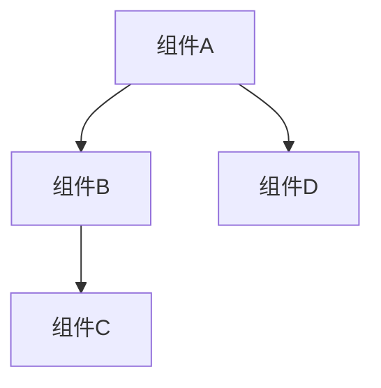

# 📚 YYC³ Easy Table Converter 技术文档指南

> **YYC³（YanYu Cloud Cube）**
> **标语**：万象归元于云枢 | 深栈智启新纪元
> ***英文***：*All Realms Converge at Cloud Nexus, DeepStack Ignites a New Era*

---

**创建日期**：2024-10-15
**作者**：YYC
**版本**：1.0.0
**更新日期**：2025-12-05

## 1. 文档结构概述

```
docs/
├── technical/                  # 技术文档
│   ├── api/                   # API文档
│   │   ├── ai-service.md     # AI服务API
│   │   ├── converter-api.md  # 转换器API
│   │   └── index.md          # API文档索引
│   ├── architecture/         # 架构文档
│   │   ├── overview.md       # 架构概览
│   │   ├── data-flow.md      # 数据流图
│   │   └── components.md     # 组件架构
│   ├── components/           # 组件文档
│   │   ├── ai-components.md  # AI组件说明
│   │   ├── ui-components.md  # UI组件说明
│   │   └── converters.md     # 转换器组件
│   └── guidelines/           # 开发指南
│       ├── coding-standards.md # 编码规范
│       ├── testing-guide.md   # 测试指南
│       └── deployment.md      # 部署指南
├── API_Reference.md          # API参考总览
├── Testing_Plan.md           # 测试计划
└── UserGuide.md              # 用户指南
```

## 2. 文档编写规范

### 2.1 文件头模板

所有技术文档必须包含以下文件头注释：

```markdown
/**
 * @file 文件名
 * @description 文件描述
 * @module 模块名称
 * @author 作者
 * @version 版本号
 * @created 创建日期
 * @updated 更新日期
 */
```

### 2.2 文档格式标准

- **标题层级**: 使用 `#`, `##`, `###` 等严格控制标题层级
- **代码块**: 使用 ```typescript 或 ```javascript 标明语言类型
- **表格**: 使用标准Markdown表格格式
- **列表**: 关键信息使用有序或无序列表
- **链接**: 使用 `[描述](链接)` 格式
- **注释**: 关键说明使用 `> 说明内容` 格式

### 2.3 文档内容要求

- **简明扼要**: 避免冗余内容，突出重点
- **结构清晰**: 逻辑分明，层次有序
- **代码示例**: 关键功能必须提供代码示例
- **API文档**: 必须包含参数说明、返回值、错误码等
- **组件文档**: 必须包含属性说明、使用示例、事件说明等

## 3. API文档规范

### 3.1 API文档结构

```markdown
# API名称

## 概述
简要描述API的功能和用途

## 接口信息

| 参数名 | 类型 | 必填 | 默认值 | 描述 |
|-------|------|------|-------|------|
| param1 | string | 是 | - | 参数说明 |
| param2 | number | 否 | 0 | 参数说明 |

## 返回值

```typescript
interface ApiResponse {
  success: boolean;
  data?: any;
  error?: string;
}
```

## 示例代码

```typescript
// 调用示例
const result = await api.method(param1, param2);
console.log(result);
```

## 错误码

| 错误码 | 描述 | 解决方案 |
|-------|------|--------|
| 400 | 参数错误 | 检查参数格式 |
| 401 | 未授权 | 检查权限信息 |
```

### 3.2 服务端API文档

服务端API文档必须包含以下内容：
- 请求方式 (GET/POST/PUT/DELETE)
- 请求URL
- 请求头
- 请求体
- 响应体
- 状态码
- CORS策略

## 4. 组件文档规范

### 4.1 组件文档结构

```markdown
# 组件名称

## 概述
简要描述组件的功能和用途

## 属性说明

| 属性名 | 类型 | 必填 | 默认值 | 描述 |
|-------|------|------|-------|------|
| prop1 | string | 是 | - | 属性说明 |
| prop2 | number | 否 | 0 | 属性说明 |

## 事件说明

| 事件名 | 触发条件 | 回调参数 | 描述 |
|-------|--------|---------|------|
| onChange | 值改变时 | newValue: any | 值改变事件 |
| onClick | 点击时 | event: React.MouseEvent | 点击事件 |

## 示例代码

```tsx
<ComponentName 
  prop1="value1"
  prop2={2}
  onChange={(newValue) => console.log(newValue)}
/>
```

## 样式定制
组件支持的样式定制方式说明
```

### 4.2 组件分类

- **UI组件**: 通用界面组件
- **业务组件**: 特定业务功能组件
- **AI组件**: AI相关功能组件
- **转换器组件**: 数据转换组件

## 5. 架构文档规范

### 5.1 架构文档结构

```markdown
# 架构名称

## 概述
架构概述和设计理念

## 核心组件
详细描述核心组件及其职责

## 数据流程
数据在系统中的流动过程

## 依赖关系
组件间的依赖关系说明

## 扩展点
系统的扩展机制和扩展点
```

### 5.2 架构图规范

架构图使用Mermaid语法编写：



## 6. 开发指南规范

### 6.1 开发指南结构

```markdown
# 开发指南名称

## 目的
指南的目的和适用范围

## 标准规范
详细的标准和规范说明

## 最佳实践
推荐的最佳实践

## 常见问题
常见问题及解决方案

## 示例
相关示例代码或配置
```

## 7. 文档更新流程

1. **创建/更新文档**: 开发者根据功能变更创建或更新相应文档
2. **代码审查**: 文档变更必须与代码变更一起进行审查
3. **合并**: 文档审查通过后与代码一起合并到主分支
4. **发布**: 文档会随版本发布自动更新

## 8. 文档工具和资源

- **文档生成工具**: 使用Typora、VS Code等Markdown编辑器
- **图表工具**: Mermaid、Draw.io
- **示例代码格式化**: 使用Prettier

---

## 版本历史

| 版本 | 更新日期 | 更新内容 |
|------|----------|----------|
| 1.0.0 | 2025-12-05 | 文档标准化处理，添加文档头和统一编号格式 |
| 1.0.0 | 2024-10-15 | 初始版本 |

---

**本文档由 YYC³ Easy Table Converter 开发团队维护** 🌹

文档是项目成功的关键，保持文档的准确性和时效性！ 🌹