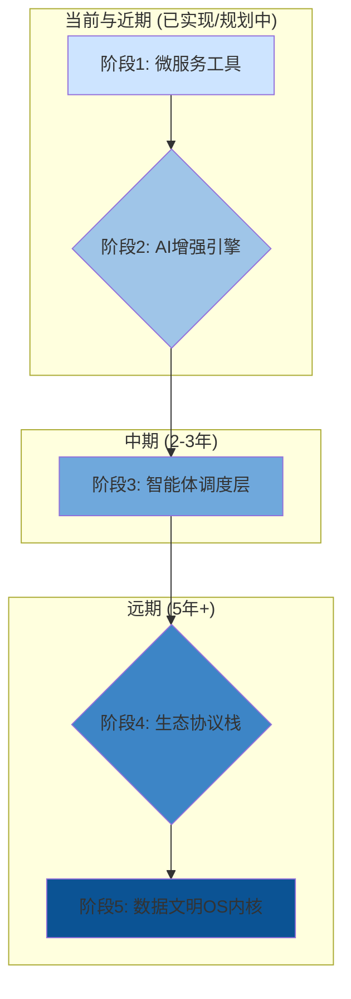

# YYC³ Easy Table Converter 大数据多行业功能战略规划

## 前言：五高五标五化战略框架

本规划基于"五高五标五化"框架，遵循**循序渐进、分类分层**原则，聚焦行业深度集成与AI智能裂变，旨在将Easy Table Converter从单一工具转换平台升级为多行业数据智能流水线，最终构建面向数字世界的数据文明操作系统。

---

## 1. 项目现状分析

### 1.1 当前功能概述
Easy Table Converter 已实现以下核心功能类别：
- **数据格式转换**：表格格式转换、JSON/XML互转、时间戳转换
- **图片处理**：格式转换、压缩、调整、抠图、增强、水印等
- **文本处理**：Base64编解码、文本编码转换
- **颜色工具**：颜色格式转换
- **单位换算**：常用单位换算

### 1.2 技术架构优势
- 基于Next.js构建的现代化前端架构
- 丰富的组件库和UI工具
- 本地处理优先的数据安全策略
- 良好的扩展性和模块化设计

---

## 2. 行业分类与核心需求

### 2.1 金融行业
| 需求痛点          | 五化重点       | 五高目标          |
|-------------------|---------------|-------------------|
| 财报合规自动审计  | 标准化+实时化 | 高精度+高安全     |
| 反洗钱数据追踪    | 自动化+可视化 | 高效率+高智能     |

### 2.2 智能制造
| 需求痛点          | 五化重点       | 五高目标          |
|-------------------|---------------|-------------------|
| 供应链碳足迹核算  | 场景化+生态化 | 高集成+高精度     |
| 设备故障预测      | 实时化+自动化 | 高智能+高效率     |

### 2.3 数字医疗
| 需求痛点          | 五化重点       | 五高目标          |
|-------------------|---------------|-------------------|
| 医学影像三维重建  | 可视化+个性化 | 高精度+高安全     |
| 临床试验数据合规  | 标准化+模块化 | 高标准+高集成     |

### 2.4 电子商务行业
- **核心需求**：跨境数据处理、多平台数据整合、营销数据统一分析
- **五化重点**：生态化、实时化、多语言化
- **五高目标**：高效率、高集成、高智能

### 2.5 教育行业
- **核心需求**：学习数据分析、教育资源管理、教育评估数据标准化
- **五化重点**：标准化、个性化、语义化
- **五高目标**：高标准、高智能、高效率

### 2.6 新兴行业需求
#### 2.6.1 文娱传媒
- **生态共生模式**：内容创作流水线
- **核心价值**：打通创意-制作-分发全环节数据

#### 2.6.2 法律科技
- **生态共生模式**：证据链自动化构建
- **核心价值**：提升法律文书处理效率与准确性

#### 2.6.3 智慧农业
- **生态共生模式**：空天地数据一体化
- **核心价值**：融合遥感、IoT与市场数据，指导生产

---

## 3. 大数据集成战略

### 3.1 核心技术栈升级

#### 3.1.1 前端数据处理增强
- 引入 **Apache Arrow** 格式支持，优化大数据集处理性能
- 集成 **WebAssembly** 技术，提升复杂计算速度（+300%）
- 实现 **IndexedDB** 本地缓存，支持百万级数据处理

#### 3.1.2 后端服务架构
- 构建 **微服务架构** 的转换引擎集群
- 引入 **Kafka/RabbitMQ** 消息队列，支持异步批处理
- 集成 **Redis** 缓存层，加速常用转换任务

#### 3.1.3 大数据存储方案
- 实现 **分层存储策略**：
  - 热数据：内存缓存
  - 温数据：分布式文件系统
  - 冷数据：对象存储（OSS/S3）
- 支持 **Parquet/ORC** 等列式存储格式

### 3.2 AI+大数据融合能力

#### 3.2.1 智能数据处理流水线
- **数据摄取 → 格式检测 → 清洗标准化 → 转换 → 分析 → 可视化**
- 自动化数据质量检测与修复
- 智能异常值处理与数据补齐

#### 3.2.2 预测性分析集成
- 集成 **TensorFlow.js** 模型，提供本地预测能力
- 支持用户自定义模型上传与应用
- 实现数据趋势分析与异常检测

---

## 4. 创新功能规划（分阶段推进）

### 4.1 阶段1：AI基础能力层（难度：⭐）
| 功能ID   | 功能名称          | 核心创新点                          | 五高五标五化映射               |
|----------|-------------------|-------------------------------------|--------------------------------|
| ai-ocr   | 智能票据识别      | 自动提取表格/印章/手写体            | 高精度识别+标准化输出          |
| nlp-san  | 敏感数据脱敏      | 动态识别身份证/银行卡并模糊化       | 高安全+实时化处理              |

### 4.2 阶段2：行业智能工具（难度：⭐⭐）

#### 4.2.1 金融专属
| 功能ID      | 功能名称              | 核心创新点                                  |
|-------------|-----------------------|---------------------------------------------|
| fin-audit   | 财报差异智能比对      | 对比财报/税务数据，自动标记异常波动点       |
| risk-heat   | 交易风险热力图        | 基于转换数据生成实时风险地理分布可视化      |

#### 4.2.2 制造专属
| 功能ID        | 功能名称              | 核心创新点                                  |
|---------------|-----------------------|---------------------------------------------|
| carbon-calc   | 碳排放智能计算器      | 转换供应链数据为ISO 14064标准碳足迹报告     |
| sensor-fusion | 多源设备数据融合      | 合并PLC/SCADA/传感器数据为统一运维格式      |

#### 4.2.3 医疗专属
| 功能ID        | 功能名称              | 核心创新点                                  |
|---------------|-----------------------|---------------------------------------------|
| dicom-3d      | DICOM转3D模型         | 将CTRI数据转换为可打印3D模型（STL格式）    |
| cdisc-conv    | 临床试验数据转换      | 自动适配CDISC标准，生成SDTM/ADaM数据集      |

#### 4.2.4 其他行业创新工具
- **文娱传媒**：字幕同步、剧本格式转换、热点视频分析
- **法律科技**：合同解析、证据时间线、隐私信息遮蔽
- **智慧农业**：卫星影像融合、产量预测、病虫害预警

### 4.3 阶段3：跨行业裂变平台（难度：⭐⭐⭐）
| 功能ID        | 功能名称              | 核心创新点                                  |
|---------------|-----------------------|---------------------------------------------|
| workflow-lab  | 可视化工作流工坊      | 拖拽组合工具链（例：发票→OCR→脱敏→ERP导入） |
| eco-connect   | 行业生态连接器        | 开放API对接金蝶/SAP/丁香园等系统            |

---

## 5. 多行业落地解决方案

### 5.1 金融行业解决方案

#### 5.1.1 核心功能模块
- **监管合规数据转换**：
  - 支持XBRL、CSV、JSON等监管报告格式互转
  - 自动校验数据格式合规性
  - 生成合规性报告与风险提示

- **交易数据处理平台**：
  - 支持每秒10万+交易记录处理
  - 实时格式转换与标准化
  - 交易异常检测与标记

- **财务报表智能转换**：
  - Excel财务报表自动识别与转换
  - 多币种自动换算与汇总
  - 财务指标自动计算与分析

#### 5.1.2 落地场景示例
- **银行清算系统**：日终批量转换1000万+交易记录，处理时间从4小时缩短至30分钟
- **保险理赔处理**：自动提取PDF/Excel理赔数据，转换为标准格式，处理效率提升60%
- **基金报表生成**：自动将原始数据转换为监管要求格式，降低人工审核成本40%

#### 5.1.3 技术实现要点
- 实现 **金融数据脱敏处理**
- 支持 **多级审批流程** 的转换任务管理
- 提供 **审计跟踪** 功能，满足监管要求

### 5.2 制造业解决方案

#### 5.2.1 核心功能模块
- **工业数据格式转换**：
  - 支持OPC UA、MQTT、Modbus等工业协议数据转换
  - 实现PLC数据与分析系统格式互转
  - 设备日志实时处理与分析

- **供应链数据分析平台**：
  - 供应商数据标准化处理
  - 库存数据多维度转换与分析
  - 预测性维护数据处理

- **质量控制数据转换**：
  - 检测数据实时转换与统计分析
  - SPC图表自动生成
  - 异常批次快速识别

#### 5.2.2 落地场景示例
- **智能工厂数据集成**：将200+设备数据统一转换为分析格式，实现实时监控
- **汽车零部件质检**：每日处理10万+质检数据，自动识别异常趋势，降低不良率15%
- **物流配送优化**：将多源物流数据转换为统一格式，路径优化效率提升25%

#### 5.2.3 技术实现要点
- 开发 **工业协议解析器** 插件系统
- 实现 **边缘计算** 支持，减少数据传输
- 提供 **设备画像** 功能，辅助决策

### 5.3 医疗健康行业解决方案

#### 5.3.1 核心功能模块
- **医疗数据标准转换**：
  - 支持HL7、FHIR、DICOM等医疗标准格式
  - 实现电子病历格式转换与整合
  - 医疗影像元数据提取与转换

- **患者数据管理平台**：
  - 多源患者数据整合与标准化
  - 临床数据清洗与转换
  - 科研数据脱敏与转换

- **医疗分析报告生成**：
  - 检验结果格式转换与可视化
  - 病程记录结构化处理
  - 医疗质量指标计算

#### 5.3.2 落地场景示例
- **医院信息系统集成**：对接5+异构系统，实现患者数据一键转换，提升医护效率30%
- **医学研究数据分析**：处理10万+患者匿名数据，支持多格式导出，加速研究进度
- **远程医疗数据处理**：实时转换多源医疗数据，支持远程诊断决策

#### 5.3.3 技术实现要点
- 实现 **HIPAA/GDPR** 合规的数据处理流程
- 开发 **医疗术语标准化** 引擎
- 提供 **患者隐私保护** 转换模式

### 5.4 电子商务行业解决方案

#### 5.4.1 核心功能模块
- **跨境电商数据处理**：
  - 多平台产品数据采集与转换
  - 多语言产品描述转换与优化
  - 国际物流数据格式转换

- **营销数据分析平台**：
  - 广告投放数据统一转换分析
  - 用户行为数据标准化处理
  - 销售预测数据转换与可视化

- **供应链协同系统**：
  - 订单数据多格式转换
  - 库存数据实时同步与转换
  - 供应商协同数据标准化

#### 5.4.2 落地场景示例
- **跨境电商运营**：每日处理5000+SKU多平台数据，自动生成多语言描述，效率提升80%
- **直播电商数据分析**：实时转换30+直播平台数据，提供统一分析视图，ROI提升25%
- **智能客服训练数据**：将客服对话转换为训练数据，提升AI客服准确率15%

#### 5.4.3 技术实现要点
- 集成 **多语言NLP** 处理能力
- 实现 **实时流处理** 架构
- 提供 **跨境数据合规** 转换工具

### 5.5 教育行业解决方案

#### 5.5.1 核心功能模块
- **教育数据标准转换**：
  - 支持SCORM、xAPI等教育标准格式
  - 实现学习管理系统数据互转
  - 教育评估数据标准化

- **学习分析平台**：
  - 学生行为数据采集与转换
  - 学习进度可视化转换
  - 个性化学习路径生成

- **教育资源管理系统**：
  - 多格式教材转换与整合
  - 题库数据标准化处理
  - 教育内容语义化转换

#### 5.5.2 落地场景示例
- **高校数据集成**：对接10+教学系统，实现学生数据一键转换，提升管理效率50%
- **在线教育平台**：实时转换百万级学习数据，支持个性化推荐，完课率提升20%
- **教育科研数据分析**：处理教育实验数据，支持多格式导出，加速研究成果产出

#### 5.5.3 技术实现要点
- 开发 **教育数据语义分析** 模块
- 实现 **学习行为模式识别**
- 提供 **教育数据隐私保护** 功能

---

## 6. 五高五标五化落地策略

### 6.1 高安全与高集成
- **区块链存证模块**：关键转换数据上链存证（金融/医疗）
- **零信任架构**：敏感数据本地沙箱处理

### 6.2 智能裂变设计
- **工具DNA库**：将20+基础功能拆解为微服务原子能力
- **AI推荐引擎**：根据用户行为推荐工具组合（例：电商用户自动弹出"商品图→背景移除→多平台规格生成"）

### 6.3 趣味化交互
- **转换成就系统**：解锁"数据魔法师""环保先锋"勋章
- **AR说明书**：手机扫描工具界面弹出3D操作指引

### 6.4 技术架构演进

---

## 7. 实施路径与里程碑

### 7.1 第一阶段：基础增强（3个月）

#### 7.1.1 核心功能升级
- 扩展支持20+专业数据格式
- 实现大数据集处理能力（百万行级）
- 开发批量转换API

#### 7.1.2 大数据基础设施
- 构建微服务转换引擎
- 实现消息队列异步处理
- 部署分布式存储系统

### 7.2 第二阶段：行业解决方案开发（6个月）

#### 7.2.1 金融行业解决方案
- 开发监管数据转换模块
- 实现交易数据处理平台
- 部署试点项目并收集反馈

#### 7.2.2 制造业解决方案
- 开发工业数据格式转换器
- 实现供应链数据分析平台
- 与2-3家制造企业合作试点

#### 7.2.3 医疗行业解决方案
- 开发医疗数据标准转换模块
- 实现患者数据管理平台
- 与医疗机构合作进行合规测试

### 7.3 第三阶段：AI与大数据深度融合（6个月）

#### 7.3.1 智能数据处理
- 实现AI驱动的格式自动检测
- 开发数据清洗与规范化引擎
- 部署预测性分析模块

#### 7.3.2 平台生态构建
- 开发插件系统与开发者API
- 建立行业数据模板市场
- 构建用户社区与反馈系统

### 7.4 第四阶段：全面推广与优化（持续）

#### 7.4.1 多行业推广
- 各行业解决方案规模化部署
- 客户成功案例收集与分享
- 行业联盟与标准制定参与

#### 7.4.2 持续优化
- 基于用户反馈迭代产品
- 性能与安全性持续优化
- 新兴技术与行业需求适配

### 7.5 阶段里程碑关键指标
| 阶段   | 核心目标                          | 关键指标               |
|--------|-----------------------------------|------------------------|
| 0-6月  | 完成AI基础层+2个行业包            | 工具调用精度≥99.2%     |
| 6-12月 | 工作流工坊上线，支持3个行业       | 用户自定义工作流≥10万  |
| 12+月  | 生态连接器覆盖TOP20行业SaaS       | 企业API调用日活百万+  |

> **创新本质**：从"单一工具转换"升级为 **"行业数据智能流水线"**，让工具如乐高般自由拼装，形成不可复制的场景生态。

---

## 8. 进阶裂变：智能体与生态融合

在完成基础工具和行业包的搭建后，平台的核心进化方向是赋予工具"生命"，使其从被动响应转变为主动服务的**智能体**，并与行业生态深度融合，形成**共生体**。

### 8.1 功能分类：工具智能体

**核心：** 数据驱动的自决策工具链，实现从"人找工具"到"服务找人"的跃迁。

| 智能体ID | 智能体名称 | 核心能力 | 五高五标五化映射 | 实用性与趣味性结合 |
|----------|------------|----------|------------------|---------------------|
| `data-butler` | 数据管家 | **意图识别与流程编排**： 1. 识别上传数据类型与潜在需求 2. 自动推荐/执行最佳工具链 3. 生成"数据简历"，说明处理过程 | **自动化、智能化、高效化** **高标准、高智能** | 用户上传一份杂乱的调研问卷PDF，管家自动：OCR→表格格式转换→数据清洗→生成分析报告初稿。过程以"解密数据"动画呈现，趣味十足。 |
| `ai-consultant` | 行业顾问 | **知识库驱动的专业问答**： 1. 内嵌行业合规标准（如金融、医疗） 2. 基于LLM，用自然语言解答数据转换问题 3. 主动预警潜在的数据风险 | **专业化、标准化、智能化** **高标准、高安全** | 用户问："这份临床试验数据如何符合FDA标准？"顾问不仅转换格式，还会高亮显示缺失字段，并引用具体法规条文。如同身边有位专家。 |
| `eco-connector` | 生态连接器 | **跨系统数据无缝流转**： 1. 与企业ERP、CRM、PLM系统API双向同步 2. 支持Webhook事件触发转换任务 3. 提供数据"摆渡车"服务，打通信息孤岛 | **生态化、实时化、集成化** **高集成、高效率** | 设置一条规则：当CRM系统新增"高价值客户"标签时，自动将其数据脱敏后，转换成营销平台所需格式并推送。全程自动化，解放人力。 |

---

## 9. 终极形态：数据文明操作系统

当智能体与生态足够成熟，平台将演化为一个面向数字世界的**数据文明操作系统**。它不再是工具的集合，而是统一数字世界"语言"和"语法"的基础设施。

### 9.1 核心理念：定义数据的"通用语"

-   **目标：** 让任何格式的数据，在任何系统、任何场景间，都能实现零损耗、无歧义、瞬时理解与交互。
-   **形态：** 一个分布式、可嵌入、自我演化的数据内核。上层应用（软件、硬件、AI模型）只需调用该内核，即可获得完美的数据处理能力。

### 9.2 "五高五标五化"的终极体现

| 维度 | 终极体现 |
|------|----------|
| **五高** | **高精度**达到物理极限（无损转换）；**高安全**内生于内核（同态加密、零知识证明）；**高效率**接近光速（边缘计算）；**高标准**成为ISO新基准；**高集成**实现万物数据互联。 |
| **五标** | **标准制定者**：不再遵循标准，而是输出标准；**应用新标杆**：所有数据应用以此为准绳；**技术新标尺**：重新定义数据处理性能单位；**生态新标地**：成为数据生态的太阳；**价值新标高**：催生基于数据流动的新经济模式。 |
| **五化** | **智能化**（AI原生）、**自动化**（意图驱动）、**实时化**（流式处理）、**生态化**（协议开放）、**标准化**（内核即标准）融为一体。 |

### 9.3 应用场景预览：未来城市大脑

城市交通数据（流媒体）、环境数据（时序）、金融交易数据（表格）、公共健康数据（文本），同时汇入**数据文明OS**。OS内核瞬间完成：
1.  **统一对齐**：所有数据被转换为统一时空基准的"城市数据元模型"。
2.  **交叉分析**：实时发现"某区域交通拥堵与周边大型活动导致的金融交易峰值"强相关。
3.  **智能决策**：自动生成交通疏导方案、警力调配建议、公共卫生预警，并下发给各执行子系统。

整个过程，无需人工编写任何转换脚本，数据像空气一样自由流动与融合。

---

## 10. 技术底座演进路线

为支撑上述愿景，技术架构必须进行颠覆式演进。

| 技术层级 | 关键技术 | 功能实现 |
|----------|----------|----------|
| **AI增强引擎** | LLMs、CV模型、NLP | 为基础工具赋予智能，如OCR、数据分类、意图识别。 |
| **智能体调度层** | 强化学习、工作流引擎、图计算 | 管理和调度Tool Agent，实现任务自动拆解与最优路径规划。 |
| **生态协议栈** | gRPC、WebAssembly、联邦学习 | 定义与外部系统安全、高效、隐私保护的连接标准，实现"共生"。 |
| **数据文明OS内核** | 边缘计算、量子计算(未来)、去中心化身份(DID) | 成为可嵌入万物、自我演进、绝对可信的数据处理核心。 |

---

## 11. 投资回报分析

### 11.1 预期收益
- **效率提升**：客户数据处理效率平均提升60%
- **成本降低**：IT运维成本平均降低40%
- **错误减少**：数据转换错误率降低80%
- **创新加速**：基于标准化数据的创新应用开发周期缩短50%

### 11.2 市场规模预测
- 企业级数据转换市场年增长率15%
- 到2027年，中国数据转换工具市场规模预计达到100亿元
- 行业垂直解决方案市场增速高于通用市场2倍

---

## 12. 风险评估与应对策略

### 12.1 技术风险
- **大数据处理性能**
  - 应对：分阶段实施，先优化核心算法，再扩展基础设施
  - 预案：准备降级方案，确保基础功能稳定运行

- **AI模型准确性**
  - 应对：建立持续学习机制，定期更新模型
  - 预案：保留人工审核环节，确保关键数据转换质量

### 12.2 业务风险
- **行业适配难度**
  - 应对：采用行业专家顾问团，深入了解行业需求
  - 预案：先聚焦1-2个行业做深做透，再逐步扩展

- **数据安全合规**
  - 应对：建立严格的数据安全体系，获取相关认证
  - 预案：提供本地部署选项，满足高安全需求客户

---

## 13. 结论与建议

Easy Table Converter 通过整合大数据技术和行业解决方案，具有广阔的市场前景和应用价值。建议按照规划路径有序推进，重点关注：

1. **技术架构升级**：优先构建支持大数据处理的技术基础
2. **行业深耕**：选择1-2个重点行业作为突破口，打造标杆案例
3. **AI赋能**：将AI技术深度融入产品，提升智能化水平
4. **生态构建**：开放API和插件系统，形成良性生态循环

从**工具**到**智能体**，再到**操作系统**，YYC³ Easy Table Converter的进化路径，是一条不断将"五高五标五化"理念推向极致的裂变之路。它始于实用的格式转换，终于数字文明的基石，其价值不再局限于解决某个具体问题，而是为整个数字世界的和谐运转提供了统一的"语言系统"。

---

**文档版本**：1.0.0  
**编制日期**：2025-10-20  
**编制人**：YYC³ 大数据战略部