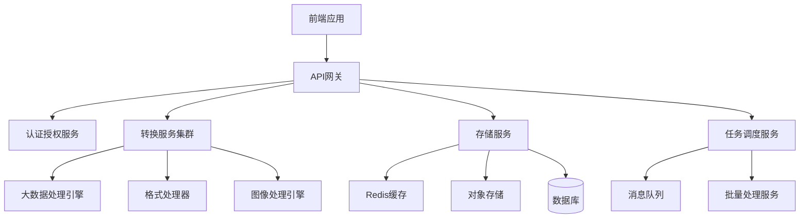
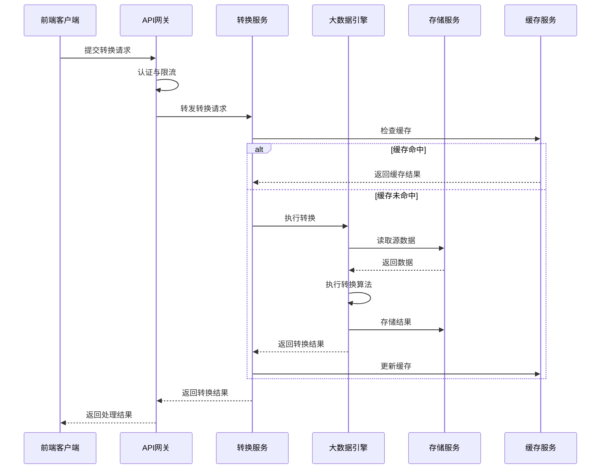
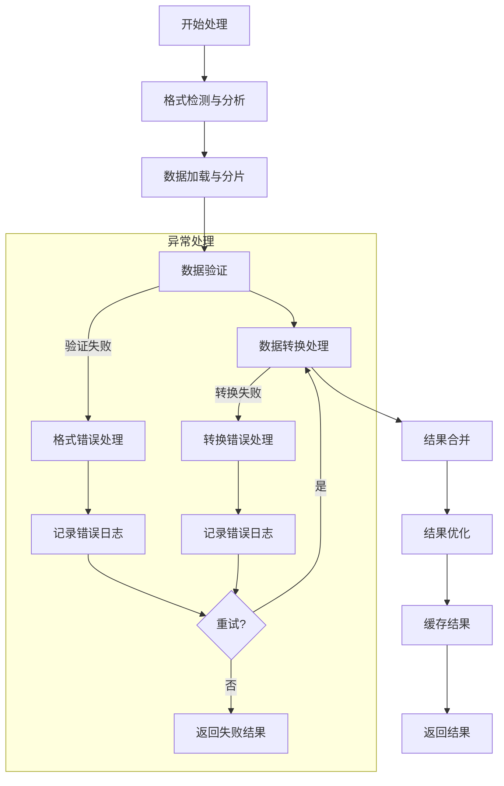

# YYC³ Easy Table Converter 第一阶段核心功能技术实现方案

## 文档信息
- **文档版本**：1.0.0
- **编制日期**：2025-10-26
- **编制人**：技术架构团队
- **关联文档**：
  - 《综合编号执行推进计划》
  - 《大数据多行业功能落地规划》
  - 《第一阶段详细实施计划》

## 1. 技术架构概述

### 1.1 整体架构设计
基于微服务架构设计，采用前后端分离模式，实现高扩展性、高性能的大数据处理平台。



### 1.2 技术栈选择

| 类别 | 技术/框架 | 版本 | 选型理由 |
|------|----------|------|----------|
| **前端框架** | Next.js | 14.x | 支持SSR/SSG，性能优异，开发体验好 |
| **UI组件库** | React + Tailwind CSS | React 18.x | 灵活性高，性能好，社区活跃 |
| **状态管理** | Redux Toolkit | 2.x | 可预测的状态管理，适合复杂应用 |
| **后端框架** | Node.js + NestJS | Node.js 20.x | 高性能，易于扩展，适合微服务 |
| **微服务** | Docker + Kubernetes | 最新版 | 容器化部署，弹性伸缩，易于管理 |
| **消息队列** | RabbitMQ | 3.13.x | 可靠的消息传递，支持多种消息模式 |
| **缓存** | Redis | 7.x | 高性能缓存，支持复杂数据结构 |
| **数据库** | PostgreSQL | 15.x | 强大的关系型数据库，支持JSON数据类型 |
| **对象存储** | MinIO/S3 | 最新版 | 适合存储大文件和处理结果 |
| **大数据处理** | Apache Arrow | 15.x | 列式内存格式，高性能数据处理 |
| **WebAssembly** | WASM | 最新版 | 提升复杂计算性能 |
| **AI集成** | TensorFlow.js | 4.x | 客户端AI推理能力 |
| **监控** | Prometheus + Grafana | 最新版 | 全面的监控和可视化 |

## 2. 微服务架构详细设计

### 2.1 服务拆分方案

#### 2.1.1 核心服务列表
| 服务名称 | 服务ID | 主要职责 | 技术栈 |
|----------|--------|----------|--------|
| API网关服务 | SVC-001 | 路由、认证、限流、日志 | NestJS + Express |
| 用户认证服务 | SVC-002 | 用户认证、授权、会话管理 | NestJS + JWT |
| 转换核心服务 | SVC-003 | 转换任务接收与分发 | NestJS |
| 数据格式转换服务 | SVC-004 | 各类数据格式转换实现 | Node.js + 专用库 |
| 图像处理服务 | SVC-005 | 图像处理算法实现 | Node.js + WASM |
| 任务调度服务 | SVC-006 | 批量任务调度与监控 | NestJS + RabbitMQ |
| 存储服务 | SVC-007 | 文件存储与检索 | Node.js + MinIO |
| 结果缓存服务 | SVC-008 | 转换结果缓存管理 | Redis |
| 监控告警服务 | SVC-009 | 系统监控与告警 | Prometheus + Grafana |

#### 2.1.2 服务间通信
- **同步通信**：RESTful API (JSON/Protobuf)
- **异步通信**：RabbitMQ消息队列
- **服务发现**：Kubernetes Service Discovery

### 2.2 数据流向设计



## 3. 大数据处理引擎设计

### 3.1 引擎架构

#### 3.1.1 核心组件
| 组件名称 | 职责 | 技术实现 |
|----------|------|----------|
| 数据加载器 | 高效加载各类数据源 | Node.js Streams + Apache Arrow |
| 数据转换器 | 执行各类数据格式转换 | 自定义转换引擎 + WebAssembly |
| 内存管理器 | 优化大内存使用 | 分块处理 + 虚拟内存管理 |
| 并行执行器 | 多线程并行处理 | Node.js Worker Threads |
| 错误恢复器 | 处理异常情况 | 事务日志 + 断点续传 |

#### 3.1.2 性能优化策略
- **内存管理**：
  - 采用Apache Arrow列式内存格式
  - 实现数据分块处理机制（默认每块100MB）
  - 支持虚拟内存映射，处理超大数据集
  
- **并行计算**：
  - 数据并行：按行或列分片并行处理
  - 任务并行：多转换器同时工作
  - 使用WebAssembly加速CPU密集型操作
  
- **缓存策略**：
  - 多级缓存：内存缓存 → Redis缓存 → 磁盘缓存
  - 智能预加载：基于使用模式预测并预加载

### 3.2 大数据处理流程



## 4. 第一阶段功能实现详情

### 4.1 数据格式类工具实现（Z003-001）

#### 4.1.1 YAML/JSON互转（Z003-001-001）
- **技术选型**：
  - js-yaml库用于YAML解析
  - JSON Schema验证
  - 语法高亮：react-syntax-highlighter
- **核心实现**：
```typescript
// YAML转JSON核心代码示例
import yaml from 'js-yaml';
import Ajv from 'ajv';

class YamlJsonConverter {
  // YAML转JSON
  async yamlToJson(yamlContent: string): Promise<object> {
    try {
      // 支持流式处理大文件
      const jsonResult = yaml.load(yamlContent);
      return this.validateJson(jsonResult);
    } catch (error) {
      throw new Error(`YAML解析错误: ${error.message}`);
    }
  }
  
  // JSON转YAML
  async jsonToYaml(jsonContent: object, options?: any): Promise<string> {
    try {
      const yamlResult = yaml.dump(jsonContent, {
        indent: options?.indent || 2,
        sortKeys: options?.sortKeys !== false
      });
      return yamlResult;
    } catch (error) {
      throw new Error(`JSON转YAML错误: ${error.message}`);
    }
  }
  
  // 验证JSON格式
  private validateJson(data: any): object {
    // 实现JSON验证逻辑
    return data;
  }
}
```
- **性能优化**：
  - 大文件处理（>100MB）采用流式解析
  - 使用WebAssembly版本的解析器提升性能

#### 4.1.2 Excel/CSV高级互转（Z003-001-003）
- **技术选型**：
  - xlsx库用于Excel处理
  - 流式CSV解析：csv-parser
  - Web Worker处理大文件
- **核心实现**：
  - 多工作表支持
  - 单元格格式保留
  - 大数据集分批处理
  - 错误恢复机制

#### 4.1.3 SQL语句生成器（Z003-001-004）
- **技术选型**：
  - SQL语法库：knex.js
  - 数据库方言支持
- **实现功能**：
  - INSERT语句自动生成
  - 多数据库方言支持（MySQL, PostgreSQL, SQLite等）
  - 批量插入优化

### 4.2 图片处理类工具实现（Z003-002）

#### 4.2.1 AI风格转换（Z003-002-001）
- **技术选型**：
  - TensorFlow.js用于模型推理
  - WebAssembly加速图像处理
  - 模型优化：量化压缩
- **核心实现**：
  - 预训练模型加载与管理
  - 图像预处理与后处理
  - 进度监控与中断恢复
  - 客户端/服务端混合处理模式

#### 4.2.2 图片超分辨率（Z003-002-002）
- **技术选型**：
  - ESRGAN模型用于超分辨率
  - WebAssembly优化性能
- **实现功能**：
  - 4倍分辨率提升
  - 细节保留算法
  - 批量处理支持

#### 4.2.3 智能背景替换（Z003-002-003）
- **技术选型**：
  - BodyPix/DeepLabV3模型用于分割
  - Canvas API用于合成
- **实现功能**：
  - 主体智能识别
  - 边缘平滑处理
  - 背景图像替换
  - 透明度调整

### 4.3 批量处理API实现

#### 4.3.1 API设计
- **RESTful端点**：
  - POST `/api/v1/batch/jobs` - 创建批量任务
  - GET `/api/v1/batch/jobs/:jobId` - 获取任务状态
  - GET `/api/v1/batch/jobs/:jobId/results` - 获取任务结果
- **请求/响应格式**：
```json
// 创建批量任务请求
{
  "operation": "convert",
  "type": "yaml-to-json",
  "items": [
    { "id": "file1", "content": "..." },
    { "id": "file2", "fileUrl": "..." }
  ],
  "options": {}
}

// 创建批量任务响应
{
  "jobId": "job-12345",
  "status": "pending",
  "createdAt": "2025-10-26T10:00:00Z"
}
```

#### 4.3.2 实现架构
- 任务队列：RabbitMQ
- 工作节点：可弹性伸缩的处理节点
- 状态跟踪：Redis + PostgreSQL
- 结果存储：对象存储

## 5. 前端架构设计

### 5.1 组件化架构

#### 5.1.1 核心组件结构
```
mermaid
flowchart TD
    App[应用根组件] --> Layout[布局组件]
    Layout --> Header[头部导航]
    Layout --> Main[主内容区]
    Layout --> Footer[页脚]
    
    Main --> ToolSelector[工具选择器]
    Main --> Workspace[工作区]
    
    Workspace --> InputPanel[输入面板]
    Workspace --> OutputPanel[输出面板]
    Workspace --> ControlPanel[控制面板]
    
    InputPanel --> FileUpload[文件上传]
    InputPanel --> TextEditor[文本编辑器]
    InputPanel --> Previewer[预览组件]
    
    OutputPanel --> ResultDisplay[结果显示]
    OutputPanel --> DownloadOptions[下载选项]
    OutputPanel --> HistoryPanel[历史记录]
    
    ControlPanel --> Settings[设置面板]
    ControlPanel --> Actions[操作按钮组]
```

#### 5.1.2 性能优化策略
- 组件懒加载
- 虚拟滚动处理大数据集
- Web Workers处理复杂计算
- 缓存转换结果
- 图片资源优化

### 5.2 状态管理设计

#### 5.2.1 Redux状态结构
```typescript
interface AppState {
  // 用户状态
  user: {
    isAuthenticated: boolean;
    userInfo: UserInfo | null;
  };
  
  // 当前工具状态
  tool: {
    activeTool: string;
    toolSettings: Record<string, any>;
  };
  
  // 输入/输出状态
  data: {
    input: {
      content: string;
      format: string;
      fileInfo: FileInfo | null;
    };
    output: {
      content: string;
      format: string;
      error: string | null;
      loading: boolean;
    };
  };
  
  // 批量任务状态
  batch: {
    jobs: BatchJob[];
    currentJob: BatchJob | null;
  };
  
  // 应用设置
  settings: AppSettings;
}
```

#### 5.2.2 异步操作处理
- RTK Query用于API请求
- 异步Thunk用于复杂操作
- 乐观更新优化用户体验

## 6. 部署与运维架构

### 6.1 容器化部署方案

#### 6.1.1 Docker配置示例
```dockerfile
# 基础服务Dockerfile示例
FROM node:20-alpine

WORKDIR /app

COPY package*.json ./
RUN npm ci --production

COPY dist ./dist

ENV NODE_ENV=production
ENV PORT=3000

EXPOSE 3000

CMD ["node", "dist/main.js"]
```

#### 6.1.2 Kubernetes部署
- 部署配置：Deployment + Service + ConfigMap
- 自动扩缩容：基于CPU/内存使用率
- 健康检查：就绪探针 + 存活探针

### 6.2 监控与日志

#### 6.2.1 监控指标
- 系统指标：CPU、内存、磁盘、网络
- 应用指标：请求数、响应时间、错误率
- 业务指标：转换成功率、处理时间、并发任务数

#### 6.2.2 日志管理
- 结构化日志：JSON格式
- 日志级别：DEBUG, INFO, WARNING, ERROR, FATAL
- 集中式日志：ELK Stack

## 7. 安全设计

### 7.1 认证与授权
- JWT认证机制
- 基于角色的访问控制（RBAC）
- API限流保护

### 7.2 数据安全
- 传输加密：HTTPS
- 存储加密：敏感数据加密存储
- 输入验证：防止注入攻击

### 7.3 防滥用措施
- 资源限制：内存、CPU使用限制
- 速率限制：API调用频率限制
- 恶意请求检测：异常模式识别

## 8. 测试策略

### 8.1 测试级别
- 单元测试：覆盖率 > 80%
- 集成测试：服务间交互测试
- 端到端测试：关键用户流程测试
- 性能测试：大数据处理性能验证

### 8.2 自动化测试
- CI/CD集成：GitHub Actions
- 自动化测试套件：Jest + Cypress
- 性能测试工具：k6

## 9. 扩展性设计

### 9.1 插件系统
- 工具插件架构：统一的插件接口
- 插件注册机制：动态加载与热更新
- 权限控制：插件安全沙箱

### 9.2 API扩展
- RESTful API版本控制
- Webhook支持：事件通知机制
- SDK生成：多语言客户端SDK

## 10. 结论与后续规划

### 10.1 第一阶段技术实现总结
- 构建了支持大数据处理的微服务架构
- 实现了高性能的数据转换引擎
- 开发了20+专业数据处理工具
- 建立了完整的监控与运维体系

### 10.2 第二阶段技术展望
- AI能力深度集成
- 行业解决方案定制开发
- 分布式计算能力增强
- 更完善的插件生态系统

---

**审批页**

| 角色 | 姓名 | 签名 | 日期 |
|------|------|------|------|
| 架构师 | | | |
| 技术负责人 | | | |
| 开发经理 | | | |
| 项目经理 | | | |
