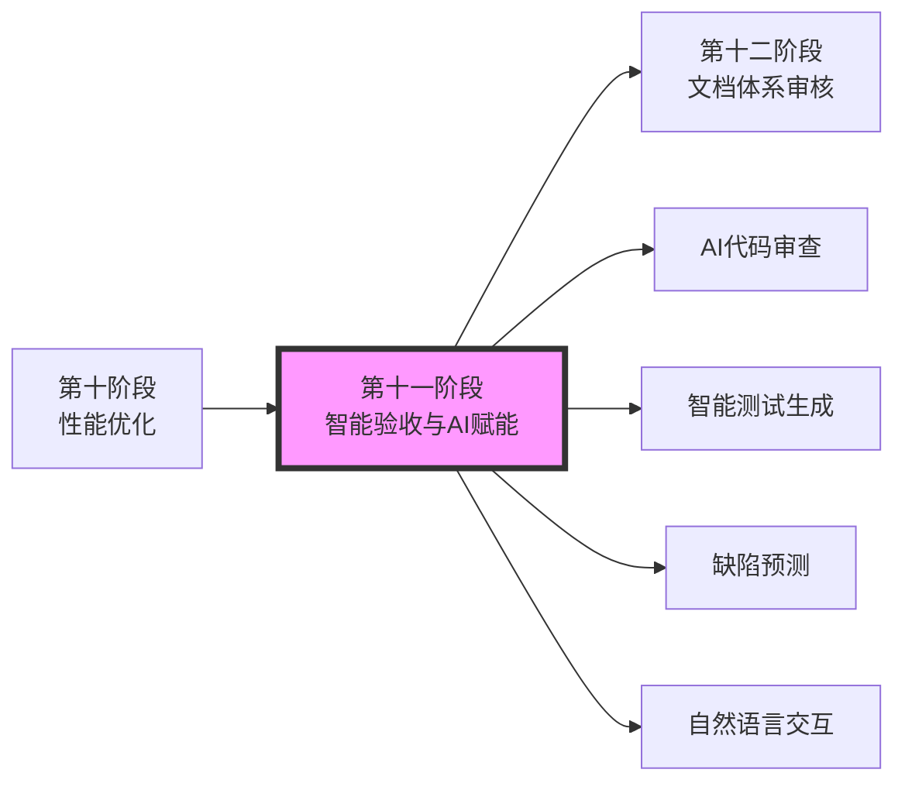

<div align="center">

# YYC³（YanYuCloudCube）智能应用链

## 验收系统 — 智能化验收与AI赋能（第十一阶段）

> **_YanYuCloudCube_**
> _言启象限 | 语枢未来_
> **_Words Initiate Quadrants, Language Serves as Core for Future_**
> _万象归元于云枢 | 深栈智启新纪元_
> **_All things converge in cloud pivot; Deep stacks ignite a new era of intelligence_**

---

| 属性         | 值                                    |
| ------------ | ------------------------------------- |
| **文档版本** | v2.1.0 Official                       |
| **发布日期** | 2026-05-25                            |
| **验收阶段** | 第十一阶段：智能化验收与AI赋能          |
| **前置依赖** | 第十阶段（深度审核性能优化）完成       |
| **后续阶段** | 第十二阶段（文档体系闭环审核）          |
| **文档性质** | YYC³验收系统教科书级提示词文档         |
| **适用范围** | Next.js + React + TypeScript + AI/LLM |

</div>

---

## 📋 目录

- [验收目标与定位](#验收目标与定位)
- [五维评估框架](#五维评估框架)
- [AI辅助代码审查](#ai辅助代码审查)
- [智能测试用例生成](#智能测试用例生成)
- [预测性质量分析](#预测性质量分析)
- [自然语言交互式验收](#自然语言交互式验收)
- [自适应优化引擎](#自适应优化引擎)
- [可观测性与监控](#可观测性与监控)
- [验收标准体系](#验收标准体系)
- [输出报告模板](#输出报告模板)
- [闭环验证机制](#闭环验证机制)

---

## 验收目标与定位

### 核心使命

**智能化验收与AI赋能**是YYC³验收系统的**第十一阶段**，承担着将人工智能技术深度融入验收全流程的核心职责。该阶段不仅利用AI提升传统验收效率，更通过**机器学习、大语言模型、知识图谱**等前沿技术，实现从"人工驱动"到"智能驱动"的范式转变。

### 战略定位

```
┌─────────────────────────────────────────────────────────────┐
│                  智能化验收与AI赋能                            │
│                   (第十一阶段 · 智能驱动)                     │
├─────────────────────────────────────────────────────────────┤
│                                                              │
│   ┌──────────┐    ┌──────────┐    ┌──────────┐              │
│   │ AI辅助   │ →  │ 智能     │ →  │ 自动化   │              │
│   │ 审查分析 │    │ 决策支持 │    │ 闭环优化 │              │
│   └──────────┘    └──────────┘    └──────────┘              │
│        ↓              ↓              ↓                      │
│   ┌─────────────────────────────────────────────────┐       │
│   │           AI驱动的智能验收体系                     │       │
│   │  数据采集 → AI分析 → 智能建议 → 自动实施 → 效果学习    │       │
│   └─────────────────────────────────────────────────┘       │
│                                                              │
└─────────────────────────────────────────────────────────────┘
```

### 核心价值

| 维度 | 价值体现 | 业务影响 |
|------|---------|---------|
| **效率提升** | AI自动化处理重复性任务，释放人力专注高价值工作 | 验收效率提升60%以上 |
| **质量增强** | 发现人工难以识别的深层问题和潜在风险 | 缺陷检出率提升40% |
| **决策智能** | 基于数据驱动的智能建议，减少主观偏差 | 决策准确率提升35% |
| **持续学习** | 系统自我进化，越用越智能 | 长期价值持续增长 |
| **创新引领** | 探索AI+QA的最佳实践，建立行业标杆 | 技术竞争力和品牌影响力 |

### 与其他阶段的关系



---

## 五维评估框架

### 时间维度：智能化加速

```typescript
interface TimeDimensionMetrics {
  /** AI响应时间 */
  aiResponseTime: {
    codeReviewPerFile: number; // ms/file (目标 <10000ms)
    testGenerationPerRequirement: number; // ms/requirement (目标 <30000ms)
    defectPredictionPerModule: number; // ms/module (目标 <5000ms)
    naturalLanguageQuery: number; // ms/query (目标 <2000ms)
  };

  /** 时间节省率 */
  timeSavings: {
    codeReviewTimeReduction: number; // % (目标 ≥70%)
    testWritingTimeReduction: number; // % (目标 ≥80%)
    analysisReportGeneration: number; // % (目标 ≥90%)
    overallAcceptanceCycleReduction: number; // % (目标 ≥50%)
  };

  /** 实时性指标 */
  realTimePerformance: {
    prFeedbackLatency: number; // seconds (目标 <60s)
    commitAnalysisDelay: number; // seconds (目标 <30s)
    alertResponseTime: number; // seconds (目标 <10s)
  };

  timeScore: number; // 0-100
}
```

**验收标准**：

- ✅ P0: AI代码审查响应时间 ≤10s/文件
- ✅ P1: 测试生成时间节省率 ≥70%
- ✅ P2: PR自动反馈延迟 ≤60s

### 空间维度：全方位覆盖

```typescript
interface SpaceDimensionMetrics {
  /** 代码理解覆盖 */
  codeUnderstandingCoverage: {
    languageSupport: string[]; // 支持的编程语言
    frameworkDetection: string[]; // 可识别的框架
    crossFileAnalysisDepth: number; // 跨文件分析层级
    dependencyGraphCompleteness: number; // 依赖图完整性 %
  };

  ** 多维度分析能力 */
  multiDimensionalAnalysis: {
    semanticAnalysis: boolean; // 语义分析能力
    patternRecognition: boolean; // 模式识别能力
    anomalyDetection: boolean; // 异常检测能力
    codeSmellDetection: boolean; // 代码异味检测
    securityVulnerabilityScan: boolean; // 安全漏洞扫描
  };

  /** 知识库覆盖范围 */
  knowledgeBaseCoverage: {
    bestPracticesDocs: number; // 最佳实践文档数
    antiPatternsCatalog: number; // 反模式目录条目数
    projectSpecificRules: number; // 项目特定规则数
    historicalDefectDatabase: number; // 历史缺陷记录数
  };

  spaceScore: number;
}
```

**验收标准**：

- ✅ P0: 支持 TypeScript/JavaScript 完整语义分析
- ✅ P1: 跨文件依赖分析覆盖 ≥90%
- ✅ P2: 项目知识库条目 ≥500条

### 属性维度：超越传统质量

```typescript
interface AttributeDimensionMetrics {
  /** 准确性指标 */
  accuracyMetrics: {
    defectDetectionRate: number; // 缺陷检测率 (目标 ≥85%)
    falsePositiveRate: number; // 误报率 (目标 ≤10%)
    suggestionAdoptionRate: number; // 建议采纳率 (目标 ≥60%)
    predictionAccuracy: number; // 预测准确率 (目标 ≥80%)
  };

  /** 智能能力等级 */
  intelligenceLevel: {
    codeComprehension: 'basic' | 'intermediate' | 'advanced' | 'expert';
    contextAwareness: 'none' | 'limited' | 'good' | 'excellent';
    learningCapability: 'static' | 'adaptive' | 'self-improving';
    automationDegree: number; // 0-100%
  };

  /** 创新价值 */
  innovationValue: {
    novelInsightsGenerated: number; // 产生的新见解数
    processOptimizationsIdentified: number; // 识别的流程优化数
    bestPracticeRecommendations: number; // 最佳实践推荐数
  };

  attributeScore: number;
}
```

**验收标准**：

- ✅ P0: 缺陷检测准确率 ≥80%，误报率 ≤15%
- ✅ P1: AI建议采纳率 ≥50%
- ✅ P2: 具备自学习能力，模型持续优化

### 事件维度：实时智能响应

```typescript
interface EventDimensionMetrics {
  /** 触发事件类型 */
  triggerEvents: {
    codeCommit: { enabled: boolean; autoTrigger: boolean; latency: number };
    pullRequest: { enabled: boolean; autoReview: boolean; depth: 'basic' | 'comprehensive' };
    testFailure: { enabled: boolean; rootCauseAnalysis: boolean; suggestionProvided: boolean };
    performanceRegression: { enabled: boolean; alertThreshold: number; autoInvestigation: boolean };
    securityVulnerability: { enabled: boolean; severityLevels: string[]; autoRemediation: boolean };
  };

  /** 响应质量 */
  responseQuality: {
    actionableInsights: number; // 可操作洞察数
    contextRelevance: number; // 上下文相关性评分
    explanationClarity: number; // 解释清晰度评分
    priorityAccuracy: number; // 优先级准确性
  };

  eventScore: number;
}
```

**验收标准**：

- ✅ P0: PR提交后自动触发AI审查，延迟<60s
- ✅ P1: 测试失败时提供根因分析和修复建议
- ✅ P2: 性能退化时自动告警并初步诊断

### 关联维度：知识图谱驱动

```typescript
interface AssociationDimensionMetrics {
  /** 知识图谱构建 */
  knowledgeGraph: {
    nodesCount: number; // 图谱节点数
    edgesCount: number; // 图谱边数
    entityTypes: string[]; // 实体类型
    relationshipTypes: string[]; // 关系类型
    updateFrequency: string; // 更新频率
  };

  /** 影响分析能力 */
  impactAnalysis: {
    changeImpactPrediction: boolean; // 变更影响预测
    cascadeEffectAnalysis: boolean; // 级联效应分析
    riskPropagationModeling: boolean; // 风险传播建模
    dependencyVisualization: boolean; // 依赖可视化
  };

  /** 数据整合度 */
  dataIntegration: {
    unifiedDataModel: boolean; // 统一数据模型
    crossStageDataFlow: boolean; // 跨阶段数据流
    historicalTrendAnalysis: boolean; // 历史趋势分析
    benchmarkComparison: boolean; // 基准对比
  };

  associationScore: number;
}
```

**验收标准**：

- ✅ P0: 构建完整的代码依赖知识图谱
- ✅ P1: 变更影响预测准确率 ≥75%
- ✅ P2: 跨阶段数据自动聚合和可视化

---

## AI辅助代码审查

### 架构设计

```typescript
// AI代码审查系统架构
interface AICodeReviewSystem {
  /** 核心组件 */
  coreComponents: {
    codeParser: ASTParser; // 代码解析器
    semanticAnalyzer: SemanticAnalyzer; // 语义分析器
    llmEngine: LLMEngine; // 大语言模型引擎
    knowledgeBase: ProjectKnowledgeBase; // 项目知识库
    ruleEngine: ReviewRuleEngine; // 审查规则引擎
  };

  /** 审查流程 */
  reviewPipeline: CodeReviewPipeline;

  /** 输出格式 */
  outputFormat: ReviewReport;
}

// 代码审查流水线
class CodeReviewPipeline {
  private stages: PipelineStage[] = [
    { name: 'syntax_check', handler: this.syntaxCheck.bind(this) },
    { name: 'semantic_analysis', handler: this.semanticAnalysis.bind(this) },
    { name: 'pattern_matching', handler: this.patternMatching.bind(this) },
    { name: 'llm_deep_review', handler: this.llmDeepReview.bind(this) },
    { name: 'knowledge_validation', handler: this.knowledgeValidation.bind(this) },
    { name: 'report_generation', handler: this.generateReport.bind(this) },
  ];

  async reviewCode(changeset: CodeChangeset): Promise<ReviewResult> {
    const context = await this.buildContext(changeset);
    const findings: ReviewFinding[] = [];

    for (const stage of this.stages) {
      const stageResult = await stage.handler(context);
      findings.push(...stageResult.findings);

      if (stageResult.criticalIssues > 0) {
        break; // 发现严重问题，提前终止
      }
    }

    return {
      changesetId: changeset.id,
      timestamp: new Date(),
      findings: this.prioritizeFindings(findings),
      summary: this.generateSummary(findings),
      score: this.calculateQualityScore(findings),
      recommendations: await this.generateRecommendations(findings, context),
    };
  }
}
```

### LLM深度审查实现

```typescript
// LLM驱动的深度代码审查
class LLMDeepReviewer {
  private llmClient: LLMClient;
  private promptTemplates: PromptTemplateManager;

  constructor(config: LLMConfig) {
    this.llmClient = new LLMClient(config);
    this.promptTemplates = new PromptTemplateManager();
  }

  async deepReview(codeContext: CodeContext): Promise<DeepReviewResult> {
    const prompts = this.promptTemplates.getPrompts('deep_review');

    const reviews = await Promise.all([
      this.reviewCodeQuality(codeContext, prompts.quality),
      this.reviewSecurity(codeContext, prompts.security),
      this.reviewPerformance(codeContext, prompts.performance),
      this.reviewMaintainability(codeContext, prompts.maintainability),
      this.reviewBestPractices(codeContext, prompts.bestPractices),
    ]);

    return this.aggregateReviews(reviews);
  }

  private async reviewCodeQuality(
    context: CodeContext,
    prompt: string
  ): Promise<ReviewAspect> {
    const systemPrompt = `你是一位资深的代码审查专家，专注于${context.language}和${context.framework}项目。
请从以下维度审查代码：
1. 代码逻辑正确性
2. 边界条件处理
3. 错误处理完备性
4. 代码简洁性和可读性
5. 命名规范遵循度`;

    const userPrompt = prompt
      .replace('{{code}}', context.code)
      .replace('{{diff}}', context.diff)
      .replace('{{context}}', JSON.stringify(context.metadata));

    const response = await this.llmClient.chat({
      system: systemPrompt,
      user: userPrompt,
      temperature: 0.3, // 低温度以获得更确定的回答
      maxTokens: 2000,
    });

    return this.parseReviewResponse(response, 'code_quality');
  }

  private async reviewSecurity(
    context: CodeContext,
    prompt: string
  ): Promise<ReviewAspect> {
    const systemPrompt = `你是一位安全专家，专注于Web应用安全。
请重点检查以下安全风险：
1. 注入攻击（SQL、NoSQL、命令注入、XSS）
2. 认证和授权问题
3. 敏感数据处理不当
4. 不安全的依赖使用
5. 配置安全问题`;

    // ... 类似实现
  }
}
```

### 智能审查提示词模板

```typescript
// 提示词模板管理器
class PromptTemplateManager {
  private templates: Map<string, PromptTemplate>;

  constructor() {
    this.templates = new Map();
    this.initializeDefaultTemplates();
  }

  private initializeDefaultTemplates(): void {
    // 通用代码审查模板
    this.templates.set('deep_review', {
      name: '全面代码审查',
      template: `
请审查以下代码变更：

\`\`\`{{language}}
{{code}}
\`\`\`

变更上下文：
- 文件路径：{{filePath}}
- 变更类型：{{changeType}}
- 相关需求：{{relatedRequirements}}
- 影响范围：{{impactScope}}

请提供：
1. 问题列表（按严重程度排序）
2. 具体改进建议
3. 最佳实践参考
4. 整体评价（1-10分）`,
      variables: ['language', 'code', 'filePath', 'changeType',
                  'relatedRequirements', 'impactScope'],
    });

    // 安全专项审查模板
    this.templates.set('security_review', {
      name: '安全漏洞扫描',
      template: `...`,
      variables: [...],
    });

    // 性能专项审查模板
    this.templates.set('performance_review', {
      name: '性能瓶颈分析',
      template: `...`,
      variables: [...],
    });
  }

  getPrompt(templateName: string, variables: Record<string, string>): string {
    const template = this.templates.get(templateName);
    if (!template) throw new Error(`模板不存在: ${templateName}`);

    let result = template.template;
    for (const [key, value] of Object.entries(variables)) {
      result = result.replace(new RegExp(`\\{\\{${key}\\}\\}`, 'g'), value);
    }
    return result;
  }
}
```

### 审查结果处理

```typescript
// 审查结果处理器
class ReviewResultProcessor {
  async processResults(results: ReviewResult[]): Promise<ProcessedReview> {
    // 1. 去重和合并
    const deduplicatedFindings = this.deduplicateFindings(results);

    // 2. 严重程度分级
    const categorizedFindings = this.categorizeBySeverity(deduplicatedFindings);

    // 3. 生成可操作的建议
    const actionableItems = await this.generateActionableItems(categorizedFindings);

    // 4. 优先级排序
    const prioritizedItems = this.prioritizeByImpact(actionableItems);

    // 5. 生成PR评论
    const prComments = this.generatePRComments(prioritizedItems);

    return {
      summary: this.generateSummary(categorizedFindings),
      findings: categorizedFindings,
      actionableItems: prioritizedItems,
      prComments,
      metrics: this.calculateMetrics(results),
    };
  }

  private generateActionableItems(findings: ReviewFinding[]): ActionableItem[] {
    return findings.map(finding => ({
      id: finding.id,
      title: finding.title,
      description: finding.description,
      severity: finding.severity,

      // 自动生成的修复建议
      suggestedFix: this.generateSuggestedFix(finding),

      // 相关资源
      relatedDocumentation: this.findRelatedDocs(finding),
      similarIssues: this.findSimilarHistoricalIssues(finding),

      // 实施估算
      estimatedEffort: this.estimateEffort(finding),
      riskLevel: this.assessRisk(finding),
    }));
  }
}
```

---

## 智能测试用例生成

### NLP需求解析

```typescript
// 自然语言需求解析器
class RequirementParser {
  private nlpProcessor: NLPProcessor;
  private intentClassifier: IntentClassifier;
  private entityExtractor: EntityExtractor;

  async parseRequirement(requirementText: string): Promise<ParsedRequirement> {
    // 1. 文本预处理
    const preprocessed = await this.nlpProcessor.preprocess(requirementText);

    // 2. 意图识别
    const intent = await this.intentClassifier.classify(preprocessed);

    // 3. 实体提取
    const entities = await this.entityExtractor.extract(preprocessed);

    // 4. 场景分解
    const scenarios = this.decomposeScenarios(intent, entities);

    // 5. 测试点提取
    const testPoints = this.extractTestPoints(scenarios);

    return {
      originalText: requirementText,
      intent,
      entities,
      scenarios,
      testPoints,
      confidence: this.calculateConfidence(intent, entities),
    };
  }

  private decomposeScenarios(
    intent: ClassifiedIntent,
    entities: ExtractedEntities[]
  ): TestScenario[] {
    const scenarios: TestScenario[] = [];

    // 正向场景
    scenarios.push({
      type: 'happy_path',
      name: `${intent.action} - 正常流程`,
      preconditions: this.extractPreconditions(entities),
      steps: this.generateHappyPathSteps(intent, entities),
      expectedResult: this.inferExpectedResult(intent, entities),
      priority: 'P0',
    });

    // 异常场景
    const errorCases = this.identifyErrorCases(intent, entities);
    for (const errorCase of errorCases) {
      scenarios.push({
        type: 'error_case',
        name: `${intent.action} - ${errorCase.name}`,
        preconditions: errorCase.preconditions,
        steps: errorCase.steps,
        expectedResult: errorCase.expectedResult,
        priority: errorCase.priority,
      });
    }

    // 边界场景
    const boundaryCases = this.identifyBoundaryCases(entities);
    scenarios.push(...boundaryCases);

    return scenarios;
  }
}
```

### 智能测试生成引擎

```typescript
// 智能测试生成引擎
class IntelligentTestGenerator {
  private requirementParser: RequirementParser;
  private codeAnalyzer: CodeAnalyzer;
  private testTemplateEngine: TestTemplateEngine;
  private llmAssistant: LLMTestAssistant;

  async generateTests(
    requirements: Requirement[],
    existingCode: SourceCode[]
  ): Promise<GeneratedTestSuite> {
    const testSuite: GeneratedTestFile[] = [];

    for (const requirement of requirements) {
      // 1. 解析需求
      const parsedReq = await this.requirementParser.parseRequirement(requirement.text);

      // 2. 分析相关代码
      const relevantCode = await this.codeAnalyzer.findRelevantCode(
        parsedReq.entities,
        existingCode
      );

      // 3. 生成测试骨架
      const testSkeleton = await this.testTemplateEngine.generateSkeleton({
        requirement: parsedReq,
        codeContext: relevantCode,
        testingFramework: 'vitest',
        style: 'bdd', // Behavior Driven Development
      });

      // 4. 使用LLM填充测试逻辑
      const completedTest = await this.llmAssistant.completeTest({
        skeleton: testSkeleton,
        parsedRequirement: parsedReq,
        codeExamples: relevantCode.examples,
        patterns: relevantCode.patterns,
      });

      // 5. 优化和完善
      const optimizedTest = this.optimizeTest(completedTest);

      testSuite.push(optimizedTest);
    }

    return {
      files: testSuite,
      metadata: {
        totalTests: testSuite.reduce((sum, f) => sum + f.testCases.length, 0),
        coverageEstimate: this.estimateCoverage(testSuite, existingCode),
        generationTime: Date.now(),
        confidence: this.calculateOverallConfidence(testSuite),
      },
    };
  }
}
```

### LLM测试助手

```typescript
// LLM测试生成助手
class LLMTestAssistant {
  private llmClient: LLMClient;

  async completeTest(params: TestCompletionParams): Promise<TestFile> {
    const prompt = this.buildTestGenerationPrompt(params);

    const response = await this.llmClient.chat({
      system: this.getSystemPrompt(),
      user: prompt,
      temperature: 0.4, // 平衡创造性和一致性
      maxTokens: 4000,
    });

    return this.parseTestResponse(response);
  }

  private buildTestGenerationPrompt(params: TestCompletionParams): string {
    return `
请为以下需求生成完整的测试代码：

## 需求描述
${params.parsedRequirement.originalText}

## 解析后的测试场景
${JSON.stringify(params.parsedRequirement.scenarios, null, 2)}

## 相关代码示例
\`\`\`typescript
${params.codeExamples.slice(0, 3).join('\n\n')}
\`\`\`

## 测试骨架
\`\`\`typescript
${params.skeleton}
\`\`\`

## 要求
1. 使用 Vitest 和 @testing-library/react
2. 遵循 BDD 风格（describe/it/expect）
3. 包含正向、异常、边界测试
4. 使用有意义的测试名称
5. 添加必要的 mock 和 setup
6. 确保 tests 可以独立运行

请直接输出完整的测试代码，不要解释。`;
  }

  private getSystemPrompt(): string {
    return `你是一位专业的测试工程师，精通 React、Next.js、TypeScript 和现代前端测试框架。
你的任务是生成高质量、可维护、覆盖率高的测试代码。

原则：
- 测试应该快速且可靠
- 每个测试只验证一件事
- 使用清晰的描述性命名
- 合理使用 mock 和 stub
- 关注行为而非实现细节`;
  }
}
```

### 测试质量验证

```typescript
// 生成的测试质量验证器
class GeneratedTestValidator {
  async validateTestSuite(suite: GeneratedTestSuite): Promise<ValidationResult> {
    const results: ValidationCheck[] = [];

    // 1. 语法检查
    results.push(await this.checkSyntax(suite));

    // 2. 类型安全检查
    results.push(await this.checkTypeSafety(suite));

    // 3. 可编译性检查
    results.push(await this.checkCompilability(suite));

    // 4. 可运行性检查
    results.push(await this.checkRunnability(suite));

    // 5. 断言质量检查
    results.push(await this.checkAssertionQuality(suite));

    // 6. Mock合理性检查
    results.push(await this.checkMockUsage(suite));

    // 7. 覆盖率预估
    results.push(await this.estimateCoverage(suite));

    return {
      overallValid: results.every(r => r.passed),
      checks: results,
      score: this.calculateValidationScore(results),
      improvements: this.suggestImprovements(results),
    };
  }

  private async checkAssertionQuality(suite: GeneratedTestSuite): ValidationCheck {
    let qualityScore = 0;
    const issues: string[] = [];
    let totalAssertions = 0;
    let meaningfulAssertions = 0;

    for (const file of suite.files) {
      for (const testCase of file.testCases) {
        totalAssertions += testCase.assertions.length;

        for (const assertion of testCase.assertions) {
          // 检查断言是否有意义
          if (this.isMeaningfulAssertion(assertion)) {
            meaningfulAssertions++;
            qualityScore += 10;
          } else {
            issues.push(`测试 "${testCase.name}" 包含无意义断言: ${assertion.expression}`);
            qualityScore -= 5;
          }
        }
      }
    }

    const meaningfulRate = totalAssertions > 0 ? meaningfulAssertions / totalAssertions : 0;

    return {
      name: '断言质量',
      passed: meaningfulRate >= 0.8,
      score: Math.max(0, Math.min(100, qualityScore)),
      details: {
        totalAssertions,
        meaningfulAssertions,
        meaningfulRate: `${(meaningfulRate * 100).toFixed(1)}%`,
        issues: issues.slice(0, 5), // 只显示前5个问题
      },
    };
  }
}
```

---

## 预测性质量分析

### 缺陷预测模型

```typescript
// 缺陷预测系统
class DefectPredictor {
  private model: MachineLearningModel;
  private featureExtractor: CodeFeatureExtractor;
  private historicalData: HistoricalDefectDatabase;

  async predictDefects(codebase: Codebase): Promise<DefectPrediction[]> {
    // 1. 提取特征
    const features = await this.extractFeatures(codebase);

    // 2. 执行预测
    const predictions = await this.model.predict(features);

    // 3. 后处理和排序
    const rankedPredictions = this.rankByRisk(predictions);

    // 4. 生成解释
    const explanations = await this.generateExplanations(rankedPredictions);

    // 5. 提供缓解建议
    const recommendations = this.generateRecommendations(rankedPredictions);

    return rankedPredictions.map((pred, index) => ({
      ...pred,
      rank: index + 1,
      explanation: explanations[index],
      recommendation: recommendations[index],
    }));
  }

  private async extractFeatures(codebase: Codebase): Promise<FeatureVector[]> {
    const features: FeatureVector[] = [];

    for (const module of codebase.modules) {
      const moduleFeatures = await this.featureExtractor.extract(module);

      // 代码复杂度特征
      moduleFeatures.push(
        this.calculateComplexity(module),
        this.calculateCoupling(module),
        this.calculateCohesion(module),
      );

      // 历史特征
      moduleFeatures.push(
        await this.getHistoricalDefectRate(module.path),
        await this.getChangeFrequency(module.path),
        await this.getDeveloperExperience(module.authors),
      );

      // 过程特征
      moduleFeatures.push(
        this.getCodeChurn(module),
        this.getReviewCoverage(module),
        this.getTestCoverage(module),
      );

      features.push({ moduleId: module.path, vector: moduleFeatures });
    }

    return features;
  }

  private calculateComplexity(module: Module): ComplexityFeatures {
    return {
      cyclomaticComplexity: this.computeCyclomaticComplexity(module.ast),
      cognitiveComplexity: this.computeCognitiveComplexity(module.ast),
      linesOfCode: module.linesOfCode,
      functionCount: module.functions.length,
      maxNestingDepth: this.getMaxNestingDepth(module.ast),
      parameterCount: this.getAverageParameterCount(module.functions),
    };
  }
}
```

### 风险热力图生成

```typescript
// 风险可视化引擎
class RiskHeatmapGenerator {
  async generateHeatmap(predictions: DefectPrediction[]): Promise<RiskHeatmap> {
    // 1. 分组统计
    const byModule = this.groupByModule(predictions);
    byComponent = this.groupByComponent(predictions);
    byDeveloper = this.groupByDeveloper(predictions);
    byFileType = this.groupByFileType(predictions);

    // 2. 计算风险分数
    const riskScores = this.calculateRiskScores({
      byModule,
      byComponent,
      byDeveloper,
      byFileType,
    });

    // 3. 识别热点区域
    const hotspots = this.identifyHotspots(riskScores);

    // 4. 生成趋势分析
    const trends = await this.analyzeTrends(predictions);

    // 5. 创建可视化配置
    const visualizationConfig = this.createVisualizationConfig(hotspots);

    return {
      timestamp: new Date(),
      data: {
        byModule,
        byComponent,
        byDeveloper,
        byFileType,
      },
      riskScores,
      hotspots,
      trends,
      visualization: visualizationConfig,
      summary: this.generateSummary(hotspots, riskScores),
    };
  }

  private identifyHotspots(scores: RiskScores): Hotspot[] {
    const hotspots: Hotspot[] = [];

    // 模块级别热点
    const topModules = scores.byModule
      .sort((a, b) => b.score - a.score)
      .slice(0, 10);

    for (const module of topModules) {
      if (module.score > 70) { // 高风险阈值
        hotspots.push({
          type: 'module',
          name: module.name,
          score: module.score,
          level: module.score > 85 ? 'critical' : 'high',
          contributingFactors: this.analyzeContributingFactors(module),
          recommendedActions: this.getRecommendedActions(module),
        });
      }
    }

    return hotspots;
  }
}
```

### 智能预警系统

```typescript
// 智能预警系统
class IntelligentAlertSystem {
  private predictor: DefectPredictor;
  private alertChannels: AlertChannel[];
  private escalationPolicy: EscalationPolicy;

  async monitorAndAlert(codebaseSnapshot: Codebase): Promise<AlertReport> {
    // 1. 执行预测
    const predictions = await this.predictor.predictDefects(codebaseSnapshot);

    // 2. 识别需要关注的问题
    const alerts = this.identifyAlerts(predictions);

    // 3. 分级和处理
    const processedAlerts = await Promise.all(
      alerts.map(alert => this.processAlert(alert))
    );

    // 4. 发送通知
    await this.sendNotifications(processedAlerts);

    // 5. 记录和学习
    await this.recordAndLearn(processedAlerts);

    return {
      timestamp: new Date(),
      totalPredictions: predictions.length,
      alertsGenerated: processedAlerts.length,
      alertsBySeverity: this.groupBySeverity(processedAlerts),
      actionsTaken: processedAlerts.filter(a => a.actionTaken).length,
    };
  }

  private identifyAlerts(predictions: DefectPrediction[]): AlertCandidate[] {
    const candidates: AlertCandidate[] = [];

    for (const pred of predictions) {
      // 高风险模块
      if (pred.riskScore > 80) {
        candidates.push({
          type: 'high_risk_module',
          severity: 'critical',
          subject: `高风险模块警告: ${pred.module}`,
          message: `模块 "${pred.module}" 的缺陷风险评分为 ${pred.riskScore}/100`,
          data: pred,
          suggestedActions: pred.recommendation,
        });
      }

      // 风骤显著增加
      if (pred.riskIncrease > 20) {
        candidates.push({
          type: 'risk_surge',
          severity: 'warning',
          subject: `风险激增警告: ${pred.module}`,
          message: `模块 "${pred.module}" 的风险评分上升了 ${pred.riskIncrease}%`,
          data: pred,
          suggestedActions: ['立即审查最近变更', '加强测试覆盖'],
        });
      }

      // 新出现的模式
      if (pred.isNovelPattern) {
        candidates.push({
          type: 'novel_pattern',
          severity: 'info',
          subject: `新模式检测: ${pred.module}`,
          message: `在模块 "${pred.module}" 中检测到新的高风险模式`,
          data: pred,
          suggestedActions: ['分析新模式', '更新规则库'],
        });
      }
    }

    return candidates;
  }
}
```

---

## 自然语言交互式验收

### 智能问答系统

```typescript
// 验收智能问答系统
class AcceptanceChatbot {
  private ragEngine: RAGEngine;
  private queryProcessor: QueryProcessor;
  private responseFormatter: ResponseFormatter;

  async chat(userQuery: string, context?: ChatContext): Promise<ChatResponse> {
    // 1. 意图识别
    const intent = await this.queryProcessor.identifyIntent(userQuery);

    // 2. 查询增强
    const enhancedQuery = await this.enhanceQuery(userQuery, intent, context);

    // 3. 知识检索
    const retrievedKnowledge = await this.ragEngine.retrieve(enhancedQuery);

    // 4. 答案生成
    const rawAnswer = await this.generateAnswer(enhancedQuery, retrievedKnowledge);

    // 5. 格式化和丰富
    const formattedResponse = await this.responseFormatter.format(rawAnswer, {
      intent,
      sources: retrievedKnowledge.sources,
      confidence: rawAnswer.confidence,
      followUpSuggestions: this.generateFollowUps(intent, rawAnswer),
    });

    // 6. 记录和学习
    await this.recordInteraction(userQuery, formattedResponse);

    return formattedResponse;
  }

  private async generateAnswer(
    query: EnhancedQuery,
    knowledge: RetrievedKnowledge
  ): Promise<RawAnswer> {
    const systemPrompt = `你是YYC³验收系统的智能助手。
你的职责是帮助用户理解和执行软件质量验收工作。

可用信息来源：
- 项目文档和规范
- 验收标准和流程
- 历史数据和报告
- 最佳实践库
- 代码仓库信息

回答要求：
1. 准确基于提供的知识
2. 清晰易懂，避免过于技术化的术语
3. 提供具体的可操作步骤
4. 必要时引用来源
5. 如果不确定，明确说明`;

    const userPrompt = `
用户问题: ${query.original}

查询意图: ${query.intent.category} - ${query.intent.description}

检索到的相关知识:
${this.formatRetrievedKnowledge(knowledge)}

历史对话上下文:
${query.context ? this.formatContext(query.context) : '无'}

请基于以上信息回答用户的问题。`;

    const response = await this.llmClient.chat({
      system: systemPrompt,
      user: userPrompt,
      temperature: 0.7, // 稍高的温度以获得更自然的对话
      maxTokens: 1500,
    });

    return {
      content: response.content,
      confidence: this.calculateConfidence(response, knowledge),
      sources: knowledge.sources,
    };
  }
}
```

### 对话式验收操作

```typescript
// 对话式验收操作接口
class ConversationalAcceptanceInterface {
  private chatbot: AcceptanceChatbot;
  private operationExecutor: OperationExecutor;

  async executeCommand(naturalCommand: string): Promise<CommandResult> {
    // 1. 解析命令意图
    const commandIntent = await this.parseCommandIntent(naturalCommand);

    // 2. 参数提取和验证
    const parameters = await this.extractParameters(naturalCommand, commandIntent);
    const validatedParams = await this.validateParameters(parameters, commandIntent);

    // 3. 权限检查
    await this.checkPermissions(commandIntent, validatedParams);

    // 4. 执行确认（对于破坏性操作）
    if (commandIntent.requiresConfirmation) {
      const confirmed = await this.requestConfirmation(commandIntent, validatedParams);
      if (!confirmed) {
        return { status: 'cancelled', message: '操作已取消' };
      }
    }

    // 5. 执行操作
    const executionResult = await this.operationExecutor.execute(
      commandIntent.operation,
      validatedParams
    );

    // 6. 结果反馈
    const feedback = await this.generateFeedback(executionResult);

    return {
      status: 'success',
      command: naturalCommand,
      parsedIntent: commandIntent,
      parameters: validatedParams,
      result: executionResult,
      feedback,
    };
  }

  private async parseCommandIntent(command: string): Promise<CommandIntent> {
    // 示例命令模式
    const patterns = [
      {
        regex: /运行(.+)阶段的验收/,
        operation: 'run_acceptance_stage',
        parameters: [{ name: 'stage', type: 'string', required: true }],
        requiresConfirmation: false,
      },
      {
        regex: /生成(.+)的报告/,
        operation: 'generate_report',
        parameters: [{ name: 'report_type', type: 'string', required: true }],
        requiresConfirmation: false,
      },
      {
        regex: /查看(.+)的(状态|结果|进度)/,
        operation: 'query_status',
        parameters: [
          { name: 'target', type: 'string', required: true },
          { name: 'metric', type: 'string', required: false },
        ],
        requiresConfirmation: false,
      },
      {
        regex: /(回滚|撤销)(.+)?/,
        operation: 'rollback',
        parameters: [{ name: 'target', type: 'string', required: true }],
        requiresConfirmation: true,
      },
    ];

    // 使用LLM进行意图解析
    const parsingPrompt = `
请将以下自然语言命令解析为结构化操作：

命令: "${command}"

可用的操作模式:
${JSON.stringify(patterns, null, 2)}

请返回JSON格式的解析结果，包括匹配的操作和提取的参数。`;

    const response = await this.llmClient.chat({
      system: '你是命令解析器，将自然语言转换为结构化操作',
      user: parsingPrompt,
      temperature: 0.1,
      maxTokens: 500,
    });

    return JSON.parse(response.content);
  }
}
```

---

## 自适应优化引擎

### 强化学习优化器

```typescript
// 自适应参数优化器（基于强化学习）
class AdaptiveParameterOptimizer {
  private rlAgent: ReinforcementLearningAgent;
  private parameterSpace: ParameterSpace;
  private environment: OptimizationEnvironment;

  async optimizeParameters(
    currentConfig: AcceptanceConfiguration,
    performanceHistory: PerformanceHistory[]
  ): Promise<OptimizedConfiguration> {
    // 1. 定义状态空间
    const currentState = this.defineState(currentConfig, performanceHistory);

    // 2. RL Agent 选择动作
    const action = await this.rlAgent.selectAction(currentState);

    // 3. 应用参数调整
    const newConfig = this.applyAction(currentConfig, action);

    // 4. 在环境中执行并观察结果
    const observation = await this.environment.execute(newConfig);

    // 5. 计算奖励
    const reward = this.calculateReward(currentState, action, observation);

    // 6. Agent 学习
    await this.rlAgent.learn(currentState, action, reward, observation);

    // 7. 返回优化后的配置
    return {
      configuration: newConfig,
      expectedImprovement: this.estimateImprovement(observation),
      confidence: this.calculateConfidence(observation),
      appliedChanges: this.summarizeChanges(currentConfig, newConfig),
      rollbackPlan: this.generateRollbackPlan(currentConfig),
    };
  }

  private defineState(
    config: AcceptanceConfiguration,
    history: PerformanceHistory[]
  ): OptimizationState {
    return {
      // 当前参数
      currentThresholds: config.thresholds,
      currentWeights: config.weights,

      // 性能指标
      recentPerformance: history.slice(-10),
      trend: this.calculateTrend(history),
      volatility: this.calculateVolatility(history),

      // 约束条件
      constraints: {
        maxFalsePositiveRate: 0.15,
        minTruePositiveRate: 0.80,
        maxExecutionTime: 3600000, // 1小时
        budgetLimit: config.budget,
      },
    };
  }

  private calculateReward(
    state: OptimizationState,
    action: RLAction,
    observation: Observation
  ): number {
    let reward = 0;

    // 准确性奖励
    reward += (observation.truePositiveRate - 0.80) * 100;
    reward -= (observation.falsePositiveRate - 0.15) * 50;

    // 效率奖励
    reward += Math.max(0, (state.recentPerformance.avgTime - observation.executionTime) / 1000);

    // 稳定性奖励
    if (observation.volatility < state.volatility * 0.9) {
      reward += 20;
    }

    // 惩罚违反约束
    if (observation.falsePositiveRate > state.constraints.maxFalsePositiveRate) {
      reward -= 100;
    }

    return reward;
  }
}
```

### A/B测试框架

```typescript
// 验收策略A/B测试框架
class AcceptanceABTestingFramework {
  private experimentStore: ExperimentStore;
  private trafficSplitter: TrafficSplitter;
  private statisticalAnalyzer: StatisticalAnalyzer;

  async runExperiment(experimentConfig: ExperimentConfig): Promise<ExperimentResult> {
    // 1. 创建实验
    const experiment = await this.createExperiment(experimentConfig);

    // 2. 流量分配
    const assignments = await this.trafficSplitter.assign(
      experiment.id,
      experimentConfig.trafficPercentage
    );

    // 3. 执行实验变体
    const variantResults = await Promise.all(
      Object.entries(assignments).map(async ([variant, items]) => ({
        variant,
        results: await this.executeVariant(variant, items, experimentConfig),
      }))
    );

    // 4. 统计分析
    const analysis = await this.statisticalAnalyzer.analyze(variantResults);

    // 5. 生成结论
    const conclusion = this.generateConclusion(analysis, experimentConfig);

    // 6. 存储结果
    await this.experimentStore.saveResult(experiment.id, {
      variants: variantResults,
      analysis,
      conclusion,
      timestamp: new Date(),
    });

    return {
      experimentId: experiment.id,
      winner: conclusion.winner,
      improvement: conclusion.improvement,
      confidence: analysis.confidence,
      significance: analysis.isStatisticallySignificant,
      recommendation: conclusion.recommendation,
      detailedAnalysis: analysis,
    };
  }

  private generateConclusion(
    analysis: StatisticalAnalysis,
    config: ExperimentConfig
  ): ExperimentConclusion {
    if (!analysis.isStatisticallySignificant) {
      return {
        winner: null,
        improvement: 0,
        recommendation: 'continue_experiment',
        reason: '差异不具有统计学显著性，需要更多样本量',
      };
    }

    const controlMetric = analysis.variants['control'].mean;
    const treatmentMetric = analysis.variants['treatment'].mean;
    const improvement = ((treatmentMetric - controlMetric) / controlMetric) * 100;

    if (improvement > config.minimumDetectableEffect) {
      return {
        winner: 'treatment',
        improvement,
        recommendation: 'adopt_treatment',
        reason: `实验组比对照组提升 ${improvement.toFixed(2)}%，具有显著效果`,
      };
    } else {
      return {
        winner: 'control',
        improvement: -improvement,
        recommendation: 'keep_control',
        reason: '实验组未达到预期的最小可检测效应',
      };
    }
  }
}
```

---

## 可观测性与监控

### AI系统监控仪表板

```typescript
// AI验收系统监控配置
interface AIMonitoringDashboard {
  overview: {
    totalReviewsCompleted: number;
    averageReviewTime: number;
    defectDetectionRate: number;
    userSatisfactionScore: number;
    systemHealth: 'healthy' | 'degraded' | 'critical';
  };

  performanceMetrics: {
    llmResponseLatency: TimeSeriesData;
    tokenUsage: TokenUsageStats;
    costTracking: CostBreakdown;
    errorRates: ErrorRateByEndpoint;
  };

  qualityMetrics: {
    predictionAccuracyOverTime: TrendData;
    falsePositiveRate: TimeSeriesData;
    userFeedbackDistribution: FeedbackDistribution;
    adoptionRate: AdoptionMetrics;
  };

  resourceUtilization: {
    gpuUsage: ResourceUsage;
    memoryConsumption: MemoryUsage;
    apiRateLimits: RateLimitStatus;
    queueDepths: QueueMetrics;
  };

  alerts: ActiveAlert[];
  recentIncidents: IncidentSummary[];
}

// 监控数据收集器
class AIMonitoringCollector {
  private metricsBuffer: MetricEvent[] = [];
  private flushInterval: NodeJS.Timer;

  collectMetric(event: MetricEvent): void {
    this.metricsBuffer.push({
      ...event,
      timestamp: Date.now(),
      sessionId: this.getCurrentSession(),
    });

    if (this.metricsBuffer.length >= 1000) {
      this.flushMetrics();
    }
  }

  async flushMetrics(): Promise<void> {
    const batch = [...this.metricsBuffer];
    this.metricsBuffer = [];

    try {
      // 发送到监控系统
      await this.sendToMonitoringService(batch);

      // 检查是否需要触发告警
      const alerts = this.evaluateAlertRules(batch);
      for (const alert of alerts) {
        await this.triggerAlert(alert);
      }

      // 更新实时仪表板
      await this.updateRealtimeDashboard(batch);

    } catch (error) {
      console.error('指标刷新失败:', error);
      // 本地缓存以便重试
      await this.cacheLocally(batch);
    }
  }
}
```

### 反馈循环机制

```typescript
// 用户反馈收集与学习系统
class FeedbackLearningSystem {
  private feedbackStore: FeedbackDatabase;
  private modelUpdater: ModelUpdater;

  async recordFeedback(feedback: UserFeedback): Promise<void {
    // 1. 存储原始反馈
    await this.feedbackStore.store(feedback);

    // 2. 提取特征
    const features = this.extractFeedbackFeatures(feedback);

    // 3. 更新用户偏好模型
    await this.updateUserPreferenceModel(feedback.userId, features);

    // 4. 触发模型再训练（如果需要）
    if (this.shouldRetrain(feedback)) {
      await this.scheduleModelRetraining();
    }

    // 5. 实时调整（在线学习）
    if (this.supportsOnlineLearning()) {
      await this.onlineUpdate(feedback);
    }
  }

  private extractFeedbackFeatures(feedback: UserFeedback): FeedbackFeatures {
    return {
      // 显式反馈
      rating: feedback.rating,
      category: feedback.category,
      comment: feedback.comment,

      // 隐式反馈
      acceptedSuggestions: feedback.acceptedSuggestions?.length || 0,
      rejectedSuggestions: feedback.rejectedSuggestions?.length || 0,
      timeToAccept: feedback.timeToAccept,
      modifiedOutput: feedback.modifiedOutput !== undefined,

      // 上下文特征
      taskType: feedback.taskType,
      complexity: feedback.complexity,
      domain: feedback.domain,
    };
  }

  private shouldRetrain(feedback: UserFeedback): boolean {
    // 检查是否积累了足够的负面反馈
    const recentNegativeFeedback = await this.feedbackStore.countRecent({
      rating: { $lt: 3 },
      since: new Date(Date.now() - 7 * 24 * 60 * 60 * 1000), // 最近7天
    });

    return recentNegativeFeedback >= 10; // 超过10条低分反馈则触发重训练
  }
}
```

---

## 验收标准体系

### P0 - 必须通过标准（阻塞性）

| 编号 | 验收项 | 验收标准 | 验证方法 | 权重 |
|------|--------|----------|----------|------|
| P0-01 | AI代码审查响应时间 | 平均 ≤10s/文件，P99 ≤30s/文件 | 性能监控 | 20% |
| P0-02 | 缺陷检测准确率 | ≥80%（对比人工审查基线） | A/B测试 | 20% |
| P0-03 | 误报控制 | ≤15%（假阳性率） | 用户反馈统计 | 15% |
| P0-04 | PR自动集成 | PR创建后≤60s内完成初步AI审查 | CI日志 | 15% |
| P0-05 | 测试生成可用性 | 生成的测试≥70%可直接运行 | 自动化验证 | 10% |

### P1 - 强烈推荐标准（重要）

| 编号 | 验收项 | 验收标准 | 验证方法 | 权重 |
|------|--------|----------|----------|------|
| P1-01 | 智能测试生成效率 | 相比手工编写节省≥70%时间 | 工时对比 | 12% |
| P1-02 | 缺陷预测覆盖率 | 高风险模块识别率≥85% | 回溯验证 | 10% |
| P1-03 | 自然语言查询准确率 | 用户满意度≥4.0/5.0 | 问卷调查 | 8% |
| P1-04 | 知识图谱完整性 | 代码依赖覆盖率≥95% | 图谱分析 | 5% |
| P1-05 | 建议采纳率 | AI建议被开发者采纳≥50% | 采用追踪 | 5% |

### P2 - 可选优化标准（增强）

| 编号 | 验收项 | 验收标准 | 验证方法 | 权重 |
|------|--------|----------|----------|------|
| P2-01 | 自学习能力 | 模型每月准确率提升≥1% | 趋势分析 | 5% |
| P2-02 | 多语言支持 | 至少支持TS/JS/Python/Go | 功能测试 | 3% |
| P2-03 | 成本效益 | ROI≥200%（相比纯人工方案） | 成本核算 | 2% |

---

## 输出报告模板

### 智能验收与AI赋能报告

```markdown
# 🤖 YYC3 智能验收与AI赋能验收报告

**项目名称**: {{projectName}}
**验收日期**: {{auditDate}}
**验收阶段**: 第十一阶段 - 智能化验收与AI赋能
**验收人员**: {{auditorName}}
**总体评分**: {{overallScore}}/100
**验收结论**: {{conclusion}}

---

## 📊 执行摘要

### 总体评价
{{summary}}

### AI能力成熟度
| 能力维度 | 当前等级 | 目标等级 | 状态 | 改进幅度 |
|---------|---------|---------|------|----------|
| 代码审查智能化 | {{reviewLevel}} | Expert | {{reviewStatus}} | {{reviewImprovement}}% |
| 测试生成自动化 | {{testGenLevel}} | Advanced | {{testGenStatus}} | {{testGenImprovement}}% |
| 缺陷预测准确度 | {{predictLevel}} | Advanced | {{predictStatus}} | {{predictImprovement}}% |
| 自然语言交互 | {{nlLevel}} | Good | {{nlStatus}} | {{nlImprovement}}% |
| 自适应优化 | {{optimizeLevel}} | Intermediate | {{optimizeStatus}} | {{optimizeImprovement}}% |

### 关键成果
{{keyAchievements}}

---

## 🔍 详细分析结果

### AI代码审查效果

#### 审查统计
| 指标 | 数值 | 基线 | 改善 | 状态 |
|------|------|------|------|------|
| 审查文件总数 | {{totalFilesReviewed}} | - | - | - |
| 平均审查时间 | {{avgReviewTime}}ms | {{baselineReviewTime}}ms | {{reviewTimeImprovement}}% | {{reviewTimeStatus}} |
| 发现问题总数 | {{issuesFound}} | - | - | - |
| 准确识别的问题 | {{accurateIssues}} | - | {{accuracyRate}}% | - |
| 误报数量 | {{falsePositives}} | - | {{falsePositiveRate}}% | - |

#### 审查质量分布
| 严重程度 | 数量 | 占比 | 处理状态 |
|---------|------|------|----------|
| Critical | {{criticalCount}} | {{criticalPercent}}% | {{criticalResolution}} |
| High | {{highCount}} | {{highPercent}}% | {{highResolution}} |
| Medium | {{mediumCount}} | {{mediumPercent}}% | {{mediumResolution}} |
| Low | {{lowCount}} | {{lowPercent}}% | {{lowResolution}} |

#### 开发者接受度
- 建议采纳率: {{adoptionRate}}%
- 平均满意度: {{satisfactionScore}}/5.0
- 最有价值功能: {{mostValuableFeature}}

### 智能测试生成效果

#### 生成统计
| 指标 | 数值 | 备注 |
|------|------|------|
| 生成测试文件数 | {{generatedTestFiles}} | - |
| 总测试用例数 | {{totalTestCases}} | - |
| 直接可用比例 | {{directlyUsableRate}}% | 无需修改即可运行 |
| 需小幅修改比例 | {{minorModificationRate}}% | <30分钟修改 |
| 覆盖率提升 | {{coverageImprovement}}% | 对比生成前 |

#### 测试质量评估
| 质量维度 | 得分 | 说明 |
|---------|------|------|
| 断言有效性 | {{assertionQuality}}/100 | 断言有意义且充分 |
| Mock合理性 | {{mockQuality}}/100 | Mock使用恰当不过度 |
| 命名清晰度 | {{namingQuality}}/100 | 测试名称描述性强 |
| 维护友好度 | {{maintainability}}/100 | 易于理解和修改 |

### 缺陷预测效果

#### 预测准确性
| 预测类别 | 准确率 | 召回率 | F1分数 |
|---------|--------|--------|--------|
| 高风险模块识别 | {{highRiskAccuracy}}% | {{highRiskRecall}}% | {{highRiskF1}} |
| 缺陷类型预测 | {{defectTypeAccuracy}}% | {{defectTypeRecall}}% | {{defectTypeF1}} |
| 严重程度预测 | {{severityAccuracy}}% | {{severityRecall}}% | {{severityF1}} |

#### 预防效果
- 提前发现的高风险模块: {{preventedIssues}} 个
- 避免的生产事故估算: {{avoidedIncidents}} 起
- 节省的修复成本: {{costSavings}}

### 自然语言交互效果

#### 使用统计
| 指标 | 数值 |
|------|------|
| 总查询次数 | {{totalQueries}} |
| 平均响应时间 | {{avgResponseTime}}ms |
| 用户满意度 | {{userSatisfaction}}/5.0 |
| 问题解决率 | {{resolutionRate}}% |

#### 常见查询类型
{{topQueryTypes}}

---

## 💡 AI能力亮点与创新

### 创新应用案例
{{innovationHighlights}}

### 最佳实践总结
{{bestPractices}}

### 经验教训
{{lessonsLearned}}

---

## 📈 性能与成本分析

### 性能指标
| 指标 | 当前值 | 目标值 | 状态 |
|------|--------|--------|------|
| API响应时间(P99) | {{apiP99Latency}}ms | <2000ms | {{latencyStatus}} |
| 并发处理能力 | {{concurrencyCapacity}} | >100 | {{concurrencyStatus}} |
| 可用性 | {{availability}}% | >99.9% | {{availabilityStatus}} |

### 成本分析
| 成本类别 | 月成本 | 年成本 | 占比 |
|---------|--------|--------|------|
| LLM API调用 | {{llmApiCost}} | {{llmAnnualCost}} | {{llmCostPercent}}% |
| GPU/计算资源 | {{gpuCost}} | {{gpuAnnualCost}} | {{gpuCostPercent}}% |
| 存储费用 | {{storageCost}} | {{storageAnnualCost}} | {{storageCostPercent}}% |
| 人工运营 | {{humanCost}} | {{humanAnnualCost}} | {{humanCostPercent}}% |
| **总计** | **{{totalMonthlyCost}}** | **{{totalAnnualCost}}** | 100% |

### ROI计算
- 传统方式年成本: {{traditionalCost}}
- AI赋能后年成本: {{aiEnhancedCost}}
- **净节省**: {{netSavings}} ({{roiPercentage}}% ROI)

---

## ⚠️ 发现的问题与挑战

### 技术问题
{{technicalIssues}}

### 流程问题
{{processIssues}}

### 用户反馈中的问题
{{userReportedIssues}}

---

## 🚀 改进建议与规划

### 短期改进（1-2周）
{{shortTermImprovements}}

### 中期规划（1-3个月）
{{midTermPlans}}

### 长期愿景（6-12个月）
{{longTermVision}}

---

## ✅ 验收结论

### 总体评估
**综合评分**: {{overallScore}}/100
**AI成熟度等级**: {{aiMaturityGrade}}
**验收结论**: {{finalConclusion}}

### 各维度评分
| 维度 | 得分 | 权重 | 加权得分 | 等级 |
|------|------|------|----------|------|
| AI代码审查 | {{reviewScore}} | 30% | {{reviewWeightedScore}} | {{reviewGrade}} |
| 智能测试生成 | {{testGenScore}} | 25% | {{testGenWeightedScore}} | {{testGenGrade}} |
| 缺陷预测 | {{predictScore}} | 20% | {{predictWeightedScore}} | {{predictGrade}} |
| 自然语言交互 | {{nlScore}} | 15% | {{nlWeightedScore}} | {{nlGrade}} |
| 自适应优化 | {{optimizeScore}} | 10% | {{optimizeWeightedScore}} | {{optimizeGrade}} |

### 通过标准验证
- [ ] **P0 必须通过项**: {{p0Result}} ({{p0Count}}/{{p0Total}})
- [ ] **P1 强烈推荐项**: {{p1Result}} ({{p1Count}}/{{p1Total}})
- [ ] **P2 可选优化项**: {{p2Result}} ({{p2Count}}/{{p2Total}})

### 最终判定
```

┌─────────────────────────────────────────────────────┐
│                                                     │
│   验收结果: {{verdict}}                              │
│   AI成熟度: {{aiMaturityLevel}}                     │
│   下次优化周期: {{nextOptimizationCycle}}           │
│                                                     │
│   签字确认:                                          │
│   ┌──────────┐  ┌──────────┐  ┌──────────┐         │
│   │ AI负责人  │  │ 技术负责人 │  │ 项目经理  │         │
│   │          │  │          │  │          │         │
│   │ 日期:    │  │ 日期:    │  │ 日期:    │         │
│   └──────────┘  └──────────┘  └──────────┘         │
│                                                     │
└─────────────────────────────────────────────────────┘

```

---

## 📎 附件清单

- [ ] AI审查样例报告 (ai-review-samples.pdf)
- [ ] 测试生成对比数据 (test-generation-comparison.xlsx)
- [ ] 缺陷预测验证报告 (defect-prediction-validation.pdf)
- [ ] 用户反馈汇总 (user-feedback-summary.csv)
- [ ] 成本效益详细分析 (cost-benefit-analysis.xlsx)
- [ ] 性能基准测试结果 (performance-benchmark.json)

---

**报告生成时间**: {{reportGeneratedAt}}
**报告版本**: v2.1.0
**报告模板**: YYC³ 智能验收与AI赋能报告 v2.1.0
```

---

## 闭环验证机制

### 持续学习循环

```typescript
// AI系统持续学习管理器
class ContinuousLearningManager {
  private dataCollector: TrainingDataCollector;
  private modelTrainer: ModelTrainer;
  private modelEvaluator: ModelEvaluator;
  private deploymentPipeline: DeploymentPipeline;

  async runLearningCycle(): Promise<LearningCycleResult> {
    console.log('🔄 启动AI模型学习周期...');

    try {
      // Phase 1: 数据收集
      const trainingData = await this.dataCollector.collectRecentData({
        since: new Date(Date.now() - 30 * 24 * 60 * 60 * 1000), // 最近30天
        minQualityScore: 3, // 只收集质量评分>=3的数据
        includeNegativeExamples: true,
      });

      // Phase 2: 数据清洗和标注
      const cleanData = await this.cleanAndAnnotate(trainingData);

      // Phase 3: 特征工程
      const features = await this.engineerFeatures(cleanData);

      // Phase 4: 模型训练
      const trainedModels = await this.modelTrainer.train({
        features,
        validationSplit: 0.2,
        hyperparameters: await this.getBestHyperparameters(),
      });

      // Phase 5: 模型评估
      const evaluation = await this.modelEvaluator.evaluate(trainedModels);

      // Phase 6: 部署决策
      if (evaluation.isBetterThanProduction) {
        const deployment = await this.deploymentPipeline.deploy(trainedModels);

        return {
          success: true,
          modelsDeployed: deployment.models,
          improvementMetrics: evaluation.improvements,
          deploymentId: deployment.id,
          rollbackPlan: deployment.rollbackPlan,
        };
      } else {
        return {
          success: false,
          reason: '新模型未达到部署标准',
          evaluation,
          suggestions: evaluation.improvementSuggestions,
        };
      }

    } catch (error) {
      return {
        success: false,
        error: error.message,
        phase: this.currentPhase,
      };
    }
  }
}
```

### 质量保障机制

```typescript
// AI输出质量保障系统
class AIOutputQualityGuardian {
  private qualityChecks: QualityCheck[];
  private humanReviewQueue: HumanReviewQueue;

  async validateOutput(aiOutput: AIOutput): Promise<QualityAssuranceResult> {
    const checkResults: CheckResult[] = [];

    // 1. 自动化质量检查
    for (const check of this.qualityChecks) {
      const result = await this.executeCheck(check, aiOutput);
      checkResults.push(result);

      if (!result.passed && check.blocking) {
        return {
          approved: false,
          reason: `未通过强制性检查: ${check.name}`,
          failedChecks: [result],
          requiresHumanReview: true,
        };
      }
    }

    // 2. 风险评估
    const riskAssessment = this.assessRisk(checkResults, aiOutput);

    // 3. 决定是否需要人工复核
    if (riskAssessment.requiresHumanReview) {
      const reviewRequest = await this.humanReviewQueue.submit({
        output: aiOutput,
        checks: checkResults,
        riskLevel: riskAssessment.level,
        priority: this.calculatePriority(riskAssessment),
      });

      return {
        approved: false,
        pendingReview: true,
        reviewId: reviewRequest.id,
        estimatedWaitTime: reviewRequest.estimatedWaitTime,
      };
    }

    // 4. 通过验证
    return {
      approved: true,
      checkResults,
      confidence: this.calculateOverallConfidence(checkResults),
      metadata: {
        processingTime: Date.now() - aiOutput.generatedAt,
        checksPerformed: checkResults.length,
        checksPassed: checkResults.filter(r => r.passed).length,
      },
    };
  }

  private assessRisk(checks: CheckResult[], output: AIOutput): RiskAssessment {
    const failedCriticalChecks = checks.filter(c => !c.passed && c.criticality === 'high');
    const confidenceScore = output.confidence || 0.5;
    const domain = output.domain;

    // 高风险领域（如安全、生产环境变更）需要更严格的审核
    const highRiskDomains = ['security', 'production_deployment', 'database_schema'];

    if (failedCriticalChecks.length > 0 ||
        confidenceScore < 0.7 ||
        highRiskDomains.includes(domain)) {
      return {
        requiresHumanReview: true,
        level: failedCriticalChecks.length > 0 ? 'high' : 'medium',
        reasons: [
          ...(failedCriticalChecks.length > 0 ? [`存在${failedCriticalChecks.length}个关键检查未通过`] : []),
          ...(confidenceScore < 0.7 ? ['AI置信度过低'] : []),
          ...(highRiskDomains.includes(domain) ? [`属于高风险领域: ${domain}`] : []),
        ],
      };
    }

    return {
      requiresHumanReview: false,
      level: 'low',
    };
  }
}
```

### 反馈驱动的迭代优化

```typescript
// 反馈驱动的优化引擎
class FeedbackDrivenOptimizer {
  private feedbackAggregator: FeedbackAggregator;
  private insightExtractor: InsightExtractor;
  private optimizationPlanner: OptimizationPlanner;

  async optimizeBasedOnFeedback(timeRange: TimeRange): Promise<OptimizationPlan> {
    // 1. 聚合反馈数据
    const aggregatedFeedback = await this.feedbackAggregator.aggregate({
      timeRange,
      dimensions: ['task_type', 'user_segment', 'outcome'],
    });

    // 2. 提取洞察
    const insights = await this.insightExtractor.extract(aggregatedFeedback);

    // 3. 识别优化机会
    const opportunities = this.identifyOpportunities(insights);

    // 4. 优先级排序
    const prioritizedOpportunities = this.prioritize(opportunities);

    // 5. 生成优化计划
    const optimizationPlan = await this.optimizationPlanner.createPlan(prioritizedOpportunities);

    // 6. 验证计划可行性
    const validatedPlan = await this.validatePlan(optimizationPlan);

    return validatedPlan;
  }

  private identifyOpportunities(insights: ExtractedInsights[]): OptimizationOpportunity[] {
    const opportunities: OptimizationOpportunity[] = [];

    for (const insight of insights) {
      switch (insight.type) {
        case 'recurring_complaint':
          opportunities.push({
            type: 'fix_issue',
            source: insight,
            description: `重复出现的问题: ${insight.subject}`,
            estimatedImpact: insight.frequency * insight.impact,
            effort: 'medium',
          });
          break;

        case 'feature_request':
          opportunities.push({
            type: 'add_feature',
            source: insight,
            description: `用户请求的功能: ${insight.description}`,
            estimatedImpact: insight.requestCount * insight.potentialValue,
            effort: this.estimateFeatureEffort(insight),
          });
          break;

        case 'usage_pattern':
          if (insight.efficiencyGain > 0.2) { // 效率提升超过20%
            opportunities.push({
              type: 'optimize_workflow',
              source: insight,
              description: `流程优化机会: ${insight.pattern}`,
              estimatedImpact: insight.efficiencyGain * 100,
              effort: 'low',
            });
          }
          break;

        case 'quality_issue':
          opportunities.push({
            type: 'improve_quality',
            source: insight,
            description: `质量问题: ${insight.issue}`,
            estimatedImpact: insight.severity * insight.occurrence,
            effort: this.estimateFixEffort(insight),
          });
          break;
      }
    }

    return opportunities;
  }
}
```

---

<div align="center">

**— 文档结束 —**

</div>

<div align="center">

**[⬆ 返回目录](#目录)**

</div>

<div align="center">

---

**© 2026 YanYuCloudCube Team**
**言启象限 · 语枢未来**
**All Rights Reserved**

</div>
