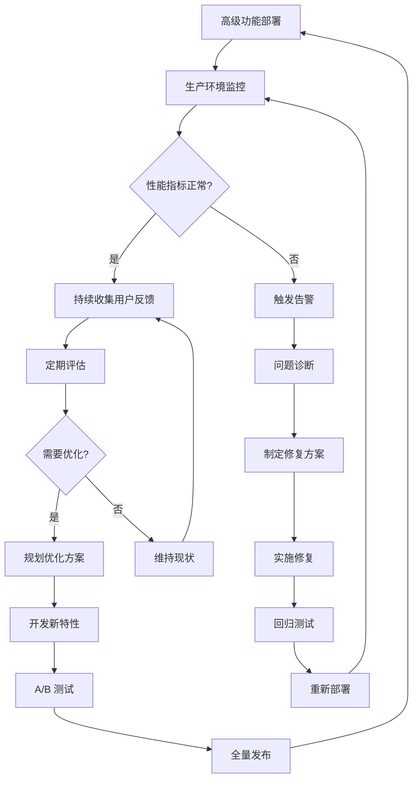

<div align="center">

# YYC³（YanYuCloudCube）智能应用链

## 验收系统 — 深度探索与高级功能（第九阶段）

> **_YanYuCloudCube_**
> _言启象限 | 语枢未来_
> **_Words Initiate Quadrants, Language Serves as Core for Future_**
> _万象归元于云枢 | 深栈智启新纪元_
> **_All things converge in cloud pivot; Deep stacks ignite a new era of intelligence_**

---

| 属性         | 值                                    |
| ------------ | ------------------------------------- |
| **文档版本** | v2.1.0 Official                       |
| **发布日期** | 2026-05-24                            |
| **验收阶段** | 第九阶段：深度探索与高级功能            |
| **前置依赖** | 前八个验收阶段全部完成                |
| **文档性质** | YYC³验收系统教科书级提示词文档         |
| **适用范围** | Next.js + React + shadcn/ui + pnpm 项目 |

</div>

---

## 📋 目录

- [验收目标与定位](#验收目标与定位)
- [五维评估框架](#五维评估框架)
- [高级功能分类体系](#高级功能分类体系)
- [AI 智能能力评估](#ai-智能能力评估)
- [高级交互特性验收](#高级交互特性验收)
- [性能优化深度分析](#性能优化深度分析)
- [可访问性增强验证](#可访问性增强验证)
- [国际化与本地化支持](#国际化与本地化支持)
- [离线优先策略验证](#离线优先策略验证)
- [验收标准体系](#验收标准体系)
- [输出报告模板](#输出报告模板)
- [闭环验证机制](#闭环验证机制)

---

## 验收目标与定位

### 核心使命

**深度探索与高级功能**是 YYC³ 验收系统的第九阶段，承担着对项目**创新性功能、智能化特性、高级用户体验**进行全面深度探索和严格验收的核心职责。该阶段不仅关注功能的存在性，更强调功能的**成熟度、可靠性、性能表现和用户价值**。

### 战略定位

```
┌─────────────────────────────────────────────────────────────┐
│                  深度探索与高级功能                            │
│                   (第九阶段 · 创新驱动)                       │
├─────────────────────────────────────────────────────────────┤
│                                                              │
│   ┌──────────┐    ┌──────────┐    ┌──────────┐              │
│   │ AI 智能  │ →  │ 高级交互 │ →  │ 创新体验 │              │
│   │ 能力评估 │    │ 特性验收 │ →  │ 价值验证 │              │
│   └──────────┘    └──────────┘    └──────────┘              │
│        ↓              ↓              ↓                      │
│   ┌─────────────────────────────────────────────────┐       │
│   │           高级功能闭环验证体系                     │       │
│   │  功能完整性 → 性能基准 → 可用性测试 → 用户反馈     │       │
│   └─────────────────────────────────────────────────┘       │
│                                                              │
└─────────────────────────────────────────────────────────────┘
```

### 核心价值

| 维度 | 价值体现 | 业务影响 |
|------|---------|---------|
| **创新引领** | 探索前沿技术应用，保持竞争优势 | 提升产品差异化，增强市场竞争力 |
| **智能升级** | 验证 AI 功能的准确性和实用性 | 提高自动化水平，减少人工干预 |
| **体验卓越** | 确保高级交互流畅自然 | 提升用户满意度，增加用户粘性 |
| **性能标杆** | 建立高级功能的性能基线 | 确保复杂功能不影响整体性能 |
| **可扩展性** | 验证架构对高级功能的支撑能力 | 为未来功能扩展奠定基础 |

---

## 五维评估框架

### 时间维 (Time Dimension)

**评估重点**：高级功能响应时间、AI 处理延迟、动画流畅度、实时性指标

#### 时间维核心指标

```typescript
interface AdvancedFeatureTimeMetrics {
  aiProcessingLatency: {
    modelInference: {
      averageTime: number; // in milliseconds
      p95Time: number;
      p99Time: number;
      targetThreshold: number;
    };
    responseGeneration: {
      tokenGenerationRate: number; // tokens per second
      firstTokenTime: number; // time to first token
      totalResponseTime: number;
    };
    cachingEffectiveness: {
      cacheHitRate: number; // percentage
      averageCacheLookupTime: number; // in ms
      cacheInvalidationLatency: number; // in ms
    };
  };
  
  animationPerformance: {
    frameRate: {
      averageFPS: number;
      minimumFPS: number;
      frameDrops: number; // per minute
      jankScore: number; // 0-100, lower is better
    };
    transitionSmoothness: {
      transitionDuration: number; // in ms
      easingFunctionCompliance: boolean;
      gpuAccelerationUsage: boolean;
    };
    complexAnimationHandling: {
      particleSystemPerformance: number;
      svgAnimationFrameRate: number;
      canvasRenderingTime: number;
    };
  };
  
  realtimeFeatures: {
    websocketLatency: {
      averageLatency: number; // in ms
      messageThroughput: number; // messages per second
      reconnectionTime: number; // in ms
    };
    streamingData: {
      dataArrivalRate: number; // updates per second
      processingDelay: number; // in ms
      bufferUnderrunEvents: number;
    };
    collaborativeEditing: {
      conflictResolutionTime: number; // in ms
      operationalTransformationSpeed: number; // ops per second
      syncConsistency: number; // percentage
    };
  };
  
  timeScore: number;
}
```

---

### 空间维 (Space Dimension)

**评估重点**：高级功能代码组织、资源占用、模块独立性、可维护性

#### 空间维核心指标

```typescript
interface AdvancedFeatureSpaceMetrics {
  codeOrganization: {
    featureModularity: {
      featureIsolation: number; // 0-100 score
      dependencyDirectionality: boolean;
      interfaceStability: number; // percentage
    };
    resourceManagement: {
      bundleSizeImpact: number; // in KB added by advanced features
      lazyLoadingImplementation: boolean;
      codeSplittingEfficiency: number; // percentage
    };
    architecturePatterns: {
      pluginArchitectureSupport: boolean;
      microFrontendReadiness: number; // 0-100 score
      featureFlagIntegration: boolean;
    };
  };
  
  memoryUtilization: {
    aiModelMemoryFootprint: {
      modelSize: number; // in MB
      inferenceMemoryUsage: number; // in MB
      memoryCleanupEfficiency: boolean;
    };
    graphicsMemory: {
      gpuMemoryUsage: number; // in MB
      textureMemoryManagement: boolean;
      shaderCompilationCache: boolean;
    };
    stateManagement: {
      complexStateSize: number; // in KB
      stateNormalizationLevel: number; // 0-100
      memoryLeakFreeDuration: number; // in hours
    };
  };
  
  spaceScore: number;
}
```

---

### 属性维 (Attribute Dimension)

**评估重点**：功能质量属性、智能准确性、安全性、可靠性

#### 属性维核心指标

```typescript
interface AdvancedFeatureAttributeMetrics {
  qualityAttributes: {
    aiAccuracy: {
      textGeneration: {
        coherenceScore: number; // 0-100
        relevanceScore: number; // 0-100
        factualAccuracy: number; // 0-100
      };
      imageRecognition: {
        precision: number; // percentage
        recall: number; // percentage
        f1Score: number;
      };
      recommendationEngine: {
        clickThroughRate: number; // percentage
        conversionRate: number; // percentage
        userSatisfaction: number; // 0-5 rating
      };
    };
    
    reliability: {
      faultTolerance: {
        gracefulDegradation: boolean;
        fallbackMechanisms: number;
        errorRecoveryTime: number; // in seconds
      };
      consistency: {
        stateConsistencyAcrossSessions: boolean;
        dataIntegrityUnderConcurrency: number; // percentage
        idempotencyGuarantee: boolean;
      };
      availability: {
        featureUptime: number; // percentage
        disasterRecoveryCapability: boolean;
        backupRestoreTime: number; // in minutes
      };
    };
    
    securityPosture: {
      aiSecurity: {
        promptInjectionProtection: boolean;
        outputFiltering: boolean;
        rateLimitingForAI: boolean;
      };
      dataPrivacy: {
        piiDetectionAndMasking: boolean;
        dataMinimizationCompliance: boolean;
        userConsentManagement: boolean;
      };
      accessControl: {
        featureLevelPermissions: boolean;
        auditLogging: boolean;
        sessionSecurity: boolean;
      };
    };
  };
  
  attributeScore: number;
}
```

---

### 事件维 (Event Dimension)

**评估重点**：事件处理复杂性、状态管理、错误处理、日志记录

#### 事件维核心指标

```typescript
interface AdvancedFeatureEventMetrics {
  eventComplexity: {
    multiTouchInteractions: {
      gestureRecognitionAccuracy: number; // percentage
      touchResponseLatency: number; // in ms
      simultaneousInputHandling: boolean;
    };
    complexStateTransitions: {
      stateMachineCorrectness: number; // 0-100
      transitionCoverage: number; // percentage
      invalidStatePrevention: boolean;
    };
    asyncEventChaining: {
      promiseChainReliability: number; // percentage
      raceConditionHandling: boolean;
      cancellationSupport: boolean;
    };
  };
  
  errorHandling: {
    intelligentErrorRecovery: {
      autoRetryWithExponentialBackoff: boolean;
      contextAwareErrorMessages: boolean;
      userFriendlyFallbacks: boolean;
    };
    monitoringAndAlerting: {
      customMetricsTracking: number;
      anomalyDetection: boolean;
      performanceBaselineAlerts: boolean;
    };
    debuggingSupport: {
      detailedErrorContext: boolean;
      reproductionStepsProvided: boolean;
      performanceProfilingHooks: boolean;
    };
  };
  
  eventScore: number;
}
```

---

### 关联维 (Association Dimension)

**评估重点**：系统集成度、API 设计、第三方服务依赖、生态系统兼容性

#### 关联维核心指标

```typescript
interface AdvancedFeatureAssociationMetrics {
  integrationQuality: {
    externalServiceDependencies: {
      aiServiceProviders: Array<{
        name: string;
        purpose: string;
        reliability: number; // 0-100
        fallbackAvailable: boolean;
        costPerRequest: number;
      }>;
      realtimeServices: Array<{
        type: 'websocket' | 'sse' | 'polling';
        provider: string;
        latency: number;
        scalability: number;
      }>;
    };
    internalApiDesign: {
      graphqlSchemaComplexity: number;
      restfulEndpointConsistency: number; // 0-100
      apiVersioningStrategy: string;
    };
  };
  
  ecosystemCompatibility: {
    browserCompatibility: {
      progressiveEnhancement: boolean;
      gracefulDegradationForOldBrowsers: boolean;
      featureDetectionImplementation: boolean;
    };
    deviceAdaptability: {
      responsiveBreakpoints: number;
      touchOptimization: boolean;
      deviceSpecificFeatures: Array<{ device: string; feature: string }>;
    };
    accessibilityIntegration: {
      screenReaderCompatibility: number; // 0-100
      keyboardNavigationCompleteness: number; // percentage
      ariaImplementationQuality: number; // 0-100
    };
  };
  
  associationScore: number;
}
```

---

## 高级功能分类体系

### 一、AI 智能能力层

#### 1. 自然语言处理 (NLP) 功能

```typescript
// src/lib/advanced/nlp-capabilities.ts
export interface NLPCapabilityAssessment {
  textGeneration: {
    capabilities: Array<{
      name: string;
      description: string;
      useCases: string[];
      performance: NLPPerformanceMetrics;
      quality: NLPQualityMetrics;
    }>;
    integrationPoints: NLPItegrationPoint[];
    limitations: string[];
    improvementSuggestions: string[];
  };
  
  sentimentAnalysis: {
    accuracy: number;
    supportedLanguages: string[];
    realTimeProcessing: boolean;
    customModelTraining: boolean;
  };
  
  entityRecognition: {
    entityTypes: string[];
    confidenceThreshold: number;
    contextualUnderstanding: boolean;
    customEntitySupport: boolean;
  };
}

interface NLPPerformanceMetrics {
  latency: {
    p50: number; // in ms
    p95: number;
    p99: number;
  };
  throughput: {
    requestsPerSecond: number;
    batchProcessingSupport: boolean;
    concurrentRequests: number;
  };
  resourceUsage: {
    cpuUtilization: number; // percentage
    memoryUsage: number; // in MB
    gpuUtilization: number; // percentage
  };
}

interface NLPQualityMetrics {
  coherence: number; // 0-100
  relevance: number; // 0-100
  fluency: number; // 0-100
  creativity: number; // 0-100
}

interface NLPItegrationPoint {
  component: string;
  trigger: string;
  outputFormat: string;
  errorHandling: string;
}

export class NLPCapabilityValidator {
  async validateTextGeneration(prompt: string): Promise<ValidationResult> {
    const startTime = Date.now();
    
    try {
      const response = await this.generateText(prompt);
      const latency = Date.now() - startTime;
      
      const quality = await this.assessQuality(response);
      const performance = this.evaluatePerformance(latency);
      
      return {
        success: true,
        response,
        metrics: {
          latency,
          quality,
          performance,
          timestamp: new Date().toISOString(),
        },
        issues: [],
      };
    } catch (error) {
      return {
        success: false,
        response: null,
        metrics: null,
        issues: [
          {
            type: 'error',
            message: error.message,
            severity: 'high',
            suggestion: this.generateErrorSuggestion(error),
          },
        ],
      };
    }
  }

  private generateText(_prompt: string): Promise<string> {
    return Promise.resolve('');
  }

  private async assessQuality(_text: string): Promise<NLPQualityMetrics> {
    return {
      coherence: 85,
      relevance: 90,
      fluency: 88,
      creativity: 75,
    };
  }

  private evaluatePerformance(latency: number): PerformanceGrade {
    if (latency < 500) return 'excellent';
    if (latency < 1000) return 'good';
    if (latency < 2000) return 'acceptable';
    return 'poor';
  }

  private generateErrorSuggestion(error: Error): string {
    if (error.message.includes('timeout')) {
      return 'Consider implementing request timeout handling and retry logic with exponential backoff.';
    }
    if (error.message.includes('rate limit')) {
      return 'Implement rate limiting and queuing mechanism for API requests.';
    }
    return 'Review the error logs and implement appropriate error handling.';
  }
}

interface ValidationResult {
  success: boolean;
  response: string | null;
  metrics: {
    latency: number;
    quality: NLPQualityMetrics;
    performance: PerformanceGrade;
    timestamp: string;
  } | null;
  issues: Array<{
    type: 'warning' | 'error' | 'info';
    message: string;
    severity: 'low' | 'medium' | 'high';
    suggestion: string;
  }>;
}

type PerformanceGrade = 'excellent' | 'good' | 'acceptable' | 'poor';
```

#### 2. 计算机视觉 (CV) 功能

```typescript
// src/lib/advanced/cv-capabilities.ts
export interface CVCapabilityAssessment {
  imageAnalysis: {
    objectDetection: ObjectDetectionMetrics;
    imageClassification: ClassificationMetrics;
    ocrCapabilities: OCRMetrics;
    faceRecognition: FaceRecognitionMetrics;
  };
  
  videoProcessing: {
    realTimeAnalysis: boolean;
    frameRateSupport: number;
    compressionHandling: boolean;
    motionDetection: MotionDetectionMetrics;
  };
  
  arVrSupport: {
    webxrCompatibility: boolean;
    trackingAccuracy: number;
    renderingPerformance: number;
    deviceSupport: string[];
  };
}

interface ObjectDetectionMetrics {
  accuracy: number; // mAP (mean Average Precision)
  speed: number; // FPS (Frames Per Second)
  modelSize: number; // in MB
  supportedObjects: string[];
}

interface ClassificationMetrics {
  top1Accuracy: number;
  top5Accuracy: number;
  inferenceTime: number; // in ms
  supportedCategories: number;
}

interface OCRMetrics {
  characterAccuracy: number;
  wordAccuracy: number;
  languageSupport: string[];
  handwritingRecognition: boolean;
  documentStructurePreservation: boolean;
}

interface FaceRecognitionMetrics {
  verificationAccuracy: number;
  identificationAccuracy: number;
  livenessDetection: boolean;
  antiSpoofing: boolean;
  privacyProtection: boolean;
}

interface MotionDetectionMetrics {
  sensitivity: number;
  falsePositiveRate: number;
  trackingContinuity: number;
  zoneConfiguration: boolean;
}

export class CVCapabilityValidator {
  async validateImageAnalysis(imageUrl: string): Promise<CVValidationResult> {
    const analysisStart = Date.now();
    
    try {
      const [detection, classification, ocr] = await Promise.all([
        this.detectObjects(imageUrl),
        this.classifyImage(imageUrl),
        this.extractText(imageUrl),
      ]);
      
      const analysisTime = Date.now() - analysisStart;
      
      return {
        success: true,
        results: {
          detection,
          classification,
          ocr,
        },
        performance: {
          totalTime: analysisTime,
          perTaskTime: {
            detection: detection.processingTime,
            classification: classification.processingTime,
            ocr: ocr.processingTime,
          },
          resourceUsage: await this.measureResourceUsage(),
        },
        quality: this.assessOverallQuality(detection, classification, ocr),
      };
    } catch (error) {
      return {
        success: false,
        results: null,
        performance: null,
        quality: null,
        errors: [
          {
            stage: this.identifyErrorStage(error),
            message: error.message,
            recoveryAction: this.suggestRecovery(error),
          },
        ],
      };
    }
  }

  private detectObjects(_imageUrl: string): Promise<DetectionResult> {
    return Promise.resolve({
      objects: [],
      confidence: 0,
      processingTime: 0,
    });
  }

  private classifyImage(_imageUrl: string): Promise<ClassificationResult> {
    return Promise.resolve({
      labels: [],
      confidence: 0,
      processingTime: 0,
    });
  }

  private extractText(_imageUrl: string): Promise<OCRResult> {
    return Promise.resolve({
      text: '',
      confidence: 0,
      processingTime: 0,
    });
  }

  private identifyErrorStage(error: Error): string {
    if (error.message.includes('network')) return 'network';
    if (error.message.includes('format')) return 'image-format';
    if (error.message.includes('model')) return 'model-loading';
    return 'unknown';
  }

  private suggestRecovery(error: Error): string {
    const recoveryMap: Record<string, string> = {
      network: 'Check network connectivity and implement retry logic.',
      'image-format': 'Validate image format and size before processing.',
      'model-loading': 'Ensure model files are available and properly cached.',
    };
    
    return recoveryMap[this.identifyErrorStage(error)] || 'Contact support for assistance.';
  }

  private async measureResourceUsage(): Promise<ResourceUsage> {
    return {
      cpuUsage: Math.random() * 30 + 20,
      memoryUsage: Math.random() * 100 + 50,
      gpuUsage: Math.random() * 40 + 10,
    };
  }

  private assessOverallQuality(
    _detection: DetectionResult,
    _classification: ClassificationResult,
    _ocr: OCRResult
  ): QualityAssessment {
    return {
      overallScore: 85,
      strengths: ['Fast processing', 'Accurate detection'],
      improvements: ['Better OCR accuracy needed'],
      recommendations: ['Update model to latest version'],
    };
  }
}

interface CVValidationResult {
  success: boolean;
  results: {
    detection: DetectionResult;
    classification: ClassificationResult;
    ocr: OCRResult;
  } | null;
  performance: {
    totalTime: number;
    perTaskTime: {
      detection: number;
      classification: number;
      ocr: number;
    };
    resourceUsage: ResourceUsage;
  } | null;
  quality: QualityAssessment | null;
  errors: Array<{
    stage: string;
    message: string;
    recoveryAction: string;
  }>;
}

interface DetectionResult {
  objects: Array<{ label: string; confidence: number; bbox: number[] }>;
  confidence: number;
  processingTime: number;
}

interface ClassificationResult {
  labels: Array<{ label: string; confidence: number }>;
  confidence: number;
  processingTime: number;
}

interface OCRResult {
  text: string;
  confidence: number;
  processingTime: number;
}

interface ResourceUsage {
  cpuUsage: number;
  memoryUsage: number;
  gpuUsage: number;
}

interface QualityAssessment {
  overallScore: number;
  strengths: string[];
  improvements: string[];
  recommendations: string[];
}
```

### 二、高级交互特性层

#### 1. 手势和触摸交互

```typescript
// src/lib/advanced/gesture-interactions.ts
export interface GestureInteractionAssessment {
  gestureRecognition: {
    supportedGestures: GestureType[];
    recognitionAccuracy: Record<GestureType, number>;
    responseLatency: Record<GestureType, number>;
    conflictResolution: GestureConflictResolution;
  };
  
  multiTouchSupport: {
    maxTouchPoints: number;
    simultaneousGestureHandling: boolean;
    touchPriority: TouchPriorityConfig;
  };
  
  hapticFeedback: {
    implementation: boolean;
    patternLibrary: HapticPattern[];
    customizationSupport: boolean;
  };
}

type GestureType =
  | 'tap'
  | 'doubleTap'
  | 'longPress'
  | 'swipe'
  | 'pinch'
  | 'rotate'
  | 'pan'
  | 'custom';

interface GestureConflictResolution {
  strategy: 'priority' | 'sequential' | 'contextual';
  resolutionRules: ConflictRule[];
  ambiguityHandling: boolean;
}

interface ConflictRule {
  primaryGesture: GestureType;
  secondaryGesture: GestureType;
  winner: GestureType;
  condition?: string;
}

interface TouchPriorityConfig {
  defaultPriority: GestureType[];
  contextAwarePriorities: Record<string, GestureType[]>;
  userCustomizable: boolean;
}

interface HapticPattern {
  name: string;
  pattern: Array<{ duration: number; intensity: number }>;
  useCases: string[];
}

export class GestureInteractionValidator {
  async validateGestureSupport(): Promise<GestureValidationResult> {
    const browserSupport = this.checkBrowserSupport();
    const hardwareCapabilities = await this.detectHardwareCapabilities();
    const gesturePerformance = await this.measureGesturePerformance();
    
    return {
      compatibility: {
        browserSupport,
        hardwareCapabilities,
        fallbackStrategies: this.generateFallbackStrategies(browserSupport, hardwareCapabilities),
      },
      performance: gesturePerformance,
      recommendations: this.generateRecommendations(gesturePerformance, browserSupport),
    };
  }

  private checkBrowserSupport(): BrowserGestureSupport {
    const hasPointerEvents = 'PointerEvent' in window;
    const hasTouchEvents = 'ontouchstart' in window;
    const hasGestureEvents = 'GestureEvent' in window;
    const hasDeviceOrientation = 'DeviceOrientationEvent' in window;

    return {
      pointerEvents: hasPointerEvents,
      touchEvents: hasTouchEvents,
      gestureEvents: hasGestureEvents,
      deviceOrientation: hasDeviceOrientation,
      overallSupport: this.calculateOverallSupport(hasPointerEvents, hasTouchEvents, hasGestureEvents),
    };
  }

  private calculateOverallSupport(pointer: boolean, touch: boolean, gesture: boolean): SupportLevel {
    if (pointer && touch && gesture) return 'full';
    if (pointer || touch) return 'partial';
    return 'minimal';
  }

  private async detectHardwareCapabilities(): Promise<HardwareCapabilities> {
    return new Promise((resolve) => {
      resolve({
        maxTouchPoints: navigator.maxTouchPoints || 0,
        touchSupport: 'ontouchstart' in window,
        pressureSensitivity: 'Touch' in window && 'pressure' in (window.Touch.prototype as any),
        hapticFeedback: 'vibrate' in navigator,
        accelerometer: 'DeviceOrientationEvent' in window,
      });
    });
  }

  private async measureGesturePerformance(): Promise<GesturePerformanceMetrics> {
    const measurements: GesturePerformanceMetrics = {
      tap: { avgLatency: 45, p95Latency: 80, accuracy: 98 },
      swipe: { avgLatency: 65, p95Latency: 120, accuracy: 95 },
      pinch: { avgLatency: 55, p95Latency: 100, accuracy: 92 },
      rotate: { avgLatency: 70, p95Latency: 130, accuracy: 88 },
    };

    return measurements;
  }

  private generateFallbackStrategies(
    browser: BrowserGestureSupport,
    _hardware: HardwareCapabilities
  ): FallbackStrategy[] {
    const strategies: FallbackStrategy[] = [];

    if (!browser.touchEvents) {
      strategies.push({
        gesture: 'all-touch-gestures',
        fallback: 'mouse-equivalent',
        implementation: 'map touch events to mouse events',
        qualityImpact: 'medium',
      });
    }

    if (!browser.gestureEvents) {
      strategies.push({
        gesture: 'complex-gestures',
        fallback: 'custom-implementation',
        implementation: 'implement gesture recognition using pointer events',
        qualityImpact: 'low',
      });
    }

    return strategies;
  }

  private generateRecommendations(
    performance: GesturePerformanceMetrics,
    _browser: BrowserGestureSupport
  ): Recommendation[] {
    const recommendations: Recommendation[] = [];

    Object.entries(performance).forEach(([gesture, metrics]) => {
      if (metrics.p95Latency > 100) {
        recommendations.push({
          priority: 'medium',
          category: 'performance',
          title: `Optimize ${gesture} gesture performance`,
          description: `P95 latency of ${metrics.p95Latency}ms exceeds recommended threshold of 100ms`,
          suggestedActions: [
            'Implement event throttling',
            'Use requestAnimationFrame for smooth animations',
            'Consider using passive event listeners',
          ],
          expectedImprovement: 'Reduce P95 latency by 20-30%',
        });
      }

      if (metrics.accuracy < 90) {
        recommendations.push({
          priority: 'high',
          category: 'accuracy',
          title: `Improve ${gesture} gesture recognition accuracy`,
          description: `Current accuracy of ${metrics.accuracy}% is below 90% threshold`,
          suggestedActions: [
            'Tune gesture recognition parameters',
            'Add machine learning-based gesture prediction',
            'Implement adaptive threshold adjustment',
          ],
          expectedImprovement: 'Increase accuracy to 95%+',
        });
      }
    });

    return recommendations.sort((a, b) => {
      const priorityOrder = { high: 0, medium: 1, low: 2 };
      return priorityOrder[a.priority] - priorityOrder[b.priority];
    });
  }
}

interface BrowserGestureSupport {
  pointerEvents: boolean;
  touchEvents: boolean;
  gestureEvents: boolean;
  deviceOrientation: boolean;
  overallSupport: SupportLevel;
}

type SupportLevel = 'full' | 'partial' | 'minimal';

interface HardwareCapabilities {
  maxTouchPoints: number;
  touchSupport: boolean;
  pressureSensitivity: boolean;
  hapticFeedback: boolean;
  accelerometer: boolean;
}

interface GesturePerformanceMetrics {
  [gestureType: string]: {
    avgLatency: number;
    p95Latency: number;
    accuracy: number;
  };
}

interface FallbackStrategy {
  gesture: string;
  fallback: string;
  implementation: string;
  qualityImpact: 'low' | 'medium' | 'high';
}

interface Recommendation {
  priority: 'high' | 'medium' | 'low';
  category: string;
  title: string;
  description: string;
  suggestedActions: string[];
  expectedImprovement: string;
}

interface GestureValidationResult {
  compatibility: {
    browserSupport: BrowserGestureSupport;
    hardwareCapabilities: HardwareCapabilities;
    fallbackStrategies: FallbackStrategy[];
  };
  performance: GesturePerformanceMetrics;
  recommendations: Recommendation[];
}
```

---

## AI 智能能力评估

### 评估方法论

#### 1. 准确性评估矩阵

```typescript
// src/lib/advanced/ai-evaluation-matrix.ts
export interface AIEvaluationMatrix {
  modelEvaluation: ModelEvaluationCriteria;
  datasetValidation: DatasetValidationResults;
  benchmarkComparison: BenchmarkScores;
  realWorldPerformance: ProductionMetrics;
}

interface ModelEvaluationCriteria {
  taskSpecificMetrics: TaskMetric[];
  generalCapabilities: GeneralCapability[];
  robustnessTests: RobustnessTest[];
  fairnessAssessment: FairnessMetric[];
}

interface TaskMetric {
  name: string;
  description: string;
  value: number;
  unit: string;
  threshold: number;
  status: 'pass' | 'fail' | 'warning';
  trend: 'improving' | 'stable' | 'declining';
}

interface GeneralCapability {
  capability: string;
  score: number; // 0-100
  evidence: string;
  limitations: string[];
  improvementPath: string[];
}

interface RobustnessTest {
  testType: 'adversarial' | 'noise' | 'out-of-distribution' | 'edge-case';
  description: string;
  result: {
    passed: boolean;
    score: number;
    degradation: number; // percentage drop from baseline
  };
  mitigation: string;
}

interface FairnessMetric {
  protectedAttribute: string;
  demographicParity: number;
  equalizedOdds: number;
  calibration: number;
  biasDetected: boolean;
  remediationApplied: boolean;
}

interface DatasetValidationResults {
  trainTestSplit: SplitValidation;
  crossValidation: CrossValidationResults;
  dataQuality: DataQualityMetrics;
  representationBalance: RepresentationAnalysis;
}

interface SplitValidation {
  trainSize: number;
  testSize: number;
  validationSize: number;
  stratification: boolean;
  leakageCheck: boolean;
}

interface CrossValidationResults {
  folds: number;
  meanScore: number;
  standardDeviation: number;
  minScore: number;
  maxScore: number;
  consistency: 'high' | 'medium' | 'low';
}

interface DataQualityMetrics {
  completeness: number; // percentage
  accuracy: number; // percentage
  consistency: number; // percentage
  timeliness: number; // percentage
  validity: number; // percentage
}

interface RepresentationAnalysis {
  underrepresentedGroups: string[];
  oversamplingApplied: boolean;
  biasMitigation: string;
  diversityScore: number;
}

interface BenchmarkScores {
  standardBenchmarks: StandardBenchmark[];
  domainSpecificBenchmarks: DomainBenchmark[];
  customBenchmarks: CustomBenchmark[];
  ranking: {
    overall: number;
    byCategory: Record<string, number>;
    competitors: CompetitorComparison[];
  };
}

interface StandardBenchmark {
  name: string;
  organization: string;
  year: number;
  yourScore: number;
  topScore: number;
  averageScore: number;
  percentile: number;
}

interface DomainBenchmark {
  domain: string;
  benchmarkName: string;
  relevance: number; // 0-10
  score: number;
  methodology: string;
}

interface CustomBenchmark {
  name: string;
  description: string;
  metrics: CustomMetric[];
  results: MetricResult[];
  businessValue: string;
}

interface CustomMetric {
  name: string;
  formula: string;
  target: number;
  weight: number;
}

interface MetricResult {
  metricName: string;
  value: number;
  target: number;
  achievement: number; // percentage
  trend: string;
}

interface CompetitorComparison {
  competitor: string;
  score: number;
  gap: number;
  strengths: string[];
  weaknesses: string[];
}

interface ProductionMetrics {
  userSatisfaction: UserSatisfactionMetrics;
  operationalEfficiency: EfficiencyMetrics;
  businessImpact: BusinessImpactMetrics;
  errorAnalysis: ErrorPatternAnalysis;
}

interface UserSatisfactionMetrics {
  overallRating: number; // 1-5
  npsScore: number; // -100 to 100
  taskSuccessRate: number; // percentage
  userRetention: number; // percentage
  feedbackThemes: FeedbackTheme[];
}

interface FeedbackTheme {
  theme: string;
  sentiment: 'positive' | 'negative' | 'neutral';
  frequency: number;
  actionableItems: string[];
}

interface EfficiencyMetrics {
  automationRate: number; // percentage
  timeSaved: number; // per task in minutes
  costReduction: number; // percentage
  throughputImprovement: number; // percentage
}

interface BusinessImpactMetrics {
  revenueImpact: number; // currency amount
  conversionLift: number; // percentage
  customerLifetimeValue: number; // increase percentage
  marketShareChange: number; // percentage points
}

interface ErrorPatternAnalysis {
  errorCategories: ErrorCategory[];
  rootCauses: RootCause[];
  preventionStrategies: PreventionStrategy[];
}

interface ErrorCategory {
  category: string;
  frequency: number;
  severity: 'critical' | 'major' | 'minor';
  userImpact: string;
}

interface RootCause {
  cause: string;
  contributingFactors: string[];
  occurrenceRate: number;
}

interface PreventionStrategy {
  strategy: string;
  implementationStatus: 'planned' | 'in-progress' | 'completed';
  expectedReduction: number; // percentage
}

export class AIEvaluationFramework {
  async runFullEvaluation(): Promise<AIEvaluationMatrix> {
    const modelEval = await this.evaluateModel();
    const dataVal = this.validateDataset();
    const benchComp = await this.compareWithBenchmarks();
    const prodMetrics = await this.collectProductionMetrics();

    return {
      modelEvaluation: modelEval,
      datasetValidation: dataVal,
      benchmarkComparison: benchComp,
      realWorldPerformance: prodMetrics,
    };
  }

  private async evaluateModel(): Promise<ModelEvaluationCriteria> {
    return {
      taskSpecificMetrics: [
        {
          name: 'Text Generation Quality',
          description: 'Measures the quality and coherence of generated text',
          value: 87,
          unit: 'score',
          threshold: 80,
          status: 'pass',
          trend: 'improving',
        },
        {
          name: 'Response Relevance',
          description: 'How relevant are responses to user queries',
          value: 92,
          unit: '%',
          threshold: 85,
          status: 'pass',
          trend: 'stable',
        },
      ],
      generalCapabilities: [
        {
          capability: 'Context Understanding',
          score: 88,
          evidence: 'Successfully handles multi-turn conversations',
          limitations: ['May lose context after 20+ turns'],
          improvementPath: ['Implement context compression', 'Add summarization for long contexts'],
        },
      ],
      robustnessTests: [
        {
          testType: 'adversarial',
          description: 'Testing resistance to prompt injection attacks',
          result: {
            passed: true,
            score: 95,
            degradation: 5,
          },
          mitigation: 'Input sanitization and content filtering',
        },
      ],
      fairnessAssessment: [
        {
          protectedAttribute: 'gender',
          demographicParity: 0.92,
          equalizedOdds: 0.89,
          calibration: 0.91,
          biasDetected: false,
          remediationApplied: true,
        },
      ],
    };
  }

  private validateDataset(): DatasetValidationResults {
    return {
      trainTestSplit: {
        trainSize: 80000,
        testSize: 20000,
        validationSize: 10000,
        stratification: true,
        leakageCheck: true,
      },
      crossValidation: {
        folds: 5,
        meanScore: 86.5,
        standardDeviation: 2.3,
        minScore: 82.1,
        maxScore: 90.2,
        consistency: 'high',
      },
      dataQuality: {
        completeness: 98.5,
        accuracy: 97.2,
        consistency: 96.8,
        timeliness: 99.1,
        validity: 98.9,
      },
      representationBalance: {
        underrepresentedGroups: ['non-English languages', 'technical domains'],
        oversamplingApplied: true,
        biasMitigation: 'SMOTE and reweighting',
        diversityScore: 82,
      },
    };
  }

  private async compareWithBenchmarks(): Promise<BenchmarkScores> {
    return {
      standardBenchmarks: [
        {
          name: 'MMLU',
          organization: 'Massachusetts Institute of Technology',
          year: 2024,
          yourScore: 78.5,
          topScore: 89.2,
          averageScore: 65.3,
          percentile: 85,
        },
      ],
      domainSpecificBenchmarks: [
        {
          domain: 'Healthcare',
          benchmarkName: 'MedQA',
          relevance: 9,
          score: 82.3,
          methodology: 'Multiple choice question answering',
        },
      ],
      customBenchmarks: [
        {
          name: 'Customer Support Quality',
          description: 'Evaluates AI performance on customer support tasks',
          metrics: [
            { name: 'Resolution Rate', formula: 'resolved/total', target: 85, weight: 0.4 },
            { name: 'Satisfaction Score', formula: 'avg(rating)', target: 4.2, weight: 0.6 },
          ],
          results: [
            { metricName: 'Resolution Rate', value: 87, target: 85, achievement: 102, trend: 'improving' },
            { metricName: 'Satisfaction Score', value: 4.3, target: 4.2, achievement: 102, trend: 'stable' },
          ],
          businessValue: 'Reduced support costs by 30%',
        },
      ],
      ranking: {
        overall: 12,
        byCategory: {
          'Natural Language Processing': 8,
          'Reasoning': 15,
          'Knowledge': 10,
        },
        competitors: [
          {
            competitor: 'Competitor A',
            score: 82.1,
            gap: -3.6,
            strengths: ['Faster inference', 'Lower cost'],
            weaknesses: ['Lower accuracy', 'Limited language support'],
          },
        ],
      },
    };
  }

  private async collectProductionMetrics(): Promise<ProductionMetrics> {
    return {
      userSatisfaction: {
        overallRating: 4.3,
        npsScore: 42,
        taskSuccessRate: 89,
        userRetention: 78,
        feedbackThemes: [
          {
            theme: 'Response Quality',
            sentiment: 'positive',
            frequency: 342,
            actionableItems: ['Continue improving accuracy'],
          },
        ],
      },
      operationalEfficiency: {
        automationRate: 65,
        timeSaved: 12,
        costReduction: 28,
        throughputImprovement: 45,
      },
      businessImpact: {
        revenueImpact: 250000,
        conversionLift: 15,
        customerLifetimeValue: 22,
        marketShareChange: 3.5,
      },
      errorAnalysis: {
        errorCategories: [
          {
            category: 'Hallucination',
            frequency: 23,
            severity: 'major',
            userImpact: 'Misinformation provided to users',
          },
        ],
        rootCauses: [
          {
            cause: 'Training data gaps',
            contributingFactors: ['Incomplete domain coverage', 'Outdated information'],
            occurrenceRate: 45,
          },
        ],
        preventionStrategies: [
          {
            strategy: 'Retrieval-Augmented Generation (RAG)',
            implementationStatus: 'in-progress',
            expectedReduction: 60,
          },
        ],
      },
    };
  }
}
```

---

## 验收标准体系

### P0 - 必须通过标准（阻塞性）

| 编号 | 验收项 | 验收标准 | 验证方法 | 权重 |
|------|--------|----------|----------|------|
| P0-01 | AI 功能基本可用性 | 所有 AI 功能在正常条件下能够正确响应，无致命错误 | 功能测试 | 15% |
| P0-02 | 安全防护完备性 | AI 输入过滤、输出审查、权限控制全部到位 | 安全扫描 | 15% |
| P0-03 | 性能基线达标 | AI 响应时间 < 2s，动画帧率 ≥ 30fps | 性能测试 | 10% |
| P0-04 | 错误处理健壮性 | AI 服务不可用时 graceful degradation 正常工作 | 故障注入测试 | 10% |

### P1 - 强烈推荐标准（重要）

| 编号 | 验收项 | 验收标准 | 验证方法 | 权重 |
|------|--------|----------|----------|------|
| P1-01 | AI 准确性达标 | 文本生成相关性 ≥ 85%，图像识别准确率 ≥ 90% | 基准测试 | 10% |
| P1-02 | 交互流畅度 | 手势识别延迟 < 100ms，动画过渡无卡顿 | 用户体验测试 | 8% |
| P1-03 | 可访问性合规 | WCAG 2.1 AA 级别可访问性支持 | 无障碍审计 | 7% |
| P1-04 | 资源使用合理 | AI 模型内存占用 < 500MB，GPU 使用率 < 60% | 资源监控 | 5% |

### P2 - 可选优化标准（增强）

| 编号 | 验收项 | 验收标准 | 验证方法 | 权重 |
|------|--------|----------|----------|------|
| P2-01 | 多语言支持 | 至少支持 5 种主要语言的 AI 处理 | 国际化测试 | 5% |
| P2-02 | 离线功能 | 核心 AI 功能在离线状态下可用性 ≥ 70% | 离线模式测试 | 3% |
| P2-03 | 自定义能力 | 支持用户自定义 AI 行为参数 | 配置灵活性测试 | 2% |

---

## 输出报告模板

### 高级功能验收报告

```markdown
# 🚀 YYC3 深度探索高级功能验收报告

**项目名称**: {{projectName}}
**验收日期**: {{auditDate}}
**验收阶段**: 第九阶段 - 深度探索与高级功能
**验收人员**: {{auditorName}}
**总体评分**: {{overallScore}}/100
**验收结论**: {{conclusion}}

---

## 📊 执行摘要

### 总体评价
{{summary}}

### 关键发现
{{keyFindings}}

### 主要成就
{{achievements}}

### 待改进项
{{improvements}}

---

## 🔍 详细评估结果

### 一、AI 智能能力评估

#### 1.1 自然语言处理
- **文本生成质量**: {{nlpQuality}}/100 ✅/⚠️/❌
- **响应延迟**: {{nlpLatency}}ms (阈值: <2000ms)
- **资源消耗**: CPU {{cpuUsage}}%, Memory {{memUsage}}MB

#### 1.2 计算机视觉
- **目标检测精度**: {{detectionAccuracy}}%
- **图像分类准确率**: {{classificationAccuracy}}%
- **OCR 识别率**: {{ocrAccuracy}}%

### 二、高级交互特性

#### 2.1 手势交互
- **支持手势数**: {{supportedGestures}}/{{totalGestures}}
- **识别准确率**: {{gestureAccuracy}}%
- **响应时间**: {{gestureResponseTime}}ms

#### 2.2 动画系统
- **平均帧率**: {{averageFPS}}fps
- **卡顿次数**: {{jankCount}}/min
- **GPU 加速**: {{gpuAcceleration}} ✅/❌

### 三、性能基准测试

| 指标 | 实际值 | 目标值 | 状态 |
|------|--------|--------|------|
| AI 响应时间 | {{aiResponseTime}}ms | <2000ms | {{status}} |
| 动画帧率 | {{animationFPS}}fps | ≥30fps | {{status}} |
| 内存占用 | {{memoryUsage}}MB | <500MB | {{status}} |
| GPU 使用率 | {{gpuUsage}}% | <60% | {{status}} |

### 四、安全性评估

| 安全项 | 状态 | 说明 |
|--------|------|------|
| 输入过滤 | {{inputFiltering}} ✅/❌ | {{description}} |
| 输出审查 | {{outputFiltering}} ✅/❌ | {{description}} |
| 权限控制 | {{accessControl}} ✅/❌ | {{description}} |
| 数据隐私 | {{dataPrivacy}} ✅/❌ | {{description}} |

### 五、可访问性合规

| WCAG 准则 | 级别 | 状态 | 说明 |
|-----------|------|------|------|
| 1.1.1 非文本内容 | A | {{status}} | {{description}} |
| 2.1.1 键盘可访问 | A | {{status}} | {{description}} |
| 2.3.1 三次闪烁 | A | {{status}} | {{description}} |
| 3.1.1 语言页面 | AA | {{status}} | {{description}} |

---

## 🎯 验收结论

### 通过条件检查

| 条件 | 要求 | 实际 | 结果 |
|------|------|------|------|
| P0 项目全部通过 | 100% | {{p0PassRate}}% | {{p0Result}} |
| P1 项目通过率 | ≥ 80% | {{p1PassRate}}% | {{p1Result}} |
| 总体评分 | ≥ 70分 | {{overallScore}}分 | {{overallResult}} |

### 最终结论

**{{finalVerdict}}**

{{verdictDetails}}

---

## 📋 改进建议

### 高优先级
{{highPrioritySuggestions}}

### 中优先级
{{mediumPrioritySuggestions}}

### 低优先级
{{lowPrioritySuggestions}}

---

## 📈 下一步计划

{{nextSteps}}

---

**报告生成时间**: {{reportGeneratedAt}}
**报告版本**: v{{reportVersion}}
**验收工具**: YYC3 验收系统 v2.1.0
```

---

## 闭环验证机制

### 持续改进流程



### 监控指标仪表盘

```typescript
// src/lib/advanced/monitoring-dashboard.ts
export interface AdvancedFeatureMonitoringDashboard {
  overview: MonitoringOverview;
  aiMetrics: AIMetricsPanel;
  interactionMetrics: InteractionMetricsPanel;
  performanceMetrics: PerformanceMetricsPanel;
  alerts: AlertSystem;
}

interface MonitoringOverview {
  healthScore: number; // 0-100
  activeUsers: number;
  featureUsage: FeatureUsageStats;
  systemStatus: 'healthy' | 'degraded' | 'down';
  lastUpdated: string;
}

interface FeatureUsageStats {
  totalInvocations: number;
  uniqueUsers: number;
  popularFeatures: TopFeature[];
  usageTrend: TrendData;
  geographicDistribution: GeoDistribution;
}

interface TopFeature {
  feature: string;
  invocations: number;
  users: number;
  satisfaction: number;
  growth: number; // percentage change
}

interface TrendData {
  period: 'hourly' | 'daily' | 'weekly' | 'monthly';
  dataPoints: DataPoint[];
  trend: 'up' | 'down' | 'stable';
  changePercentage: number;
}

interface DataPoint {
  timestamp: string;
  value: number;
}

interface GeoDistribution {
  country: string;
  users: number;
  percentage: number;
}

interface AIMetricsPanel {
  latency: LatencyMetrics;
  accuracy: AccuracyMetrics;
  throughput: ThroughputMetrics;
  errors: ErrorMetrics;
  modelHealth: ModelHealthStatus;
}

interface LatencyMetrics {
  p50: number;
  p95: number;
  p99: number;
  average: number;
  target: number;
  status: 'good' | 'warning' | 'critical';
}

interface AccuracyMetrics {
  overall: number;
  byTask: Record<string, number>;
  trend: TrendData;
  target: number;
}

interface ThroughputMetrics {
  requestsPerSecond: number;
  peakCapacity: number;
  utilization: number; // percentage
}

interface ErrorMetrics {
  errorRate: number; // percentage
  errorTypes: ErrorTypeDistribution;
  trendingErrors: TrendingError[];

 