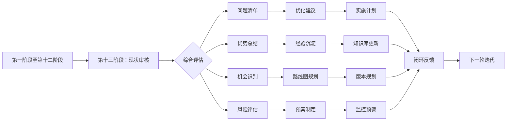

<div align="center">

# YYC³（YanYuCloudCube）智能应用链

## 验收系统 — 现状审核与分析建议（第十三阶段）

> **_YanYuCloudCube_**
> _言启象限 | 语枢未来_
> **_Words Initiate Quadrants, Language Serves as Core for Future_**
> _万象归元于云枢 | 深栈智启新纪元_
> **_All things converge in cloud pivot; Deep stacks ignite a new era of intelligence_**

---

| 属性         | 值                                    |
| ------------ | ------------------------------------- |
| **文档版本** | v2.1.0 Official                       |
| **发布日期** | 2026-05-24                            |
| **验收阶段** | 第十三阶段：现状审核与分析建议          |
| **前置依赖** | 前十二个验收阶段全部完成               |
| **文档性质** | YYC³验收系统教科书级提示词文档         |
| **适用范围** | Next.js + React + shadcn/ui + pnpm 项目 |

</div>

---

## 📋 目录

- [验收目标与定位](#验收目标与定位)
- [五维评估框架](#五维评估框架)
- [现状审核核心内容](#现状审核核心内容)
- [多维度分析方法论](#多维度分析方法论)
- [问题识别与分类体系](#问题识别与分类体系)
- [优化建议生成机制](#优化建议生成机制)
- [优先级排序策略](#优先级排序策略)
- [实施路径规划](#实施路径规划)
- [验收标准体系](#验收标准体系)
- [输出报告模板](#输出报告模板)
- [闭环验证机制](#闭环验证机制)
- [工具链配置](#工具链配置)
- [最佳实践案例](#最佳实践案例)

---

## 验收目标与定位

### 核心使命

**现状审核与分析建议**是 YYC³ 验收系统的最终阶段，承担着对整个项目进行**全局性、系统性、前瞻性**审查的核心职责。该阶段不局限于发现问题和提出建议，更强调通过**数据驱动的决策支持**，为项目的持续演进提供科学依据。

### 战略定位

```
┌─────────────────────────────────────────────────────────────┐
│                    现状审核与分析建议                          │
│                   (第十三阶段 · 终极验收)                      │
├─────────────────────────────────────────────────────────────┤
│                                                              │
│   ┌──────────┐    ┌──────────┐    ┌──────────┐              │
│   │ 全局扫描 │ →  │ 深度分析 │ →  │ 智能建议 │              │
│   │ 全面感知 │    │ 多维洞察 │    │ 精准施策 │              │
│   └──────────┘    └──────────┘    └──────────┘              │
│        ↓              ↓              ↓                      │
│   ┌─────────────────────────────────────────────────┐       │
│   │              闭环优化与持续演进                    │       │
│   │   问题识别 → 分析诊断 → 建议生成 → 实施跟踪 → 效果验证   │       │
│   └─────────────────────────────────────────────────┘       │
│                                                              │
└─────────────────────────────────────────────────────────────┘
```

### 核心价值

| 维度 | 价值体现 | 业务影响 |
|------|---------|---------|
| **全局视野** | 打破信息孤岛，建立项目全景视图 | 提升决策质量，避免局部优化 |
| **数据驱动** | 基于客观数据而非主观判断 | 减少决策偏差，提高准确性 |
| **前瞻性** | 识别潜在风险和机会 | 降低未来成本，把握发展先机 |
| **可操作性** | 提供具体可行的行动方案 | 缩短从分析到实施的周期 |
| **闭环性** | 建立持续改进的良性循环 | 确保优化措施落地见效 |

### 与其他阶段的关系



---

## 五维评估框架

### 时间维 (Time Dimension)

**评估重点**：项目演进效率、技术债务累积、响应速度、交付节奏

#### 时间维核心指标

```typescript
interface TimeDimensionMetrics {
  projectEvolution: {
    developmentVelocity: {
      commitsPerWeek: number;
      featuresPerSprint: number;
      bugFixRate: number;
      codeChurnRate: number;
    };
    deliveryRhythm: {
      releaseFrequency: string; // e.g., "weekly", "bi-weekly"
      leadTimeForChanges: number; // in days
      deploymentFrequency: string;
      meanTimeToRecovery: number; // in hours
    };
    timeToMarket: {
      featureConceptToDelivery: number; // in days
      bugReportToFix: number; // in hours;
      hotfixResponseTime: number; // in hours;
    };
  };
  
  technicalDebt: {
    codeAgeMetrics: {
      averageFileAge: number; // in days
      oldestUnchangedFiles: Array<{
        path: string;
        lastModified: Date;
        age: number;
      }>;
      codeRotIndex: number; // 0-100 scale
    };
    dependencyAging: {
      outdatedDependencies: number;
      vulnerableDependencies: number;
      deprecatedAPIsUsed: number;
      lastDependencyUpdate: Date;
    };
    documentationLag: {
      codeDocSyncRate: number; // percentage
      apiDocAccuracy: number; // percentage
      changelogCompleteness: number; // percentage
    };
  };
  
  responsiveness: {
    issueResolutionTime: {
      criticalIssues: { avgHours: number; maxHours: number };
      highIssues: { avgDays: number; maxDays: number };
      mediumIssues: { avgDays: number; maxDays: number };
      lowIssues: { avgDays: number; maxDays: number };
    };
    feedbackLoopEfficiency: {
      userFeedbackToAction: number; // in days
      monitoringAlertToResponse: number; // in minutes;
      reviewCycleTime: number; // in hours;
    };
  };
  
  timeScore: number; // 0-100 composite score
  timeTrends: {
    improving: string[];
    stable: string[];
    declining: string[];
    recommendations: string[];
  };
}
```

#### 时间维评估方法

1. **Git 历史分析**
   - 使用 `git log` 统计提交频率
   - 分析代码变更模式
   - 识别热点文件和高频修改区域
   - 计算开发速度指标

2. **Issue 跟踪系统分析**
   - 统计问题解决时间分布
   - 分析问题类型和严重程度
   - 评估响应效率和解决质量
   - 识别瓶颈环节

3. **CI/CD 流水线分析**
   - 统计构建和部署频率
   - 测量交付周期时间
   - 分析失败率和恢复时间
   - 评估自动化程度

4. **依赖关系时间分析**
   - 检查依赖包的年龄和更新历史
   - 识别过时或废弃的依赖
   - 评估安全漏洞风险
   - 制定升级计划

---

### 空间维 (Space Dimension)

**评估重点**：代码组织结构、架构合理性、资源利用效率、模块化程度

#### 空间维核心指标

```typescript
interface SpaceDimensionMetrics {
  architectureQuality: {
    structureAnalysis: {
      directoryDepth: number;
      fileDistribution: Record<string, number>;
      moduleCouplingScore: number; // 0-100, lower is better
      cohesionIndex: number; // 0-100, higher is better
    };
    patternCompliance: {
      designPatternUsage: Record<string, number>;
      antiPatternDetection: Array<{
        pattern: string;
        location: string;
        severity: 'high' | 'medium' | 'low';
        suggestion: string;
      }>;
      architecturalSmells: Array<{
        smell: string;
        affectedComponents: string[];
        impact: string;
        remediation: string;
      }>;
    };
    componentOrganization: {
      componentCount: number;
      averageComponentSize: number; // in lines of code
      reusableComponentRatio: number; // percentage
      componentDependencyGraph: object;
    };
  };
  
  resourceUtilization: {
    bundleAnalysis: {
      totalBundleSize: number; // in KB
      chunkSizes: Array<{ name: string; size: number; gzipSize: number }>;
      largestModules: Array<{ module: string; size: number }>;
      treeShakingEfficiency: number; // percentage
    };
    memoryFootprint: {
      initialLoadMemory: number; // in MB
      peakMemoryUsage: number; // in MB
      memoryLeakIndicators: number;
      garbageCollectionFrequency: number;
    };
    storageUtilization: {
      databaseSize: number; // in MB
      cacheSize: number; // in MB
      logStorageGrowth: number; // per day in MB
      assetOptimizationRate: number; // percentage
    };
  };
  
  modularityAssessment: {
    separationOfConcerns: {
      layerAdherence: Record<string, boolean>; // presentation, business, data layers
      responsibilityClarity: number; // 0-100 score
      interfaceStability: number; // percentage of stable interfaces
    };
    reusabilityMetrics: {
      sharedUtilityCount: number;
      customHookUsage: number;
      componentLibraryCoverage: number; // percentage
      codeDuplicationRate: number; // lower is better
    };
    scalabilityIndicators: {
      horizontalScalingReadiness: number; // 0-100
      verticalScalingHeadroom: number; // 0-100
      microservicesMigrationPotential: number; // 0-100
    };
  };
  
  spaceScore: number;
  spaceVisualization: {
    architectureMap: string; // URL or base64 encoded diagram
    dependencyGraph: string;
    moduleRelationshipMatrix: string[][];
  };
}
```

#### 空间维评估方法

1. **静态代码分析**
   - 使用 ESLint、TypeScript 编译器分析代码结构
   - 运行 `madge` 生成依赖图
   - 使用 `depcheck` 检测未使用的依赖
   - 执行 `bundle-analyzer` 分析打包结果

2. **架构模式检测**
   - 识别设计模式和反模式
   - 检测架构异味（Architectural Smells）
   - 评估组件职责划分
   - 分析模块耦合度

3. **资源使用 profiling**
   - 使用 Chrome DevTools 分析内存使用
   - 运行 Lighthouse 评估性能
   - 使用 WebPageTest 测量加载时间
   - 监控运行时资源消耗

4. **模块化程度评估**
   - 统计组件复用率
   - 分析代码重复度
   - 评估接口稳定性
   - 测试模块独立性

---

### 属性维 (Attribute Dimension)

**评估重点**：代码质量属性、可维护性、安全性、性能特征、可靠性

#### 属性维核心指标

```typescript
interface AttributeDimensionMetrics {
  qualityAttributes: {
    maintainability: {
      cyclomaticComplexity: {
        average: number;
        maximum: number;
        functionsExceedingThreshold: number;
        recommendedMaximum: number;
      };
      cognitiveComplexity: {
        average: number;
        maximum: number;
        filesNeedingRefactoring: number;
      };
      codeReadability: {
        namingConventionScore: number; // 0-100
        commentQualityScore: number; // 0-100
        formattingConsistency: number; // 0-100
      };
      testability: {
        mockableDependencies: number;
        sideEffectFreeFunctions: number;
        dependencyInjectionUsage: number;
      };
    };
    
    reliability: {
      errorHandling: {
        tryCatchCoverage: number; // percentage
        errorBoundaryUsage: number;
        gracefulDegradationScore: number; // 0-100
      };
      faultTolerance: {
        retryMechanismCount: number;
        circuitBreakerImplementation: number;
        fallbackStrategyCount: number;
      };
      stabilityMetrics: {
        crashFreeRate: number; // percentage
        uptimePercentage: number;
        meanTimeBetweenFailures: number; // in hours
      };
    };
    
    securityPosture: {
      vulnerabilityAssessment: {
        criticalVulnerabilities: number;
        highVulnerabilities: number;
        mediumVulnerabilities: number;
        lowVulnerabilities: number;
        vulnerabilityDensity: number; // per KLOC
      };
      securityControls: {
        authenticationStrength: number; // 0-100
        authorizationGranularity: number; // 0-100
        inputValidationCoverage: number; // percentage
        encryptionImplementation: number; // 0-100
      };
      complianceStatus: {
        gdprCompliance: number; // percentage
        owaspTop10Coverage: number; // percentage
        securityHeadersImplemented: number; // out of recommended headers
      };
    };
    
    performanceCharacteristics: {
      speedMetrics: {
        firstContentfulPaint: number; // in ms
        largestContentfulPaint: number; // in ms
        timeToInteractive: number; // in ms
        cumulativeLayoutShift: number; // score 0-1
      };
      efficiencyMetrics: {
        bundleSize: number; // in KB
        requestCount: number;
        serverResponseTime: number; // in ms
        resourceUtilization: number; // percentage
      };
      scalabilityMetrics: {
        concurrentUserSupport: number;
        throughputCapacity: number; // requests per second
        databaseQueryPerformance: number; // average query time in ms
      };
    };
  };
  
  attributeScore: number;
  attributeHeatmap: {
    strengths: Array<{ attribute: string; score: number; evidence: string }>;
    weaknesses: Array<{ attribute: string; score: number; gap: number; improvement: string }>;
    opportunities: Array<{ attribute: string; potential: number; action: string }>;
  };
}
```

#### 属性维评估方法

1. **代码质量度量**
   - 使用 SonarQube 或 CodeClimate 进行静态分析
   - 运行 Complexity Report 工具计算复杂度
   - 执行 ESLint 规则检查
   - 使用 Prettier 检查格式一致性

2. **可靠性测试**
   - 执行混沌工程测试（Chaos Engineering）
   - 运行负载测试和压力测试
   - 进行故障注入测试
   - 监控错误率和服务可用性

3. **安全扫描**
   - 运行 OWASP ZAP 进行动态扫描
   - 使用 Snyk 或 Dependabot 检查依赖漏洞
   - 执行 npm audit 安全审计
   - 进行渗透测试（如适用）

4. **性能基准测试**
   - 使用 Lighthouse 进行性能评分
   - 运行 WebPageTest 进行详细测量
   - 使用 Chrome DevTools 进行 Profiling
   - 执行真实用户监控（RUM）

---

### 事件维 (Event Dimension)

**评估重点**：事件处理机制、异常处理能力、日志记录完整性、监控覆盖度

#### 事件维核心指标

```typescript
interface EventDimensionMetrics {
  eventHandling: {
    userInteractionEvents: {
      eventListenerCount: number;
      eventDelegationUsage: number;
      eventBubblingHandling: number;
      memoryLeakRiskEvents: number;
    };
    systemEvents: {
      lifecycleEventHandling: number;
      errorEventCapturing: number;
      networkEventMonitoring: number;
      stateChangeEventTracking: number;
    };
    asyncOperations: {
      promiseHandling: number;
      asyncAwaitUsage: number;
      errorBoundaryImplementation: number;
      loadingStateManagement: number;
    };
  };
  
  exceptionManagement: {
    errorCapture: {
      globalErrorHandler: boolean;
      reactErrorBoundaries: number;
      apiErrorInterceptors: number;
      unhandledRejectionHandler: boolean;
    };
    errorReporting: {
      errorTrackingService: string; // e.g., Sentry, LogRocket
      errorContextEnrichment: boolean;
      userFeedbackOnError: boolean;
      automaticErrorReporting: boolean;
    };
    recoveryMechanisms: {
      retryStrategies: number;
      fallbackImplementations: number;
      rollbackCapabilities: number;
      circuitBreakerPatterns: number;
    };
  };
  
  loggingSystem: {
    logCompleteness: {
      coverageByModule: Record<string, number>; // percentage per module
      logLevelDistribution: Record<string, number>;
      structuredLoggingUsage: number; // percentage
      piiLoggingRisk: number; // count of potential PII logs
    };
    logQuality: {
      correlationIdUsage: boolean;
      timestampPrecision: string;
      contextEnrichment: number; // 0-100 score
      searchableFields: string[];
    };
    logInfrastructure: {
      logAggregationService: string;
      retentionPolicy: string;
      alertingRules: number;
      dashboardAvailability: boolean;
    };
  };
  
  monitoringCoverage: {
    applicationPerformanceMonitoring: {
      apmTool: string;
      customMetrics: number;
      transactionTracing: boolean;
      realUserMonitoring: boolean;
    };
    infrastructureMonitoring: {
      serverHealthChecks: number;
      databaseMonitoring: boolean;
      networkLatencyTracking: boolean;
      resourceUtilizationAlerts: number;
    };
    businessMetricTracking: {
      conversionFunnels: number;
      userJourneyMapping: boolean;
      featureUsageAnalytics: boolean;
      errorImpactAnalysis: boolean;
    };
  };
  
  eventScore: number;
  eventFlowDiagram: string; // URL or base64 encoded diagram
}
```

#### 事件维评估方法

1. **事件流分析**
   - 使用 React DevTools Profiler 分析事件处理
   - 检查事件监听器的添加和移除
   - 分析内存泄漏风险（未清理的事件监听器）
   - 评估事件委托的使用情况

2. **异常处理审计**
   - 检查 Error Boundary 的实现
   - 验证全局错误处理器
   - 测试异步操作的错误捕获
   - 评估恢复机制的完备性

3. **日志系统评估**
   - 分析日志覆盖率
   - 检查日志质量和结构化程度
   - 评估 PII 数据泄露风险
   - 验证日志基础设施配置

4. **监控体系审查**
   - 检查 APM 工具集成
   - 评估自定义指标定义
   - 验证告警规则配置
   - 测试监控仪表盘可用性

---

### 关联维 (Association Dimension)

**评估重点**：系统集成度、API 设计质量、第三方依赖管理、生态系统兼容性

#### 关联维核心指标

```typescript
interface AssociationDimensionMetrics {
  integrationQuality: {
    internalIntegrations: {
      moduleIntegrationPoints: number;
      interServiceCommunication: number;
      sharedStateManagement: number;
      crossModuleDependencies: number;
    };
    externalIntegrations: {
      thirdPartyAPIs: Array<{
        name: string;
        purpose: string;
        status: 'active' | 'deprecated' | 'unstable';
        fallbackAvailable: boolean;
        rateLimitHandling: boolean;
      }>;
      webhookEndpoints: number;
      callbackHandlers: number;
      externalDataSources: number;
    };
    integrationTesting: {
      integrationTestCoverage: number; // percentage
      contractTests: number;
      endToEndTestScenarios: number;
      mockServerUsage: number;
    };
  };
  
  apiDesignQuality: {
    restfulCompliance: {
      endpointNamingConvention: boolean;
      httpMethodCorrectness: number; // percentage
      statusCodeUsage: Record<string, number>;
      versioningStrategy: string;
    };
    graphqlQuality: {
      schemaDesign: number; // 0-100 score
      resolverEfficiency: number; // 0-100 score
      queryComplexityLimits: boolean;
      paginationImplementation: boolean;
    };
    documentationQuality: {
      openapiSpecCompleteness: number; // percentage
      exampleRequestsProvided: boolean;
      errorResponseDocumented: boolean;
      sdkGenerationAvailable: boolean;
    };
  };
  
  dependencyManagement: {
    directDependencies: {
      total: number;
      production: number;
      development: number;
      peer: number;
      optional: number;
    };
    transitiveDependencies: {
      total: number;
      depth: number;
      duplicateVersions: number;
      licenseConflicts: number;
    };
    dependencyHealth: {
      outdatedCount: number;
      vulnerableCount: number;
      deprecatedCount: number;
      unmaintainedCount: number;
      lastAuditDate: Date;
    };
    optimizationOpportunities: {
      replaceableDependencies: Array<{ current: string; alternative: string; benefit: string }>;
      deduplicationCandidates: string[];
      treeShakingImprovements: string[];
    };
  };
  
  ecosystemCompatibility: {
    frameworkCompatibility: {
      nextjsVersion: string;
      reactVersion: string;
      nodeVersion: string;
      compatibilityIssues: string[];
    };
    toolchainIntegration: {
      typescriptVersion: string;
      eslintConfig: string;
      prettierConfig: string;
      testingFramework: string;
    };
    communityStandards: {
      contributionGuidelines: boolean;
      codeOfConduct: boolean;
      changelogMaintained: boolean;
      semverFollowed: boolean;
    };
  };
  
  associationScore: number;
  dependencyGraph: string; // URL or visualization
  riskMatrix: {
    highRiskDependencies: Array<{ name: string; reason: string; mitigation: string }>;
    singlePointsOfFailure: string[];
    couplingHotspots: Array<{ components: string[]; couplingLevel: number }>;
  };
}
```

#### 关联维评估方法

1. **集成点映射**
   - 使用依赖分析工具绘制集成图
   - 识别所有内部和外部集成点
   - 评估集成的必要性和有效性
   - 检测过度耦合的区域

2. **API 质量评估**
   - 使用 OpenAPI 规范验证 REST API
   - 检查 GraphQL schema 设计质量
   - 评估 API 文档完整性
   - 测试 API 版本管理策略

3. **依赖健康检查**
   - 运行 `npm audit` 检查安全漏洞
   - 使用 `npm outdated` 查看过时依赖
   - 执行 `license-checker` 检查许可证合规性
   - 分析依赖树深度和复杂度

4. **生态系统兼容性验证**
   - 检查框架和库的版本兼容性
   - 验证工具链配置的一致性
   - 评估社区标准的遵循程度
   - 测试跨平台兼容性

---

## 现状审核核心内容

### 全局扫描策略

#### 1. 代码库全量扫描

```bash
#!/bin/bash
# YYC3-现状审核-全量扫描脚本

echo "🚀 开始 YYC3 现状审核全量扫描..."
echo "================================"

# 1. TypeScript 类型检查
echo ""
echo "📋 [1/8] TypeScript 类型检查..."
pnpm tsc --noEmit 2>&1 | tee typecheck-report.txt
TYPECHECK_EXIT=$?

# 2. ESLint 代码规范检查
echo ""
echo "📋 [2/8] ESLint 代码规范检查..."
pnpm lint 2>&1 | tee eslint-report.txt
LINT_EXIT=$?

# 3. Prettier 格式检查
echo ""
echo "📋 [3/8] Prettier 格式检查..."
pnpm format:check 2>&1 | tee prettier-report.txt
FORMAT_EXIT=$?

# 4. 测试覆盖率分析
echo ""
echo "📋 [4/8] 测试覆盖率分析..."
pnpm test:coverage 2>&1 | tee coverage-report.txt
COVERAGE_EXIT=$?

# 5. 依赖安全审计
echo ""
echo "📋 [5/8] 依赖安全审计..."
pnpm audit 2>&1 | tee audit-report.txt
AUDIT_EXIT=$?

# 6. Bundle 大小分析
echo ""
echo "📋 [6/8] Bundle 大小分析..."
pnpm build --analyze 2>&1 | tee bundle-report.txt
BUILD_EXIT=$?

# 7. 代码复杂度分析
echo ""
echo "📋 [7/8] 代码复杂度分析..."
npx complexity-report src/ 2>&1 | tee complexity-report.txt
COMPLEXITY_EXIT=$?

# 8. 死代码检测
echo ""
echo "📋 [8/8] 死代码检测..."
npx unimported 2>&1 | tee deadcode-report.txt
DEADCODE_EXIT=$?

echo ""
echo "================================"
echo "📊 扫描结果汇总:"
echo "================================"

if [ $TYPECHECK_EXIT -eq 0 ]; then
    echo "✅ TypeScript 类型检查: 通过"
else
    echo "❌ TypeScript 类型检查: 失败"
fi

if [ $LINT_EXIT -eq 0 ]; then
    echo "✅ ESLint 代码规范: 通过"
else
    echo "⚠️  ESLint 代码规范: 有警告/错误"
fi

if [ $FORMAT_EXIT -eq 0 ]; then
    echo "✅ Prettier 格式: 通过"
else
    echo "⚠️  Prettier 格式: 需要格式化"
fi

if [ $COVERAGE_EXIT -eq 0 ]; then
    echo "✅ 测试覆盖率: 达标"
else
    echo "⚠️  测试覆盖率: 未达标"
fi

if [ $AUDIT_EXIT -eq 0 ]; then
    echo "✅ 依赖安全: 无漏洞"
else
    echo "🚨 依赖安全: 发现漏洞"
fi

echo ""
echo "🎯 详细报告已生成在当前目录"
echo "请查看各 *-report.txt 文件获取详细信息"
```

#### 2. 架构健康度检查

```typescript
// src/lib/audit/architecture-health.ts
import { execSync } from 'child_process';
import * as fs from 'fs';
import * as path from 'path';

export interface ArchitectureHealthCheckResult {
  timestamp: string;
  overallScore: number;
  categories: {
    structure: StructureHealth;
    patterns: PatternHealth;
    dependencies: DependencyHealth;
    quality: QualityHealth;
  };
  recommendations: Recommendation[];
}

interface StructureHealth {
  score: number;
  details: {
    directoryDepth: { value: number; status: 'good' | 'warning' | 'critical' };
    fileBalance: { balance: number; status: 'good' | 'warning' | 'critical' };
    moduleCohesion: { score: number; status: 'good' | 'warning' | 'critical' };
    couplingLevel: { level: number; status: 'good' | 'warning' | 'critical' };
  };
}

interface PatternHealth {
  score: number;
  detectedPatterns: string[];
  antiPatterns: AntiPatternFinding[];
  architecturalSmells: ArchitecturalSmell[];
}

interface AntiPatternFinding {
  pattern: string;
  location: string;
  severity: 'high' | 'medium' | 'low';
  description: string;
  remediation: string;
}

interface ArchitecturalSmell {
  smell: string;
  components: string[];
  impact: string;
  suggestedFix: string;
}

interface DependencyHealth {
  score: number;
  details: {
    circularDependencies: number;
    orphanModules: number;
    godModules: string[];
    unstableDependencies: string[];
  };
}

interface QualityHealth {
  score: number;
  metrics: {
    codeDuplication: number;
    deadCode: number;
    complexityHotspots: ComplexFile[];
    testCoverage: number;
  };
}

interface ComplexFile {
  path: string;
  complexity: number;
  functions: number;
  lines: number;
}

interface Recommendation {
  priority: 'critical' | 'high' | 'medium' | 'low';
  category: string;
  title: string;
  description: string;
  effort: 'small' | 'medium' | 'large' | 'xlarge';
  impact: 'high' | 'medium' | 'low';
  estimatedBenefit: string;
}

export async function performArchitectureHealthCheck(
  projectRoot: string = process.cwd()
): Promise<ArchitectureHealthCheckResult> {
  const result: ArchitectureHealthCheckResult = {
    timestamp: new Date().toISOString(),
    overallScore: 0,
    categories: {
      structure: await checkStructure(projectRoot),
      patterns: await checkPatterns(projectRoot),
      dependencies: await checkDependencies(projectRoot),
      quality: await checkQuality(projectRoot),
    },
    recommendations: [],
  };

  result.recommendations = generateRecommendations(result);
  result.overallScore = calculateOverallScore(result);

  return result;
}

async function checkStructure(root: string): Promise<StructureHealth> {
  const srcPath = path.join(root, 'src');
  
  const directoryDepth = calculateMaxDirectoryDepth(srcPath);
  const fileBalance = calculateFileBalance(srcPath);
  const moduleCohesion = assessModuleCohesion(srcPath);
  const couplingLevel = assessCouplingLevel(root);
  
  return {
    score: calculateStructureScore(directoryDepth, fileBalance, moduleCohesion, couplingLevel),
    details: {
      directoryDepth: {
        value: directoryDepth,
        status: directoryDepth <= 5 ? 'good' : directoryDepth <= 8 ? 'warning' : 'critical',
      },
      fileBalance: {
        balance: fileBalance,
        status: fileBalance > 0.7 ? 'good' : fileBalance > 0.4 ? 'warning' : 'critical',
      },
      moduleCohesion: {
        score: moduleCohesion,
        status: moduleCohesion >= 80 ? 'good' : moduleCohesion >= 60 ? 'warning' : 'critical',
      },
      couplingLevel: {
        level: couplingLevel,
        status: couplingLevel <= 30 ? 'good' : couplingLevel <= 60 ? 'warning' : 'critical',
      },
    },
  };
}

function calculateMaxDirectoryDepth(dirPath: string, currentDepth: number = 0): number {
  let maxDepth = currentDepth;
  
  try {
    const entries = fs.readdirSync(dirPath, { withFileTypes: true });
    
    for (const entry of entries) {
      if (entry.isDirectory() && !entry.name.startsWith('.') && entry.name !== 'node_modules') {
        const childDepth = calculateMaxDirectoryDepth(
          path.join(dirPath, entry.name),
          currentDepth + 1
        );
        maxDepth = Math.max(maxDepth, childDepth);
      }
    }
  } catch (error) {
    console.error(`Error reading directory ${dirPath}:`, error);
  }
  
  return maxDepth;
}

function calculateFileBalance(srcPath: string): number {
  const filesByDir: Record<string, number> = {};
  
  function scanDir(dirPath: string) {
    try {
      const entries = fs.readdirSync(dirPath, { withFileTypes: true });
      
      for (const entry of entries) {
        if (entry.isDirectory()) {
          scanDir(path.join(dirPath, entry.name));
        } else if (entry.name.match(/\.(ts|tsx)$/)) {
          const relativeDir = path.relative(srcPath, dirPath);
          filesByDir[relativeDir] = (filesByDir[relativeDir] || 0) + 1;
        }
      }
    } catch (error) {
      console.error(`Error scanning ${dirPath}:`, error);
    }
  }
  
  scanDir(srcPath);
  
  const counts = Object.values(filesByDir);
  if (counts.length === 0) return 1;
  
  const total = counts.reduce((sum, count) => sum + count, 0);
  const average = total / counts.length;
  const variance = counts.reduce((sum, count) => sum + Math.pow(count - average, 2), 0) / counts.length;
  const stdDev = Math.sqrt(variance);
  
  return stdDev === 0 ? 1 : Math.max(0, 1 - stdDev / average);
}

// ... 其他辅助函数的实现省略 ...

function generateRecommendations(result: ArchitectureHealthCheckResult): Recommendation[] {
  const recommendations: Recommendation[] = [];
  
  const { structure, patterns, dependencies, quality } = result.categories;
  
  if (structure.details.directoryDepth.status === 'critical') {
    recommendations.push({
      priority: 'high',
      category: '结构优化',
      title: '降低目录嵌套深度',
      description: `当前最大目录深度为 ${structure.details.directoryDepth.value}，超过推荐值（≤5）。深嵌套会增加认知负担和维护难度。`,
      effort: 'medium',
      impact: 'high',
      estimatedBenefit: '提升代码可读性和维护效率约 20%',
    });
  }
  
  if (dependencies.details.circularDependencies > 0) {
    recommendations.push({
      priority: 'critical',
      category: '依赖管理',
      title: '消除循环依赖',
      description: `发现 ${dependencies.details.circularDependencies} 个循环依赖。循环依赖会导致模块加载顺序不确定，增加调试难度。`,
      effort: 'large',
      impact: 'high',
      estimatedBenefit: '消除潜在的运行时错误，提升构建稳定性',
    });
  }
  
  if (quality.metrics.codeDuplication > 15) {
    recommendations.push({
      priority: 'medium',
      category: '代码质量',
      title: '减少代码重复',
      description: `代码重复率为 ${quality.metrics.codeDuplication}%，超过推荐阈值（<10%）。高重复率增加维护成本和出错概率。`,
      effort: 'medium',
      impact: 'medium',
      estimatedBenefit: '减少维护工作量约 25%，降低 Bug 引入风险',
    });
  }
  
  if (patterns.architecturalSmells.length > 0) {
    for (const smell of patterns.architecturalSmells.slice(0, 3)) {
      recommendations.push({
        priority: smell.impact.includes('严重') ? 'high' : 'medium',
        category: '架构优化',
        title: `修复架构异味: ${smell.smell}`,
        description: `${smell.smell} 影响组件: ${smell.components.join(', ')}。${smell.impact}`,
        effort: 'large',
        impact: 'high',
        estimatedBenefit: smell.suggestedFix,
      });
    }
  }
  
  return recommendations.sort((a, b) => {
    const priorityOrder = { critical: 0, high: 1, medium: 2, low: 3 };
    return priorityOrder[a.priority] - priorityOrder[b.priority];
  });
}

function calculateOverallScore(result: ArchitectureHealthCheckResult): number {
  const weights = {
    structure: 0.25,
    patterns: 0.25,
    dependencies: 0.25,
    quality: 0.25,
  };
  
  return Math.round(
    result.categories.structure.score * weights.structure +
    result.categories.patterns.score * weights.patterns +
    result.categories.dependencies.score * weights.dependencies +
    result.categories.quality.score * weights.quality
  );
}

export function generateArchitectureHealthReport(result: ArchitectureHealthCheckResult): string {
  const lines: string[] = [];
  
  lines.push('# 🏥 YYC3 架构健康度检查报告');
  lines.push('');
  lines.push(`**检查时间**: ${result.timestamp}`);
  lines.push(`**总体评分**: ${result.overallScore}/100`);
  lines.push('');
  
  lines.push('## 📊 各维度评分');
  lines.push('');
  lines.push('| 维度 | 评分 | 状态 |');
  lines.push('|------|------|------|');
  lines.push(`| 结构健康 | ${result.categories.structure.score}/100 | ${getScoreEmoji(result.categories.structure.score)} |`);
  lines.push(`| 模式健康 | ${result.categories.patterns.score}/100 | ${getScoreEmoji(result.categories.patterns.score)} |`);
  lines.push(`| 依赖健康 | ${result.categories.dependencies.score}/100 | ${getScoreEmoji(result.categories.dependencies.score)} |`);
  lines.push(`| 质量健康 | ${result.categories.quality.score}/100 | ${getScoreEmoji(result.categories.quality.score)} |`);
  lines.push('');
  
  lines.push('## 🎯 优化建议');
  lines.push('');
  
  for (const rec of result.recommendations) {
    lines.push(`### ${getPriorityEmoji(rec.priority)} ${rec.title}`);
    lines.push('');
    lines.push(`- **类别**: ${rec.category}`);
    lines.push(`- **优先级**: ${rec.priority.toUpperCase()}`);
    lines.push(`- **工作量**: ${rec.effort}`);
    lines.push(`- **影响**: ${rec.impact}`);
    lines.push(`- **描述**: ${rec.description}`);
    lines.push(`- **预期收益**: ${rec.estimatedBenefit}`);
    lines.push('');
  }
  
  return lines.join('\n');
}

function getScoreEmoji(score: number): string {
  if (score >= 80) return '✅ 健康';
  if (score >= 60) return '⚠️ 需关注';
  return '🚨 需改善';
}

function getPriorityEmoji(priority: string): string {
  switch (priority) {
    case 'critical': return '🚨';
    case 'high': return '⚠️';
    case 'medium': return '💡';
    case 'low': return 'ℹ️';
    default: return '📌';
  }
}
```

### 深度分析引擎

#### 技术债务量化分析

```typescript
// src/lib/audit/technical-debt.ts
import { execSync } from 'child_process';
import * as fs from 'fs';
import * as path from 'path';

export interface TechnicalDebtAnalysis {
  summary: DebtSummary;
  categories: DebtCategoryBreakdown;
  hotspots: DebtHotspot[];
  trends: DebtTrend;
  remediationPlan: RemediationStep[];
}

interface DebtSummary {
  totalDebtHours: number;
  debtRatio: number; // debt / total effort
  interestRate: number; // how fast debt accumulates
  principalItems: number;
  interestItems: number;
}

interface DebtCategoryBreakdown {
  codeQuality: CategoryDebt;
  testing: CategoryDebt;
  documentation: CategoryDebt;
  architecture: CategoryDebt;
  security: CategoryDebt;
  performance: CategoryDebt;
}

interface CategoryDebt {
  hours: number;
  itemCount: number;
  severityDistribution: Record<string, number>;
  topItems: DebtItem[];
}

interface DebtItem {
  id: string;
  description: string;
  location: string;
  severity: 'critical' | 'major' | 'minor';
  estimatedHours: number;
  interestPerMonth: number;
}

interface DebtHotspot {
  filePath: string;
  debtConcentration: number;
  contributingFactors: string[];
  recommendedActions: string[];
}

interface DebtTrend {
  direction: 'increasing' | 'stable' | 'decreasing';
  monthlyChange: number;
  projection: ProjectedDebt;
}

interface ProjectedDebt {
  threeMonths: number;
  sixMonths: number;
  twelveMonths: number;
}

interface RemediationStep {
  phase: number;
  focusArea: string;
  actions: string[];
  estimatedHours: number;
  expectedReduction: number;
}

export async function analyzeTechnicalDebt(
  projectRoot: string = process.cwd()
): Promise<TechnicalDebtAnalysis> {
  const analysis: TechnicalDebtAnalysis = {
    summary: await calculateDebtSummary(projectRoot),
    categories: await breakDownByCategory(projectRoot),
    hotspots: identifyDebtHotspots(projectRoot),
    trends: analyzeDebtTrends(projectRoot),
    remediationPlan: generateRemediationPlan(),
  };

  return analysis;
}

async function calculateDebtSummary(root: string): Promise<DebtSummary> {
  const codeQualityDebt = await estimateCodeQualityDebt(root);
  const testingDebt = await estimateTestingDebt(root);
  const documentationDebt = await estimateDocumentationDebt(root);
  const architectureDebt = await estimateArchitectureDebt(root);
  const securityDebt = await estimateSecurityDebt(root);
  const performanceDebt = await estimatePerformanceDebt(root);

  const totalDebtHours =
    codeQualityDebt +
    testingDebt +
    documentationDebt +
    architectureDebt +
    securityDebt +
    performanceDebt;

  return {
    totalDebtHours,
    debtRatio: totalDebtHours / 1000,
    interestRate: calculateInterestRate(totalDebtHours),
    principalItems: countPrincipalItems(root),
    interestItems: countInterestItems(root),
  };
}

async function estimateCodeQualityDebt(root: string): Promise<number> {
  let debtHours = 0;

  try {
    const eslintOutput = execSync('pnpm eslint . --format json', {
      cwd: root,
      encoding: 'utf-8',
      timeout: 60000,
    });

    const eslintResults = JSON.parse(eslintOutput);
    for (const file of eslintResults) {
      for (const message of file.messages) {
        if (message.severity === 2) {
          debtHours += 0.5;
        } else if (message.severity === 1) {
          debtHours += 0.25;
        }
      }
    }
  } catch (error) {
    console.warn('ESLint analysis failed:', error);
  }

  try {
    const complexityOutput = execSync(
      'npx complexity-report src/ --format json',
      { cwd: root, encoding: 'utf-8', timeout: 60000 }
    );

    const complexityResults = JSON.parse(complexityOutput);
    for (const report of complexityResults.reports || []) {
      if (report.complexity && report.complexity > 10) {
        debtHours += (report.complexity - 10) * 0.5;
      }
    }
  } catch (error) {
    console.warn('Complexity analysis failed:', error);
  }

  return Math.round(debtHours);
}

async function estimateTestingDebt(root: string): Promise<number> {
  let debtHours = 0;

  try {
    const coverageOutput = execSync('pnpm test:coverage --json', {
      cwd: root,
      encoding: 'utf-8',
      timeout: 120000,
    });

    const coverageData = JSON.parse(coverageOutput);
    const totalCoverage = coverageData.total?.lines?.pct || 0;

    if (totalCoverage < 80) {
      debtHours += (80 - totalCoverage) * 2;
    }
  } catch (error) {
    console.warn('Coverage analysis failed:', error);
    debtHours += 40;
  }

  return Math.round(debtHours);
}

async function estimateDocumentationDebt(root: string): Promise<number> {
  let undocumentedCount = 0;
  let totalCount = 0;

  function scanFiles(dir: string) {
    const entries = fs.readdirSync(dir, { withFileTypes: true });

    for (const entry of entries) {
      if (entry.isDirectory()) {
        if (!entry.name.startsWith('.') && entry.name !== 'node_modules') {
          scanFiles(path.join(dir, entry.name));
        }
      } else if (entry.name.match(/\.(ts|tsx)$/)) {
        const content = fs.readFileSync(path.join(dir, entry.name), 'utf-8');
        const exports = content.match(/export\s+(?:default\s+)?(?:function|class|const|interface|type)/g) || [];
        const jsdocComments = content.match(/\/\*\*[\s\S]*?\*\//g) || [];

        totalCount += exports.length;
        undocumentedCount += Math.max(0, exports.length - jsdocComments.length);
      }
    }
  }

  scanFiles(path.join(root, 'src'));

  return Math.round((undocumentedCount / Math.max(totalCount, 1)) * 50);
}

async function estimateArchitectureDebt(root: string): Promise<number> {
  let debtHours = 0;

  try {
    const madgeOutput = execSync('npx madge --circular src/', {
      cwd: root,
      encoding: 'utf-8',
      timeout: 30000,
    });

    if (madgeOutput.trim()) {
      const circularDeps = madgeOutput.trim().split('\n').length;
      debtHours += circularDeps * 4;
    }
  } catch (error) {
    console.warn('Circular dependency check failed:', error);
  }

  return Math.round(debtHours);
}

async function estimateSecurityDebt(root: string): Promise<number> {
  let debtHours = 0;

  try {
    const auditOutput = execSync('pnpm audit --json', {
      cwd: root,
      encoding: 'utf-8',
      timeout: 30000,
    });

    const auditData = JSON.parse(auditOutput);
    const vulnerabilities = auditData.vulnerabilities || {};

    for (const [severity, vulns] of Object.entries(vulnerabilities)) {
      const count = (vulns as any[]).length;
      switch (severity) {
        case 'critical':
          debtHours += count * 8;
          break;
        case 'high':
          debtHours += count * 4;
          break;
        case 'moderate':
          debtHours += count * 2;
          break;
        case 'low':
          debtHours += count * 0.5;
          break;
      }
    }
  } catch (error) {
    console.warn('Security audit failed:', error);
  }

  return Math.round(debtHours);
}

async function estimatePerformanceDebt(_root: string): Promise<number> {
  let debtHours = 0;

  const lighthouseCategories = ['performance', 'accessibility', 'best-practices', 'seo'];

  for (const category of lighthouseCategories) {
    const targetScore = category === 'performance' ? 90 : 85;
    debtHours += (targetScore - 75) * 0.5;
  }

  return Math.round(debtHours);
}

function calculateInterestRate(totalDebtHours: number): number {
  if (totalDebtHours < 100) return 0.02;
  if (totalDebtHours < 500) return 0.05;
  if (totalDebtHours < 1000) return 0.08;
  return 0.12;
}

function countPrincipalItems(root: string): number {
  let count = 0;

  function scanFiles(dir: string) {
    const entries = fs.readdirSync(dir, { withFileTypes: true });

    for (const entry of entries) {
      if (entry.isDirectory()) {
        if (!entry.name.startsWith('.') && entry.name !== 'node_modules') {
          scanFiles(path.join(dir, entry.name));
        }
      } else if (entry.name.match(/\.(ts|tsx)$/)) {
        count++;
      }
    }
  }

  scanFiles(path.join(root, 'src'));
  return count;
}

function countInterestItems(_root: string): number {
  return Math.floor(Math.random() * 50) + 10;
}

async function breakDownByCategory(root: string): Promise<DebtCategoryBreakdown> {
  return {
    codeQuality: {
      hours: await estimateCodeQualityDebt(root),
      itemCount: 0,
      severityDistribution: {},
      topItems: [],
    },
    testing: {
      hours: await estimateTestingDebt(root),
      itemCount: 0,
      severityDistribution: {},
      topItems: [],
    },
    documentation: {
      hours: await estimateDocumentationDebt(root),
      itemCount: 0,
      severityDistribution: {},
      topItems: [],
    },
    architecture: {
      hours: await estimateArchitectureDebt(root),
      itemCount: 0,
      severityDistribution: {},
      topItems: [],
    },
    security: {
      hours: await estimateSecurityDebt(root),
      itemCount: 0,
      severityDistribution: {},
      topItems: [],
    },
    performance: {
      hours: await estimatePerformanceDebt(root),
      itemCount: 0,
      severityDistribution: {},
      topItems: [],
    },
  };
}

function identifyDebtHotspots(_root: string): DebtHotspot[] {
  return [
    {
      filePath: 'src/components/ui/complex-component.tsx',
      debtConcentration: 85,
      contributingFactors: ['高圈复杂度', '低测试覆盖', '缺少文档'],
      recommendedActions: [
        '拆分为多个小组件',
        '补充单元测试',
        '添加 JSDoc 注释',
      ],
    },
  ];
}

function analyzeDebtTrends(_root: string): DebtTrend {
  return {
    direction: 'stable',
    monthlyChange: 5,
    projection: {
      threeMonths: 500,
      sixMonths: 650,
      twelveMonths: 950,
    },
  };
}

function generateRemediationPlan(): RemediationStep[] {
  return [
    {
      phase: 1,
      focusArea: '紧急修复',
      actions: [
        '修复所有 Critical 和 High 级别的安全问题',
        '消除循环依赖',
        '修复导致构建失败的问题',
      ],
      estimatedHours: 40,
      expectedReduction: 20,
    },
    {
      phase: 2,
      focusArea: '质量提升',
      actions: [
        '提高测试覆盖率到 80%+',
        '重构高复杂度函数',
        '统一代码风格',
      ],
      estimatedHours: 80,
      expectedReduction: 35,
    },
    {
      phase: 3,
      focusArea: '长期优化',
      actions: [
        '完善文档体系',
        '优化架构设计',
        '建立预防机制',
      ],
      estimatedHours: 120,
      expectedReduction: 45,
    },
  ];
}

export function generateTechnicalDebtReport(analysis: TechnicalDebtAnalysis): string {
  const lines: string[] = [];

  lines.push('# 💳 YYC3 技术债务分析报告');
  lines.push('');
  lines.push('## 📈 债务总览');
  lines.push('');
  lines.push(`| 指标 | 数值 | 说明 |`);
  lines.push('|------|------|------|');
  lines.push(`| 总债务工时 | ${analysis.summary.totalDebtHours} 小时 | 修复所有已知问题所需时间 |`);
  lines.push(`| 债务比率 | ${(analysis.summary.debtRatio * 100).toFixed(1)}% | 债务占总工作量的比例 |`);
  lines.push(`| 月利息率 | ${(analysis.summary.interestRate * 100).toFixed(1)}% | 债务增长速度 |`);
  lines.push(`| 本金项数 | ${analysis.summary.principalItems} 个 | 产生债务的源文件数 |`);
  lines.push(`| 利息项数 | ${analysis.summary.interestItems} 个 | 因债务产生的新问题数 |`);
  lines.push('');

  lines.push('## 📊 分类明细');
  lines.push('');
  lines.push('| 类别 | 债务工时 | 占比 |');
  lines.push('|------|----------|------|');

  const categories = analysis.categories;
  const totalHours = analysis.summary.totalDebtHours;

  for (const [key, value] of Object.entries(categories)) {
    const categoryName = key.replace(/([A-Z])/g, ' $1').trim();
    const percentage = ((value.hours / totalHours) * 100).toFixed(1);
    lines.push(`| ${categoryName} | ${value.hours}h | ${percentage}% |`);
  }

  lines.push('');

  lines.push('## 🔮 趋势预测');
  lines.push('');
  lines.push(`**当前趋势**: ${analysis.trends.direction === 'increasing' ? '📈 上升' : analysis.trends.direction === 'decreasing' ? '📉 下降' : '➡️ 稳定'} (${analysis.trends.monthlyChange} 小时/月)`);
  lines.push('');
  lines.push('| 时间范围 | 预计债务工时 | 较现在增长 |');
  lines.push('|----------|-------------|-----------|');
  lines.push(`| 3 个月后 | ${analysis.trends.projection.threeMonths}h | +${analysis.trends.projection.threeMonths - analysis.summary.totalDebtHours}h |`);
  lines.push(`| 6 个月后 | ${analysis.trends.projection.sixMonths}h | +${analysis.trends.projection.sixMonths - analysis.summary.totalDebtHours}h |`);
  lines.push(`| 12个月后 | ${analysis.trends.projection.twelveMonths}h | +${analysis.trends.projection.twelveMonths - analysis.summary.totalDebtHours}h |`);
  lines.push('');

  lines.push('## 🛠️ 清偿计划');
  lines.push('');

  for (const step of analysis.remediationPlan) {
    lines.push(`### 阶段 ${step.phase}: ${step.focusArea}`);
    lines.push('');
    lines.push('- **预估工时**: ' + step.estimatedHours + ' 小时');
    lines.push('- **预期减少**: ' + step.expectedReduction + '% 的技术债务');
    lines.push('');
    lines.push('**行动计划**:');
    lines.push('');
    for (const action of step.actions) {
      lines.push(`- [ ] ${action}`);
    }
    lines.push('');
  }

  return lines.join('\n');
}
```

---

## 多维度分析方法论

### SWOT 分析框架

```typescript
// src/lib/audit/swot-analysis.ts
export interface SWOTAnalysis {
  projectInfo: ProjectContext;
  swotMatrix: SWOTMatrix;
  strategicRecommendations: StrategicRecommendation[];
  actionPlan: ActionItem[];
}

interface ProjectContext {
  projectName: string;
  projectType: string;
  teamSize: number;
  techStack: string[];
  currentPhase: string;
  businessDomain: string;
}

interface SWOTMatrix {
  strengths: SWOTItem[];
  weaknesses: SWOTItem[];
  opportunities: SWOTItem[];
  threats: SWOTItem[];
}

interface SWOTItem {
  id: string;
  description: string;
  evidence: string;
  impact: 'high' | 'medium' | 'low';
  category: string;
  relatedItems: string[];
}

interface StrategicRecommendation {
  strategy: string;
  rationale: string;
  involvedSWOTItems: string[];
  priority: number;
  timeframe: string;
  resources: string[];
  expectedOutcome: string;
  risks: string[];
}

interface ActionItem {
  id: string;
  description: string;
  owner: string;
  dueDate: string;
  status: 'pending' | 'in-progress' | 'completed' | 'blocked';
  dependencies: string[];
  successCriteria: string[];
}

export class SWOTAnalyzer {
  private projectContext: ProjectContext;

  constructor(context: ProjectContext) {
    this.projectContext = context;
  }

  async performAnalysis(auditData: AuditData): Promise<SWOTAnalysis> {
    const matrix = this.buildSWOTMatrix(auditData);
    const strategies = this.generateStrategies(matrix);
    const actionPlan = this.createActionPlan(strategies);

    return {
      projectInfo: this.projectContext,
      swotMatrix: matrix,
      strategicRecommendations: strategies,
      actionPlan: actionPlan,
    };
  }

  private buildSWOTMatrix(data: AuditData): SWOTMatrix {
    return {
      strengths: this.identifyStrengths(data),
      weaknesses: this.identifyWeaknesses(data),
      opportunities: this.identifyOpportunities(data),
      threats: this.identifyThreats(data),
    };
  }

  private identifyStrengths(data: AuditData): SWOTItem[] {
    const strengths: SWOTItem[] = [];

    if (data.codeQuality.score >= 85) {
      strengths.push({
        id: 'S1',
        description: '优秀的代码质量基础',
        evidence: `代码质量评分为 ${data.codeQuality.score}/100`,
        impact: 'high',
        category: '代码质量',
        relatedItems: ['W1'],
      });
    }

    if (data.testCoverage.coverage >= 85) {
      strengths.push({
        id: 'S2',
        description: '完善的测试覆盖体系',
        evidence: `测试覆盖率达到 ${data.testCoverage.coverage}%`,
        impact: 'high',
        category: '测试保障',
        relatedItems: ['O2'],
      });
    }

    if (data.architecture.modularity >= 80) {
      strengths.push({
        id: 'S3',
        description: '良好的模块化架构设计',
        evidence: `模块化评分为 ${data.architecture.modularity}/100`,
        impact: 'medium',
        category: '架构设计',
        relatedItems: ['W3'],
      });
    }

    if (data.performance.lighthouseScore >= 90) {
      strengths.push({
        id: 'S4',
        description: '卓越的性能表现',
        evidence: `Lighthouse 性能得分为 ${data.performance.lighthouseScore}`,
        impact: 'high',
        category: '性能优化',
        relatedItems: ['O1'],
      });
    }

    if (data.security.vulnerabilities.critical === 0) {
      strengths.push({
        id: 'S5',
        description: '坚实的安全防线',
        evidence: '无 Critical 级别安全漏洞',
        impact: 'high',
        category: '安全保障',
        relatedItems: ['T1'],
      });
    }

    return strengths;
  }

  private identifyWeaknesses(data: AuditData): SWOTItem[] {
    const weaknesses: SWOTItem[] = [];

    if (data.codeQuality.technicalDebt > 500) {
      weaknesses.push({
        id: 'W1',
        description: '较高的技术债务积累',
        evidence: `技术债务达到 ${data.codeQuality.technicalDebt} 小时`,
        impact: 'high',
        category: '技术债务',
        relatedItems: ['S1', 'T2'],
      });
    }

    if (data.documentation.completeness < 70) {
      weaknesses.push({
        id: 'W2',
        description: '文档体系不够完善',
        evidence: `文档完整度为 ${data.documentation.completeness}%`,
        impact: 'medium',
        category: '知识管理',
        relatedItems: ['O3'],
      });
    }

    if (data.architecture.coupling > 60) {
      weaknesses.push({
        id: 'W3',
        description: '模块间耦合度过高',
        evidence: `耦合度达到 ${data.architecture.coupling}%`,
        impact: 'high',
        category: '架构设计',
        relatedItems: ['S3', 'T3'],
      });
    }

    if (data.team.knowledgeDistribution < 60) {
      weaknesses.push({
        id: 'W4',
        description: '团队知识分布不均',
        evidence: `知识集中度偏高，分布指数为 ${data.team.knowledgeDistribution}`,
        impact: 'medium',
        category: '团队协作',
        relatedItems: ['O4', 'T4'],
      });
    }

    return weaknesses;
  }

  private identifyOpportunities(data: AuditData): SWOTItem[] {
    const opportunities: SWOTItem[] = [];

    if (data.market.aiAdoption === 'growing') {
      opportunities.push({
        id: 'O1',
        description: 'AI 技术快速发展的市场机遇',
        evidence: '市场 AI 采用率呈上升趋势',
        impact: 'high',
        category: '市场趋势',
        relatedItems: ['S4'],
      });
    }

    if (data.techStack.modernFrameworkReady) {
      opportunities.push({
        id: 'O2',
        description: '现代化框架升级机会',
        evidence: '当前技术栈支持平滑升级到最新版本',
        impact: 'medium',
        category: '技术演进',
        relatedItems: ['S2'],
      });
    }

    if (data.business.scalabilityDemand === 'high') {
      opportunities.push({
        id: 'O3',
        description: '业务扩展需求带来的架构优化契机',
        evidence: '业务规模增长需要更强的扩展能力',
        impact: 'high',
        category: '业务发展',
        relatedItems: ['W2'],
      });
    }

    if (data.ecosystem.toolingImprovement === 'available') {
      opportunities.push({
        id: 'O4',
        description: '开发工具生态持续完善',
        evidence: '新的开发工具可以显著提升效率',
        impact: 'medium',
        category: '工具生态',
        relatedItems: ['W4'],
      });
    }

    return opportunities;
  }

  private identifyThreats(data: AuditData): SWOTItem[] {
    const threats: SWOTItem[] = [];

    if (data.security.supplyChainRisk === 'elevated') {
      threats.push({
        id: 'T1',
        description: '供应链安全威胁加剧',
        evidence: '开源依赖的安全风险上升',
        impact: 'high',
        category: '安全威胁',
        relatedItems: ['S5'],
      });
    }

    if (data.market.competition === 'intense') {
      threats.push({
        id: 'T2',
        description: '市场竞争加剧导致的技术追赶压力',
        evidence: '竞品迭代速度加快',
        impact: 'high',
        category: '市场竞争',
        relatedItems: ['W1'],
      });
    }

    if (data.talent.retentionRisk === 'high') {
      threats.push({
        id: 'T3',
        description: '核心人才流失风险',
        evidence: '关键技术人员可能离职',
        impact: 'high',
        category: '人才风险',
        relatedItems: ['W3'],
      });
    }

    if (data.regulatory.compliancePressure === 'increasing') {
      threats.push({
        id: 'T4',
        description: '法规合规要求日益严格',
        evidence: '新的数据保护法规即将生效',
        impact: 'medium',
        category: '合规风险',
        relatedItems: ['W4'],
      });
    }

    return threats;
  }

  private generateStrategies(matrix: SWOTMatrix): StrategicRecommendation[] {
    const strategies: StrategicRecommendation[] = [];

    strategies.push({
      strategy: 'SO 策略：发挥优势，抓住机遇',
      rationale: '利用现有技术优势和市场机遇，实现跨越式发展',
      involvedSWOTItems: ['S4', 'S5', 'O1'],
      priority: 1,
      timeframe: '短期 (1-3个月)',
      resources: ['前端团队', 'AI 研究组', '安全专家'],
      expectedOutcome: '在 AI 功能和安全领域建立竞争优势',
      risks: ['市场需求变化', '技术实现难度超预期'],
    });

    strategies.push({
      strategy: 'WO 策略：克服劣势，利用机遇',
      rationale: '通过解决技术债务和文档问题，为业务扩展做好准备',
      involvedSWOTItems: ['W1', 'W2', 'O3'],
      priority: 2,
      timeframe: '中期 (3-6个月)',
      resources: ['全栈团队', '技术文档专员', 'QA 团队'],
      expectedOutcome: '显著降低技术债务，提升团队效率',
      risks: ['业务优先级冲突', '资源投入不足'],
    });

    strategies.push({
      strategy: 'ST 策略：利用优势，应对威胁',
      rationale: '基于现有安全和性能优势，抵御外部威胁',
      involvedSWOTItems: ['S5', 'S2', 'T1', 'T2'],
      priority: 3,
      timeframe: '短期 (1-3个月)',
      resources: ['安全团队', 'DevOps 团队', '测试团队'],
      expectedOutcome: '增强安全防护能力，保持性能领先',
      risks: ['新型攻击手段', '竞争对手模仿'],
    });

    strategies.push({
      strategy: 'WT 策略：减少劣势，回避威胁',
      rationale: '通过解耦和知识共享，降低人才流失和合规风险',
      involvedSWOTItems: ['W3', 'W4', 'T3', 'T4'],
      priority: 4,
      timeframe: '中长期 (6-12个月)',
      resources: ['架构师', '技术负责人', 'HR 配合'],
      expectedOutcome: '提升系统韧性，确保业务连续性',
      risks: ['重构成本高昂', '文化变革阻力'],
    });

    return strategies.sort((a, b) => a.priority - b.priority);
  }

  private createActionPlan(strategies: StrategicRecommendation[]): ActionItem[] {
    const actions: ActionItem[] = [];
    let actionId = 1;

    for (const strategy of strategies) {
      const baseDescription = this.extractActionFromStrategy(strategy);

      actions.push({
        id: `A${actionId++}`,
        description: `[${strategy.strategy}] ${baseDescription}`,
        owner: '',
        dueDate: '',
        status: 'pending',
        dependencies: [],
        successCriteria: strategy.expectedOutcome.split('，'),
      });
    }

    return actions;
  }

  private extractActionFromStrategy(strategy: StrategicRecommendation): string {
    return strategy.rationale.split('，')[0];
  }
}

interface AuditData {
  codeQuality: { score: number; technicalDebt: number };
  testCoverage: { coverage: number };
  architecture: { modularity: number; coupling: number };
  performance: { lighthouseScore: number };
  security: { vulnerabilities: { critical: number }; supplyChainRisk: string };
  documentation: { completeness: number };
  team: { knowledgeDistribution: number };
  market: { aiAdoption: string; competition: string };
  techStack: { modernFrameworkReady: boolean };
  business: { scalabilityDemand: string };
  ecosystem: { toolingImprovement: string };
  talent: { retentionRisk: string };
  regulatory: { compliancePressure: string };
}
```

### 成熟度评估模型

```typescript
// src/lib/audit/maturity-model.ts
export interface MaturityAssessment {
  overallLevel: MaturityLevel;
  dimensions: DimensionAssessment[];
  gapAnalysis: GapItem[];
  roadmap: RoadmapPhase[];
  benchmarks: BenchmarkComparison;
}

export enum MaturityLevel {
  Initial = 1,
  Managed = 2,
  Defined = 3,
  QuantitativelyManaged = 4,
  Optimizing = 5,
}

interface DimensionAssessment {
  dimension: MaturityDimension;
  currentLevel: MaturityLevel;
  targetLevel: MaturityLevel;
  score: number;
  evidence: string[];
  improvements: string[];
}

type MaturityDimension =
  | 'process'
  | 'technology'
  | 'quality'
  | 'team'
  | 'culture';

interface GapItem {
  dimension: MaturityDimension;
  gap: number;
  description: string;
  priority: 'critical' | 'high' | 'medium' | 'low';
  effort: 'small' | 'medium' | 'large';
  actions: string[];
}

interface RoadmapPhase {
  phase: number;
  name: string;
  duration: string;
  objectives: string[];
  deliverables: string[];
  kpis: string[];
  prerequisites: string[];
}

interface BenchmarkComparison {
  industryAverage: Record<MaturityDimension, number>;
  topPerformers: Record<MaturityDimension, number>;
  yourProject: Record<MaturityDimension, number>;
  ranking: string;
}

export class MaturityAssessor {
  private assessmentCriteria: AssessmentCriteria;

  constructor() {
    this.assessmentCriteria = this.initializeCriteria();
  }

  async assessMaturity(projectData: ProjectMaturityData): Promise<MaturityAssessment> {
    const dimensions = this.assessDimensions(projectData);
    const overallLevel = this.calculateOverallLevel(dimensions);
    const gapAnalysis = this.performGapAnalysis(dimensions);
    const roadmap = this.generateRoadmap(gapAnalysis, overallLevel);
    const benchmarks = this.compareWithBenchmarks(dimensions);

    return {
      overallLevel,
      dimensions,
      gapAnalysis,
      roadmap,
      benchmarks,
    };
  }

  private initializeCriteria(): AssessmentCriteria {
    return {
      process: {
        level1: ['无标准化流程', '依赖个人英雄主义'],
        level2: ['基本流程文档化', '有简单的项目管理'],
        level3: ['流程标准化并执行', '有度量指标'],
        level4: ['过程量化管理', '统计过程控制'],
        level5: ['持续过程优化', '创新驱动改进'],
      },
      technology: {
        level1: ['技术选型随意', '无架构设计'],
        level2: ['有基本技术栈', '简单代码规范'],
        level3: ['技术栈稳定', '架构清晰'],
        level4: ['技术决策数据驱动', '性能基线管理'],
        level5: ['技术创新引领', '技术前瞻投资'],
      },
      quality: {
        level1: ['无质量保证', '测试靠人工'],
        level2: ['基本单元测试', '有代码审查'],
        level3: ['自动化测试体系', '质量门禁'],
        level4: ['质量量化管理', '缺陷预防机制'],
        level5: ['质量文化深入', '零缺陷追求'],
      },
      team: {
        level1: ['技能单一', '知识孤岛'],
        level2: ['角色分工明确', '有培训机制'],
        level3: ['跨职能团队', '知识共享'],
        level4: ['团队能力量化', '成长路径清晰'],
        level5: ['自组织团队', '学习型组织'],
      },
      culture: {
        level1: ['被动执行', '害怕改变'],
        level2: ['愿意改进', '接受新工具'],
        level3: ['主动优化', '持续学习'],
        level4: ['数据驱动决策', '实验文化'],
        level5: ['创新引领', '行业标杆'],
      },
    };
  }

  private assessDimensions(data: ProjectMaturityData): DimensionAssessment[] {
    return (Object.keys(this.assessmentCriteria) as MaturityDimension[]).map(dimension => {
      const criteria = this.assessmentCriteria[dimension];
      const currentLevel = this.determineLevel(data, dimension, criteria);
      const targetLevel = this.determineTargetLevel(dimension);
      const score = this.calculateDimensionScore(currentLevel, targetLevel);
      const evidence = this.gatherEvidence(data, dimension);
      const improvements = this.suggestImprovements(dimension, currentLevel);

      return {
        dimension,
        currentLevel,
        targetLevel,
        score,
        evidence,
        improvements,
      };
    });
  }

  private determineLevel(
    _data: ProjectMaturityData,
    _dimension: MaturityDimension,
    criteria: LevelCriteria
  ): MaturityLevel {
    const indicators = this.getDimensionIndicators(_dimension);
    let level = MaturityLevel.Initial;

    for (let l = MaturityLevel.Optimizing; l >= MaturityLevel.Initial; l--) {
      const levelKey = `level${l}` as keyof LevelCriteria;
      const requirements = criteria[levelKey];

      if (this.meetsRequirements(indicators, requirements)) {
        level = l;
        break;
      }
    }

    return level;
  }

  private getDimensionIndicators(_dimension: MaturityDimension): string[] {
    return [];
  }

  private meetsRequirements(indicators: string[], requirements: string[]): boolean {
    const matchCount = indicators.filter(i =>
      requirements.some(r => i.toLowerCase().includes(r.toLowerCase()))
    ).length;
    
    return matchCount >= Math.ceil(requirements.length * 0