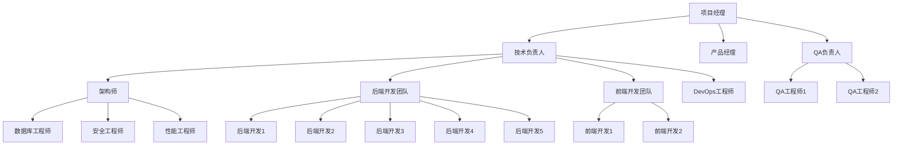

# 团队分工和资源分配计划

## 项目概述

**项目名称**：YYC³ Easy Table Converter 开发项目
**实施阶段**：第一阶段（0-3个月）
**关联文档**：
- 《第一阶段详细实施计划》
- 《第一阶段核心功能技术实现方案》
- 《项目实施追踪看板》
- 《综合编号执行推进计划》
- 《大数据多行业功能落地规划》

## 目录

1. [团队组织结构](#团队组织结构)
2. [团队角色与职责](#团队角色与职责)
3. [团队分工矩阵](#团队分工矩阵)
4. [人力资源分配](#人力资源分配)
5. [硬件资源分配](#硬件资源分配)
6. [软件资源分配](#软件资源分配)
7. [资源分配时间表](#资源分配时间表)
8. [资源优化策略](#资源优化策略)
9. [资源风险管理](#资源风险管理)
10. [团队协作机制](#团队协作机制)

## 团队组织结构

## 团队角色与职责

### 1. 项目经理

**职责**：
- 负责项目的整体规划、组织、协调和控制
- 制定项目计划和里程碑
- 管理项目范围、时间、成本和质量
- 协调跨部门资源和沟通
- 识别和管理项目风险
- 定期向管理层汇报项目进展
- 确保项目按时、按质、按量交付

**技能要求**：
- PMP或相关项目管理认证
- 3年以上软件开发项目管理经验
- 良好的沟通协调能力和团队管理能力
- 熟悉敏捷开发方法论

### 2. 技术负责人

**职责**：
- 负责项目的技术方向和架构设计
- 领导开发团队进行技术实现
- 解决技术难题和架构问题
- 确保代码质量和技术标准
- 评审技术方案和代码
- 指导开发团队成员

**技能要求**：
- 5年以上软件开发经验
- 2年以上技术团队管理经验
- 深厚的微服务架构知识
- 精通相关技术栈

### 3. 产品经理

**职责**：
- 负责产品需求分析和功能规划
- 编写产品需求文档（PRD）
- 与用户和业务方沟通，收集反馈
- 设计产品原型和用户体验
- 确定产品优先级和发布计划
- 协调开发和测试团队的工作

**技能要求**：
- 3年以上产品经理经验
- 良好的需求分析和文档编写能力
- 熟悉用户体验设计原则
- 具备跨部门沟通能力

### 4. 架构师

**职责**：
- 设计项目的整体技术架构
- 制定技术规范和标准
- 评估和选择技术方案
- 进行技术风险分析
- 指导数据库和安全设计
- 确保系统的可扩展性和可维护性

**技能要求**：
- 7年以上软件开发经验
- 3年以上架构设计经验
- 精通微服务架构设计
- 深入理解分布式系统原理

### 5. 后端开发工程师

**职责**：
- 根据技术方案开发后端服务
- 编写API接口和业务逻辑
- 进行单元测试和代码优化
- 解决开发过程中的技术问题
- 参与代码评审
- 维护和更新技术文档

**技能要求**：
- 2年以上后端开发经验
- 精通至少一种后端编程语言和框架
- 熟悉微服务和RESTful API设计
- 了解数据库设计和优化

### 6. 前端开发工程师

**职责**：
- 根据UI设计开发前端界面
- 实现前端交互功能
- 优化用户体验和页面性能
- 进行前端测试和调试
- 参与代码评审
- 维护前端技术文档

**技能要求**：
- 2年以上前端开发经验
- 精通HTML、CSS、JavaScript
- 熟悉React等前端框架
- 了解前端工程化和性能优化

### 7. QA工程师

**职责**：
- 制定测试计划和测试策略
- 编写测试用例和自动化脚本
- 执行功能测试、集成测试和回归测试
- 报告和跟踪Bug
- 参与需求和设计评审
- 确保产品质量符合标准

**技能要求**：
- 2年以上软件测试经验
- 熟悉测试理论和方法
- 具备自动化测试能力
- 良好的问题分析和沟通能力

### 8. DevOps工程师

**职责**：
- 搭建和维护开发、测试和生产环境
- 实现持续集成和持续部署流程
- 监控系统运行状态和性能
- 处理系统故障和问题
- 优化部署流程和系统性能
- 确保系统安全和稳定性

**技能要求**：
- 2年以上DevOps或运维经验
- 熟悉Docker、Kubernetes等容器技术
- 了解CI/CD工具和流程
- 具备一定的脚本编程能力

### 9. 数据库工程师

**职责**：
- 设计和优化数据库结构
- 编写高效的SQL查询
- 进行数据库性能调优
- 实施数据库备份和恢复策略
- 确保数据安全和完整性
- 解决数据库相关问题

**技能要求**：
- 3年以上数据库设计和开发经验
- 精通至少一种主流数据库
- 具备数据库性能优化能力
- 了解数据库安全知识

### 10. 安全工程师

**职责**：
- 进行系统安全设计和评估
- 实施安全防护措施
- 进行安全测试和审计
- 解决安全漏洞和问题
- 制定安全策略和规范
- 提供安全培训和指导

**技能要求**：
- 2年以上安全相关工作经验
- 熟悉Web安全和应用安全
- 具备安全测试和漏洞修复能力
- 了解安全法规和标准

### 11. 性能工程师

**职责**：
- 制定性能测试计划和策略
- 执行性能测试和分析
- 识别和解决性能瓶颈
- 优化系统性能和响应时间
- 监控系统性能指标
- 提供性能优化建议

**技能要求**：
- 2年以上性能测试和优化经验
- 熟悉性能测试工具和方法
- 具备性能分析和调优能力
- 了解分布式系统性能特性

## 团队分工矩阵

### 核心功能模块分工

| 功能模块 | 负责人 | 参与人员 | 支持人员 |
|---------|--------|---------|--------|
| 数据格式转换工具 | 后端开发1 | 后端开发1 | 架构师、QA工程师1 |
| 图片处理工具 | 后端开发2 | 后端开发2-4 | 架构师、QA工程师1 |
| 文本处理工具 | 后端开发5 | 后端开发5 | 架构师、QA工程师1 |
| 颜色工具 | 后端开发3 | 后端开发3 | 架构师、QA工程师1 |
| 单位换算工具 | 后端开发4 | 后端开发4 | 架构师、QA工程师1 |
| 前端界面 | 前端开发1 | 前端开发1-2 | 产品经理、QA工程师2 |
| 用户认证系统 | 安全工程师 | 安全工程师、后端开发1 | 架构师、QA工程师2 |
| API网关 | 后端开发5 | 后端开发5 | 架构师、QA工程师1 |
| 数据库设计 | 数据库工程师 | 数据库工程师 | 架构师 |
| 性能优化 | 性能工程师 | 性能工程师 | 架构师、开发团队 |
| 部署运维 | DevOps工程师 | DevOps工程师 | 架构师、开发团队 |

### 项目阶段分工

| 项目阶段 | 主要负责人 | 关键参与人员 | 支持人员 |
|---------|-----------|------------|--------|
| 需求分析 | 产品经理 | 项目经理、架构师 | 技术负责人 |
| 架构设计 | 架构师 | 技术负责人、数据库工程师 | 安全工程师、性能工程师 |
| 核心开发 | 技术负责人 | 前后端开发团队 | 架构师、数据库工程师 |
| 测试验证 | QA负责人 | QA工程师1-2 | 开发团队、性能工程师 |
| 部署上线 | DevOps工程师 | 技术负责人、QA负责人 | 开发团队 |
| 运维监控 | DevOps工程师 | 后端开发团队 | 架构师 |

## 人力资源分配

### 人员配置表

| 角色 | 人数 | 第一阶段分配 | 第二阶段预留 | 外包/内部 | 招聘状态 |
|------|------|------------|------------|----------|--------|
| 项目经理 | 1 | 100% | - | 内部 | 已到位 |
| 技术负责人 | 1 | 100% | - | 内部 | 已到位 |
| 产品经理 | 1 | 80% | 20% | 内部 | 已到位 |
| 架构师 | 1 | 100% | - | 内部 | 已到位 |
| 后端开发工程师 | 5 | 4人 | 1人 | 内部/外包 | 需招聘2名 |
| 前端开发工程师 | 2 | 2人 | - | 内部 | 已到位 |
| QA工程师 | 2 | 2人 | - | 内部 | 已到位 |
| DevOps工程师 | 1 | 100% | - | 内部 | 已到位 |
| 数据库工程师 | 1 | 100% | - | 内部 | 已到位 |
| 安全工程师 | 1 | 50% | 50% | 内部 | 已到位（兼职） |
| 性能工程师 | 1 | 50% | 50% | 内部 | 已到位（兼职） |
| **总计** | **18** | **15.5人** | **1.5人** | - | - |

### 人力资源日历

| 周数 | 总人力（人天） | 关键角色分配 | 备注 |
|------|--------------|------------|------|
| 第1周 | 77.5 | 项目经理、技术负责人、架构师、产品经理、数据库工程师全员参与 | 需求分析和架构设计启动 |
| 第2周 | 77.5 | 项目经理、技术负责人、架构师、产品经理、数据库工程师全员参与 | 架构设计完成 |
| 第3周 | 77.5 | 开发团队全员参与，QA团队准备测试计划 | 开发阶段开始 |
| 第4周 | 77.5 | 开发团队全员参与，DevOps搭建开发环境 | API网关和认证系统实现 |
| 第5周 | 77.5 | 开发团队全员参与，QA开始单元测试 | 核心功能开发中 |
| 第6周 | 77.5 | 开发团队全员参与，QA继续单元测试 | 核心功能开发完成 |
| 第7周 | 77.5 | 开发团队参与测试修复，QA主导测试 | 单元测试完成 |
| 第8周 | 77.5 | 开发团队参与测试修复，QA和性能工程师主导测试 | 集成测试和性能测试 |
| 第9周 | 77.5 | 开发团队Bug修复，DevOps准备部署 | Bug修复和优化 |
| 第10周 | 77.5 | 全体团队参与上线准备和部署 | 系统上线 |
| **总计** | **775人天** | - | - |

## 硬件资源分配

### 开发环境

| 资源类型 | 配置 | 数量 | 用途 | 分配对象 | 到位时间 |
|---------|------|------|------|---------|--------|
| 开发服务器 | 8核16G，500G SSD | 3台 | 后端服务开发环境 | 后端开发团队 | 已到位 |
| 开发PC | 16核32G，1T SSD | 10台 | 开发人员日常开发 | 全体开发人员 | 已到位 |
| 测试服务器 | 16核32G，1T SSD | 2台 | 测试环境 | QA团队 | 已到位 |
| 共享开发机 | 32核64G，2T SSD | 1台 | 构建和CI/CD | DevOps工程师 | 已到位 |

### 测试环境

| 资源类型 | 配置 | 数量 | 用途 | 分配对象 | 到位时间 |
|---------|------|------|---------|---------|--------|
| 应用服务器 | 16核32G，1T SSD | 2台 | 应用服务部署 | QA团队 | 已到位 |
| 数据库服务器 | 16核32G，2T SSD | 2台 | 数据库主从部署 | 数据库工程师 | 已到位 |
| 缓存服务器 | 8核16G，500G SSD | 1台 | Redis缓存服务 | 架构师 | 已到位 |
| 性能测试服务器 | 32核64G，2T SSD | 1台 | 性能测试 | 性能工程师 | 已到位 |

### 生产环境

| 资源类型 | 配置 | 数量 | 用途 | 分配对象 | 到位时间 |
|---------|------|------|---------|---------|--------|
| 应用服务器 | 32核64G，2T SSD | 4台 | 负载均衡应用服务 | DevOps工程师 | 第8周 |
| 数据库服务器 | 32核64G，4T SSD | 2台 | 数据库主从部署 | 数据库工程师 | 第8周 |
| 缓存服务器 | 16核32G，1T SSD | 2台 | Redis集群 | DevOps工程师 | 第8周 |
| 文件存储服务器 | 8核16G，10T HDD | 2台 | 对象存储服务 | DevOps工程师 | 第8周 |
| CDN资源 | 企业级CDN | 1套 | 静态资源分发 | DevOps工程师 | 第9周 |
| 监控服务器 | 8核16G，500G SSD | 1台 | 系统监控 | DevOps工程师 | 第8周 |

## 软件资源分配

### 开发工具

| 软件类别 | 软件名称 | 许可类型 | 数量 | 分配对象 | 备注 |
|---------|---------|---------|------|---------|------|
| IDE | Visual Studio Code | 开源 | 15 | 开发团队 | - |
| IDE | WebStorm | 商业 | 2 | 前端开发团队 | 年度许可 |
| IDE | IntelliJ IDEA | 商业 | 5 | 后端开发团队 | 年度许可 |
| 数据库工具 | DataGrip | 商业 | 3 | 数据库工程师、后端开发 | 年度许可 |
| API工具 | Postman | 免费版 | 15 | 开发团队 | 需考虑企业版 |
| 协作工具 | Jira | 商业 | 1 | 全团队 | 项目管理和问题跟踪 |
| 代码管理 | GitLab | 企业版 | 1 | 全团队 | 代码仓库和CI/CD |
| 文档工具 | Confluence | 商业 | 1 | 全团队 | 知识库和文档 |
| 设计工具 | Figma | 商业 | 1 | 产品经理、前端开发 | UI设计和原型 |

### 服务器软件

| 软件类别 | 软件名称 | 版本 | 用途 | 部署位置 | 授权状态 |
|---------|---------|------|------|---------|--------|
| 操作系统 | CentOS | 8.0 | 服务器操作系统 | 所有服务器 | 开源 |
| Web服务器 | Nginx | 1.20+ | 反向代理和静态资源 | 应用服务器 | 开源 |
| 应用容器 | Docker | 20.10+ | 容器化部署 | 所有服务器 | 开源 |
| 容器编排 | Kubernetes | 1.20+ | 容器编排 | 生产环境 | 开源 |
| 数据库 | PostgreSQL | 13.0+ | 主数据库 | 数据库服务器 | 开源 |
| 缓存 | Redis | 6.0+ | 缓存服务 | 缓存服务器 | 开源 |
| 消息队列 | Kafka | 2.8+ | 消息处理 | 应用服务器 | 开源 |
| 监控 | Prometheus + Grafana | 最新版 | 系统监控 | 监控服务器 | 开源 |
| 日志 | ELK Stack | 最新版 | 日志管理 | 监控服务器 | 开源 |

### 中间件和框架

| 技术类别 | 技术名称 | 版本 | 用途 | 开发/运行 | 授权状态 |
|---------|---------|------|------|----------|--------|
| 后端框架 | Spring Boot | 2.6+ | 后端服务开发 | 开发 | 开源 |
| 后端框架 | Node.js | 16.0+ | 部分服务开发 | 开发 | 开源 |
| 前端框架 | React | 18.0+ | 前端开发 | 开发 | 开源 |
| API网关 | Kong | 2.8+ | API管理 | 运行 | 开源 |
| 服务注册发现 | Consul | 1.11+ | 服务治理 | 运行 | 开源 |
| 配置中心 | Nacos | 2.0+ | 配置管理 | 运行 | 开源 |
| 认证授权 | Keycloak | 18.0+ | 身份认证 | 运行 | 开源 |

## 资源分配时间表

### 资源需求时间线

| 资源类型 | 开始需求时间 | 高峰需求时间 | 结束需求时间 | 资源状态 |
|---------|------------|------------|------------|--------|
| 开发人力 | 第1周 | 第3-6周 | 第10周 | 部分到位，招聘中 |
| 测试人力 | 第3周 | 第7-8周 | 第10周 | 已到位 |
| 运维人力 | 第1周 | 第9-10周 | 持续 | 已到位 |
| 开发环境 | 第1周 | 第3-6周 | 持续 | 已到位 |
| 测试环境 | 第3周 | 第7-8周 | 持续 | 已到位 |
| 生产环境 | 第8周 | 第10周 | 持续 | 采购中 |
| 软件许可 | 第1周 | 第3-10周 | 持续 | 部分已到位 |

### 资源释放计划

| 资源类型 | 释放时间 | 释放条件 | 备注 |
|---------|---------|---------|------|
| 临时开发人员 | 第10周 | 项目顺利交付 | 如需延期，可协商延长 |
| 测试环境 | 项目稳定后 | 生产环境稳定运行1个月 | 可保留作为紧急回滚环境 |
| 临时服务器 | 第12周 | 项目验收完成 | 可转为其他项目使用 |

## 资源优化策略

### 人力资源优化

1. **技能互补**：合理搭配不同技能水平的团队成员，实现经验传承和效率提升
2. **任务分解**：将大任务分解为小任务，便于并行工作和资源灵活调配
3. **跨职能培训**：鼓励团队成员学习相关领域知识，提高资源使用灵活性
4. **自动化优先**：优先实现自动化工具和流程，减少重复性工作
5. **外部资源利用**：对非核心功能，可考虑利用开源组件或外包服务

### 硬件资源优化

1. **容器化部署**：使用Docker容器化应用，提高服务器利用率
2. **资源监控**：实施资源监控，及时调整资源分配
3. **弹性伸缩**：在云环境中配置自动伸缩，根据负载动态调整资源
4. **负载均衡**：合理配置负载均衡，避免单点资源瓶颈
5. **资源回收**：定期清理和回收闲置资源

### 软件资源优化

1. **开源优先**：优先使用开源软件，降低许可成本
2. **按需付费**：对云服务采用按需付费模式，避免资源浪费
3. **集中管理**：实施软件许可证集中管理，提高利用率
4. **版本控制**：统一软件版本，减少兼容性问题和维护成本
5. **生命周期管理**：建立软件资源生命周期管理流程

## 资源风险管理

### 人力资源风险

| 风险ID | 风险描述 | 影响 | 概率 | 缓解措施 | 责任人 |
|--------|---------|------|------|---------|--------|
| HR-R1 | 关键人员离职 | 高 | 中 | 知识文档化，交叉培训，建立团队备份机制 | 项目经理 |
| HR-R2 | 招聘延迟 | 高 | 高 | 提前启动招聘，考虑外包或临时人员 | 项目经理 |
| HR-R3 | 团队士气低落 | 中 | 中 | 建立激励机制，合理安排工作，定期团队建设 | 项目经理 |
| HR-R4 | 技能缺口 | 高 | 中 | 制定培训计划，招聘有经验人员，外部顾问支持 | 技术负责人 |

### 硬件资源风险

| 风险ID | 风险描述 | 影响 | 概率 | 缓解措施 | 责任人 |
|--------|---------|------|------|---------|--------|
| HW-R1 | 硬件采购延迟 | 高 | 中 | 提前下单，备选供应商，云资源临时替代 | DevOps工程师 |
| HW-R2 | 硬件故障 | 高 | 低 | 冗余配置，定期维护，备份机制 | DevOps工程师 |
| HW-R3 | 性能不足 | 中 | 中 | 性能测试，预留扩展空间，优化配置 | 性能工程师 |
| HW-R4 | 容量规划不足 | 中 | 高 | 详细容量评估，弹性扩展设计，监控预警 | 架构师 |

### 软件资源风险

| 风险ID | 风险描述 | 影响 | 概率 | 缓解措施 | 责任人 |
|--------|---------|------|------|---------|--------|
| SW-R1 | 许可证到期 | 高 | 低 | 建立许可证管理系统，提前续期 | 项目经理 |
| SW-R2 | 版本兼容性问题 | 高 | 中 | 严格版本控制，升级测试，兼容性检查 | 架构师 |
| SW-R3 | 开源软件安全漏洞 | 高 | 中 | 定期安全扫描，及时更新补丁，漏洞管理 | 安全工程师 |
| SW-R4 | 技术选型不当 | 高 | 中 | 技术评估，POC验证，专家评审 | 架构师 |

## 团队协作机制

### 沟通机制

1. **每日站会**
   - 时间：每天上午10:00-10:15
   - 参与人员：开发团队、项目经理、技术负责人
   - 内容：昨日完成工作、今日计划、遇到的阻碍
   - 形式：面对面或视频会议

2. **周例会**
   - 时间：每周五下午3:00-4:30
   - 参与人员：全体项目成员
   - 内容：本周工作总结、下周工作计划、问题讨论、风险评估
   - 形式：面对面会议，会后发送会议纪要

3. **技术评审会**
   - 时间：按需（架构设计、方案评审等）
   - 参与人员：技术团队、架构师、技术负责人
   - 内容：技术方案评审、代码评审、架构评审
   - 形式：面对面或视频会议

4. **里程碑评审会**
   - 时间：每个里程碑完成时
   - 参与人员：全体项目成员、管理层
   - 内容：里程碑达成情况、成果展示、经验总结
   - 形式：正式会议，准备演示和文档

### 协作工具

1. **项目管理**：Jira - 任务跟踪、进度管理
2. **代码管理**：GitLab - 代码仓库、代码评审、CI/CD
3. **文档协作**：Confluence - 知识库、文档管理
4. **即时通讯**：企业微信 - 日常沟通、问题讨论
5. **设计协作**：Figma - UI设计、原型共享
6. **文件共享**：企业云盘 - 资料共享、版本管理

### 工作流程

1. **需求管理流程**
   - 需求收集 → 需求分析 → 需求评审 → 需求确认 → 需求变更控制

2. **开发流程**
   - 任务分配 → 设计 → 编码 → 代码评审 → 单元测试 → 提交

3. **测试流程**
   - 测试计划制定 → 测试用例编写 → 测试执行 → Bug报告 → 回归测试 → 测试报告

4. **发布流程**
   - 预发布准备 → 预发布测试 → 发布审批 → 正式发布 → 发布验证 → 发布总结

5. **变更管理流程**
   - 变更申请 → 变更评估 → 变更审批 → 变更实施 → 变更验证 → 变更关闭

---

*注：本计划将根据项目进展和实际情况进行动态调整，确保资源的合理高效利用。*